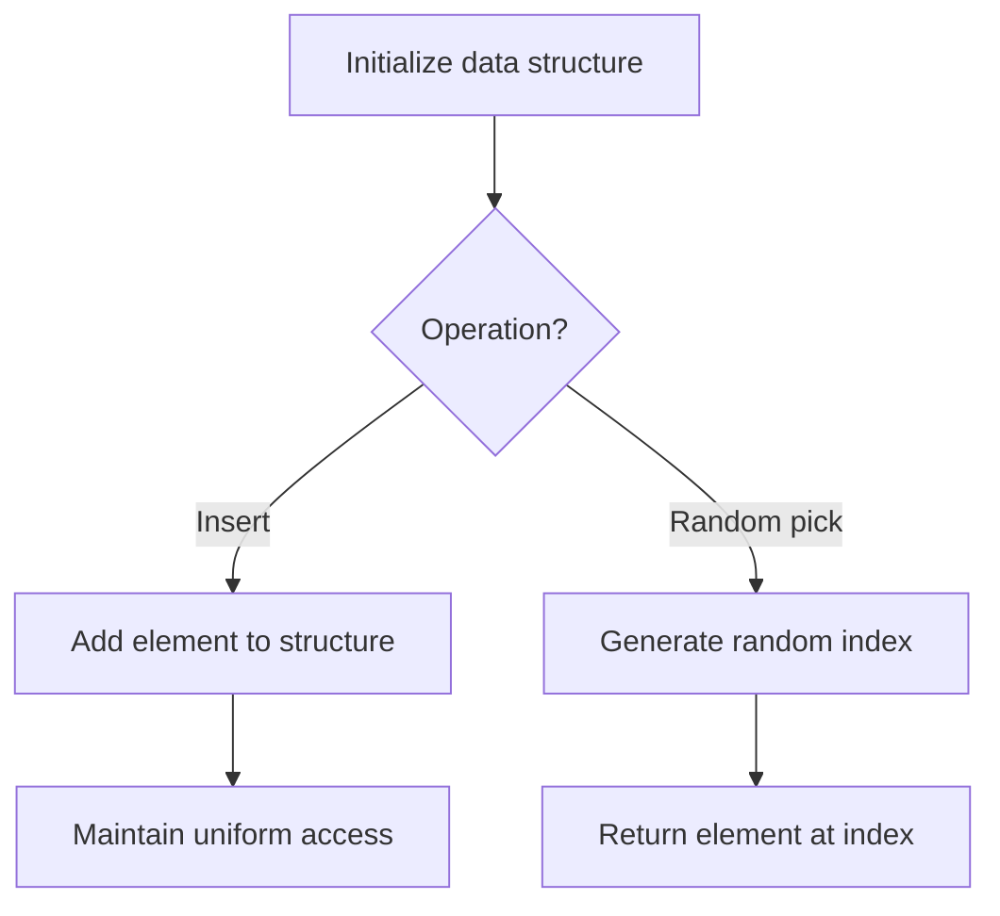

# Problem 478: Generate Random Point in a Circle

**Difficulty:** Medium  
**Tags:** Math, Geometry, Rejection Sampling, Randomized  
**Pattern:** Randomized Algorithm  
**Link:** [leetcode.com/problems/generate-random-point-in-a-circle](https://leetcode.com/problems/generate-random-point-in-a-circle/)

## Description

Given the radius and the position of the center of a circle, implement the function `randPoint` which generates a uniform random point inside the circle.

Implement the `Solution` class:

	- `Solution(double radius, double x_center, double y_center)` initializes the object with the radius of the circle `radius` and the position of the center `(x_center, y_center)`.
	- `randPoint()` returns a random point inside the circle. A point on the circumference of the circle is considered to be in the circle. The answer is returned as an array `[x, y]`.

 

Example 1:

```

**Input**
["Solution", "randPoint", "randPoint", "randPoint"]
[[1.0, 0.0, 0.0], [], [], []]
**Output**
[null, [-0.02493, -0.38077], [0.82314, 0.38945], [0.36572, 0.17248]]

**Explanation**
Solution solution = new Solution(1.0, 0.0, 0.0);
solution.randPoint(); // return [-0.02493, -0.38077]
solution.randPoint(); // return [0.82314, 0.38945]
solution.randPoint(); // return [0.36572, 0.17248]

```

 

**Constraints:**

	- `0 < radius <= 10^8`
	- `-10^7 <= x_center, y_center <= 10^7`
	- At most `3 * 10^4` calls will be made to `randPoint`.

## Approach: Randomized Algorithm

Use randomization for expected-case efficiency. Random sampling, Fisher-Yates shuffle, or reservoir sampling.

## Pseudocode

```
1. Set up data structure for random access
2. On query:
   - Generate random index/number
   - Return corresponding element
3. Ensure uniform distribution
```

## Algorithm Flow



## Complexity Analysis

- **Time:** O(n) or varies
- **Space:** O(n)

## Solution (Python3)

```python
class Solution:
    def __init__(self, radius: float, x_center: float, y_center: float):
        # Initialize data structure
        self.radius = radius
        self.x_center = x_center
        self.y_center = y_center

    def randPoint(self) -> List[float]:
        return []

```

## Solution (C++)

```cpp
#include <cstdlib>
#include <ctime>
#include <string>
#include <vector>
using namespace std;

class Solution {
public:
    Solution(double radius, double x_center, double y_center) {
        // Initialize
    }

    vector<double> randPoint() {
        return {};
    }

};
```
