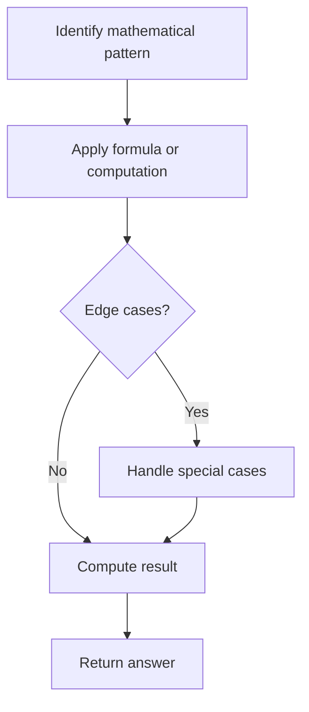

# Problem 479: Largest Palindrome Product

**Difficulty:** Hard  
**Tags:** Math, Enumeration  
**Pattern:** Math  
**Link:** [leetcode.com/problems/largest-palindrome-product](https://leetcode.com/problems/largest-palindrome-product/)

## Description

Given an integer n, return *the **largest palindromic integer** that can be represented as the product of two `n`-digits integers*. Since the answer can be very large, return it **modulo** `1337`.

 

Example 1:

```

**Input:** n = 2
**Output:** 987
Explanation: 99 x 91 = 9009, 9009 % 1337 = 987

```

Example 2:

```

**Input:** n = 1
**Output:** 9

```

 

**Constraints:**

	- `1 <= n <= 8`

## Approach: Math

Apply mathematical properties, formulas, or number-theoretic concepts. Look for patterns, modular arithmetic, or closed-form solutions.

## Pseudocode

```
1. Identify the mathematical pattern or formula
2. Apply computation:
   - Modular arithmetic for large numbers
   - GCD/LCM for divisibility
   - Sieve for primes
3. Handle edge cases
4. Return result
```

## Algorithm Flow



## Complexity Analysis

- **Time:** O(n) or O(sqrt(n))
- **Space:** O(1)

## Solution (Python3)

```python
class Solution:
    def largestPalindrome(self, n: int) -> int:
        # Mathematical approach
        result = 0
        x = n
        while x != 0:
            result = result * 10 + x % 10
            x //= 10 if isinstance(x, int) else 1
        return result
```

## Solution (C++)

```cpp
#include <string>
#include <vector>
using namespace std;

class Solution {
public:
    int largestPalindrome(int n) {
        // Mathematical approach
        long long result = 0;
        int x = n;
        while (x != 0) {
            result = result * 10 + x % 10;
            x /= 10;
        }
        return (int)result;
    }
};
```
