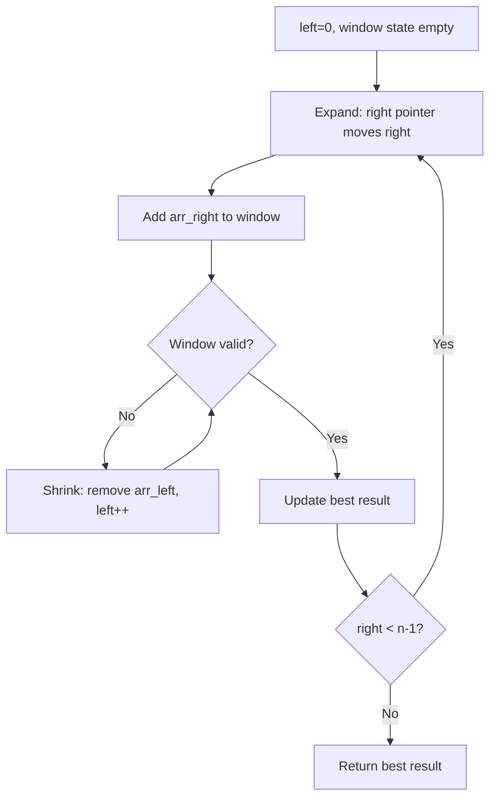
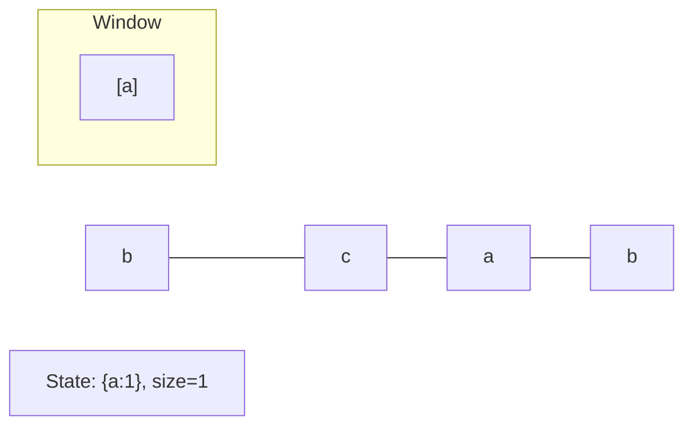
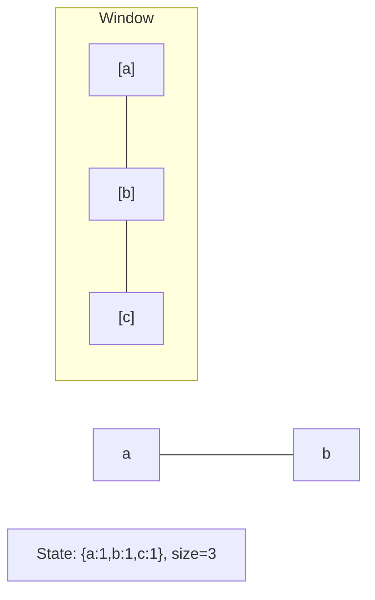
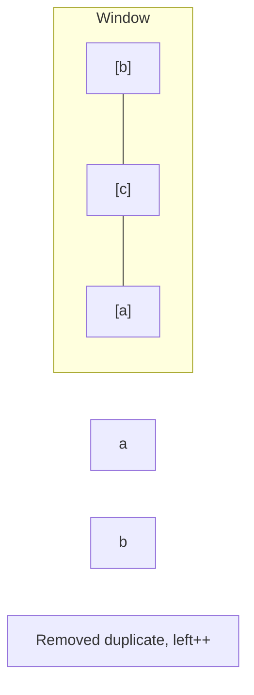
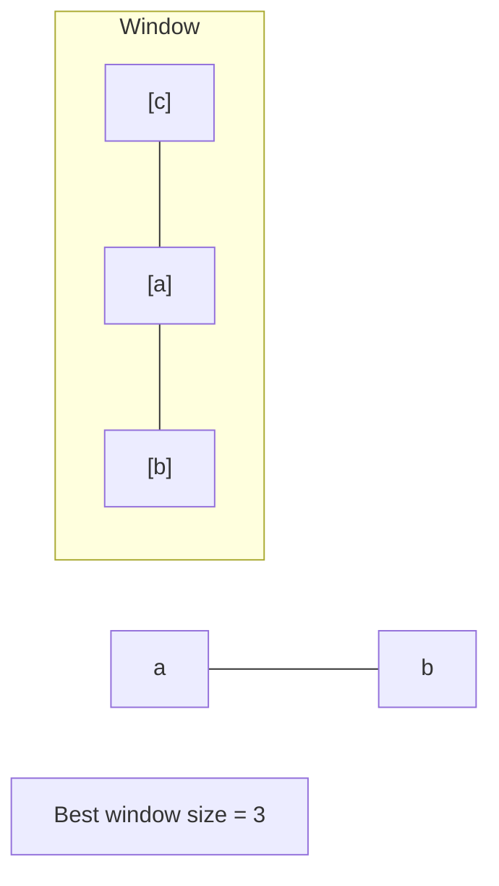

# Problem 480: Sliding Window Median

**Difficulty:** Hard  
**Tags:** Array, Hash Table, Sliding Window, Heap (Priority Queue)  
**Pattern:** Sliding Window  
**Link:** [leetcode.com/problems/sliding-window-median](https://leetcode.com/problems/sliding-window-median/)

## Description

The **median** is the middle value in an ordered integer list. If the size of the list is even, there is no middle value. So the median is the mean of the two middle values.

	- For examples, if `arr = [2,3,4]`, the median is `3`.
	- For examples, if `arr = [1,2,3,4]`, the median is `(2 + 3) / 2 = 2.5`.

You are given an integer array `nums` and an integer `k`. There is a sliding window of size `k` which is moving from the very left of the array to the very right. You can only see the `k` numbers in the window. Each time the sliding window moves right by one position.

Return *the median array for each window in the original array*. Answers within `10^-5` of the actual value will be accepted.

 

Example 1:

```

**Input:** nums = [1,3,-1,-3,5,3,6,7], k = 3
**Output:** [1.00000,-1.00000,-1.00000,3.00000,5.00000,6.00000]
**Explanation:** 
Window position                Median
---------------                -----
[**1  3  -1**] -3  5  3  6  7        1
 1 [**3  -1  -3**] 5  3  6  7       -1
 1  3 [**-1  -3  5**] 3  6  7       -1
 1  3  -1 [**-3  5  3**] 6  7        3
 1  3  -1  -3 [**5  3  6**] 7        5
 1  3  -1  -3  5 [**3  6  7**]       6

```

Example 2:

```

**Input:** nums = [1,2,3,4,2,3,1,4,2], k = 3
**Output:** [2.00000,3.00000,3.00000,3.00000,2.00000,3.00000,2.00000]

```

 

**Constraints:**

	- `1 <= k <= nums.length <= 10^5`
	- `-2^31 <= nums[i] <= 2^31 - 1`

## Approach: Sliding Window

Maintain a window over the data using two pointers. Expand the right boundary to include new elements, and shrink the left boundary when the window constraint is violated. Track the optimal window.

## Pseudocode

```
1. Initialize left = 0, result = initial_value
2. For right in range(n):
   a. Add element at right to window state
   b. While window is invalid:
      - Remove element at left from window state
      - left++
   c. Update result = best of (result, window size/value)
3. Return result
```

## Algorithm Flow



## Visual State Transitions

**Sliding Window Step-by-Step:**

**Frame 1: Initial window (left=0, right=0)**


**Frame 2: Expand right (right=2)**


**Frame 3: Violation - shrink left**


**Frame 4: Continue expanding**



## Complexity Analysis

- **Time:** O(n)
- **Space:** O(k)

## Solution (Python3)

```python
class Solution:
    def medianSlidingWindow(self, nums: List[int], k: int) -> List[float]:
        # Sliding window approach - O(n) time, O(k) space
        from collections import defaultdict
        window = defaultdict(int)
        left = 0
        result = 0
        for right in range(len(nums)):
            window[nums[right]] += 1
            while len(window) > (k if isinstance(k, int) else len(nums)):
                window[nums[left]] -= 1
                if window[nums[left]] == 0:
                    del window[nums[left]]
                left += 1
            result = max(result, right - left + 1)
        return result
```

## Solution (C++)

```cpp
#include <algorithm>
#include <string>
#include <unordered_map>
#include <vector>
using namespace std;

class Solution {
public:
    vector<double> medianSlidingWindow(vector<int>& nums, int k) {
        // Sliding window approach - O(n) time, O(k) space
        unordered_map<char, int> window;
        int left = 0, result = 0;
        for (int right = 0; right < nums.size(); right++) {
            window[nums[right]]++;
            while ((int)window.size() > k) {
                window[nums[left]]--;
                if (window[nums[left]] == 0)
                    window.erase(nums[left]);
                left++;
            }
            result = max(result, right - left + 1);
        }
        return result;
    }
};
```
