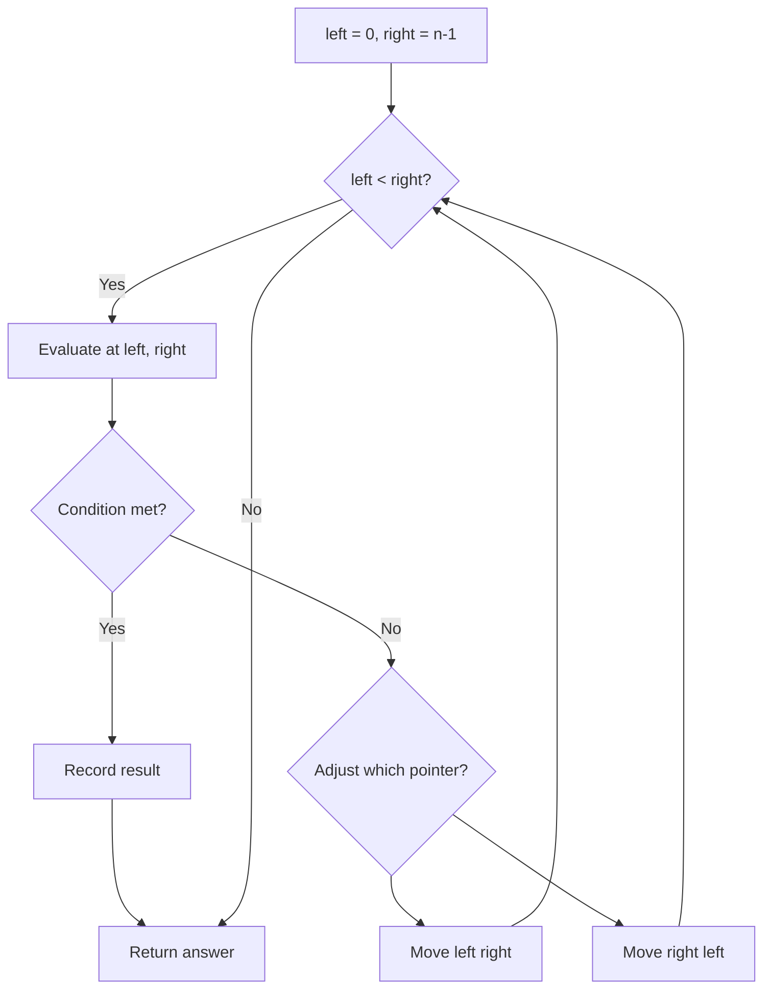
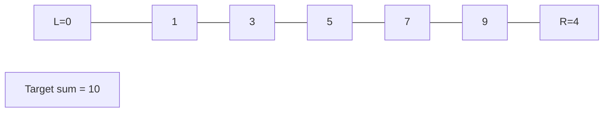
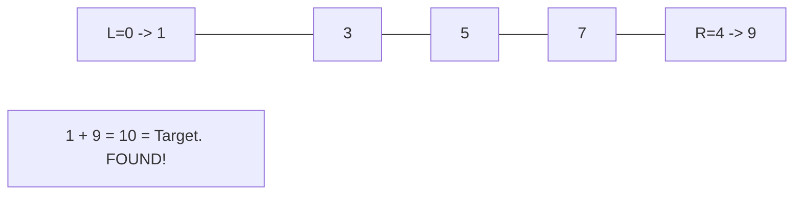

# Problem 481: Magical String

**Difficulty:** Medium  
**Tags:** Two Pointers, String  
**Pattern:** Two Pointers  
**Link:** [leetcode.com/problems/magical-string](https://leetcode.com/problems/magical-string/)

## Description

A magical string `s` consists of only `'1'` and `'2'` and obeys the following rule:

	- Concatenating the sequence of lengths of its consecutive groups of identical characters `'1'` and `'2'` generates the string `s` itself.

The first few elements of `s` is `s = "1221121221221121122……"`. If we group the consecutive `1`'s and `2`'s in `s`, it will be `"1 22 11 2 1 22 1 22 11 2 11 22 ......"` and counting the occurrences of `1`'s or `2`'s in each group yields the sequence `"1 2 2 1 1 2 1 2 2 1 2 2 ......"`.

You can see that concatenating the occurrence sequence gives us `s` itself.

Given an integer `n`, return the number of `1`'s in the first `n` number in the magical string `s`.

 

Example 1:

```

**Input:** n = 6
**Output:** 3
**Explanation:** The first 6 elements of magical string s is "122112" and it contains three 1's, so return 3.

```

Example 2:

```

**Input:** n = 1
**Output:** 1

```

 

**Constraints:**

	- `1 <= n <= 10^5`

## Approach: Two Pointers

Use two pointers moving through the data structure. Depending on the problem, pointers may move toward each other (converging), in the same direction (fast/slow), or independently.

## Pseudocode

```
1. Initialize left = 0, right = n-1 (or two independent pointers)
2. While pointers haven't crossed:
   a. Evaluate condition at pointer positions
   b. Move left pointer right or right pointer left
3. Return result
```

## Algorithm Flow



## Visual State Transitions

**Two Pointer Convergence:**

**Frame 1: Initialize pointers**


**Frame 2: Sum = 1+9 = 10, found!**



## Complexity Analysis

- **Time:** O(n)
- **Space:** O(1)

## Solution (Python3)

```python
class Solution:
    def magicalString(self, n: int) -> int:
        # Two pointer approach - O(n) time, O(1) space
        left, right = 0, len(n) - 1
        while left < right:
            curr = n[left] + n[right]
            if curr == n:
                return [left, right]
            elif curr < n:
                left += 1
            else:
                right -= 1
        return 0
```

## Solution (C++)

```cpp
#include <string>
#include <vector>
using namespace std;

class Solution {
public:
    int magicalString(int n) {
        // Two pointer approach - O(n) time, O(1) space
        int left = 0, right = n.size() - 1;
        while (left < right) {
            int curr = n[left] + n[right];
            if (curr == n) {
                return {left, right};
            } else if (curr < n) {
                left++;
            } else {
                right--;
            }
        }
        return 0;
    }
};
```
