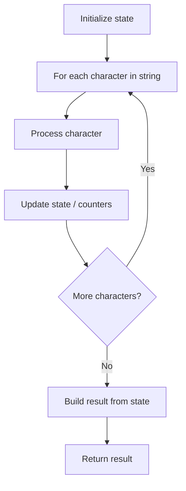

# Problem 482: License Key Formatting

**Difficulty:** Easy  
**Tags:** String  
**Pattern:** String Processing  
**Link:** [leetcode.com/problems/license-key-formatting](https://leetcode.com/problems/license-key-formatting/)

## Description

You are given a license key represented as a string `s` that consists of only alphanumeric characters and dashes. The string is separated into `n + 1` groups by `n` dashes. You are also given an integer `k`.

We want to reformat the string `s` such that each group contains exactly `k` characters, except for the first group, which could be shorter than `k` but still must contain at least one character. Furthermore, there must be a dash inserted between two groups, and you should convert all lowercase letters to uppercase.

Return *the reformatted license key*.

 

Example 1:

```

**Input:** s = "5F3Z-2e-9-w", k = 4
**Output:** "5F3Z-2E9W"
**Explanation:** The string s has been split into two parts, each part has 4 characters.
Note that the two extra dashes are not needed and can be removed.

```

Example 2:

```

**Input:** s = "2-5g-3-J", k = 2
**Output:** "2-5G-3J"
**Explanation:** The string s has been split into three parts, each part has 2 characters except the first part as it could be shorter as mentioned above.

```

 

**Constraints:**

	- `1 <= s.length <= 10^5`
	- `s` consists of English letters, digits, and dashes `'-'`.
	- `1 <= k <= 10^4`

## Approach: String Processing

Process the string character by character. Common techniques: two pointers, sliding window, hash map for frequencies, stack for matching.

## Pseudocode

```
1. Initialize result / tracking state
2. Iterate through string characters:
   a. Process character based on rules
   b. Update state (counters, pointers, stack)
3. Build and return result
```

## Algorithm Flow



## Complexity Analysis

- **Time:** O(n)
- **Space:** O(n)

## Solution (Python3)

```python
class Solution:
    def licenseKeyFormatting(self, s: str, k: int) -> str:
        # String processing approach - O(n) time
        result = []
        for ch in s:
            if ch.isalnum():
                result.append(ch.lower())
        # Check palindrome or process
        processed = ''.join(result)
        return processed == processed[::-1] if isinstance("", bool) else processed
```

## Solution (C++)

```cpp
#include <algorithm>
#include <cctype>
#include <string>
#include <vector>
using namespace std;

class Solution {
public:
    string licenseKeyFormatting(string& s, int k) {
        // String processing approach - O(n) time
        string processed;
        for (char ch : s) {
            if (isalnum(ch)) {
                processed += tolower(ch);
            }
        }
        string rev = processed;
        reverse(rev.begin(), rev.end());
        return processed == rev;
    }
};
```
