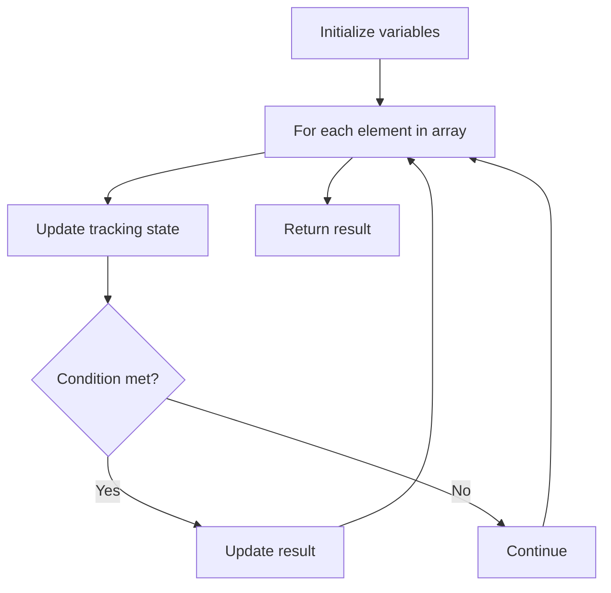

# Problem 485: Max Consecutive Ones

**Difficulty:** Easy  
**Tags:** Array  
**Pattern:** Array Processing  
**Link:** [leetcode.com/problems/max-consecutive-ones](https://leetcode.com/problems/max-consecutive-ones/)

## Description

Given a binary array `nums`, return *the maximum number of consecutive *`1`*'s in the array*.

 

Example 1:

```

**Input:** nums = [1,1,0,1,1,1]
**Output:** 3
**Explanation:** The first two digits or the last three digits are consecutive 1s. The maximum number of consecutive 1s is 3.

```

Example 2:

```

**Input:** nums = [1,0,1,1,0,1]
**Output:** 2

```

 

**Constraints:**

	- `1 <= nums.length <= 10^5`
	- `nums[i]` is either `0` or `1`.

## Approach: Array Processing

Process the array with a linear scan, tracking state variables. Look for patterns: running maximum/minimum, counting, or transformations.

## Pseudocode

```
1. Initialize tracking variables
2. Iterate through array:
   a. Update tracking state
   b. Check conditions
   c. Update result
3. Return result
```

## Algorithm Flow



## Complexity Analysis

- **Time:** O(n)
- **Space:** O(1)

## Solution (Python3)

```python
class Solution:
    def findMaxConsecutiveOnes(self, nums: List[int]) -> int:
        # Array processing - O(n) time
        result = 0
        for i in range(len(nums)):
            # Process element
            pass
        return result
```

## Solution (C++)

```cpp
#include <string>
#include <vector>
using namespace std;

class Solution {
public:
    int findMaxConsecutiveOnes(vector<int>& nums) {
        // Array processing - O(n) time
        for (int i = 0; i < (int)nums.size(); i++) {
            // Process element
        }
        return 0;
    }
};
```
