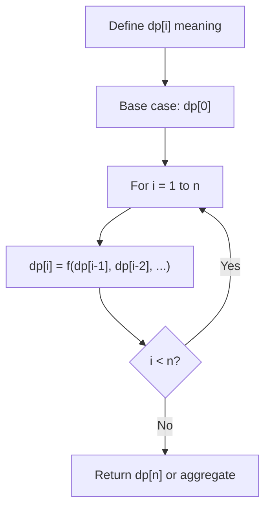
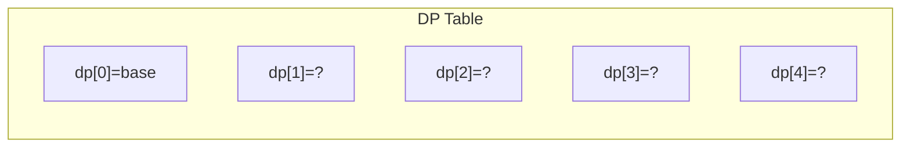
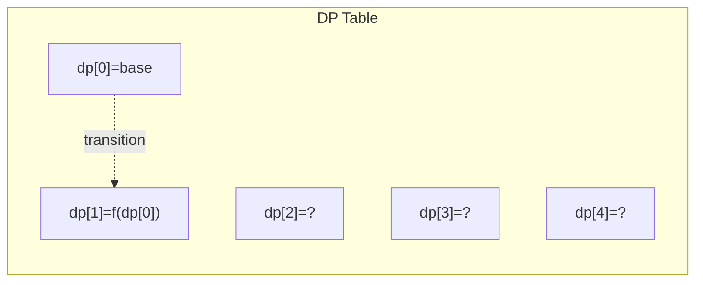
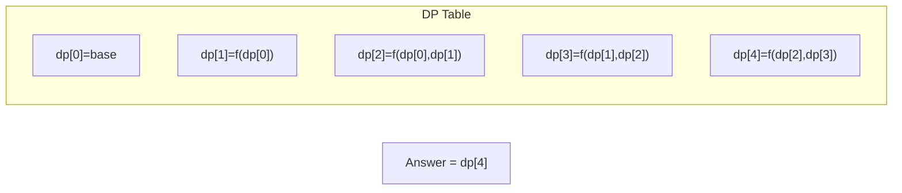

# Problem 486: Predict the Winner

**Difficulty:** Medium  
**Tags:** Array, Math, Dynamic Programming, Recursion, Game Theory  
**Pattern:** Dynamic Programming (1D)  
**Link:** [leetcode.com/problems/predict-the-winner](https://leetcode.com/problems/predict-the-winner/)

## Description

You are given an integer array `nums`. Two players are playing a game with this array: player 1 and player 2.

Player 1 and player 2 take turns, with player 1 starting first. Both players start the game with a score of `0`. At each turn, the player takes one of the numbers from either end of the array (i.e., `nums[0]` or `nums[nums.length - 1]`) which reduces the size of the array by `1`. The player adds the chosen number to their score. The game ends when there are no more elements in the array.

Return `true` if Player 1 can win the game. If the scores of both players are equal, then player 1 is still the winner, and you should also return `true`. You may assume that both players are playing optimally.

 

Example 1:

```

**Input:** nums = [1,5,2]
**Output:** false
**Explanation:** Initially, player 1 can choose between 1 and 2. 
If he chooses 2 (or 1), then player 2 can choose from 1 (or 2) and 5. If player 2 chooses 5, then player 1 will be left with 1 (or 2). 
So, final score of player 1 is 1 + 2 = 3, and player 2 is 5. 
Hence, player 1 will never be the winner and you need to return false.

```

Example 2:

```

**Input:** nums = [1,5,233,7]
**Output:** true
**Explanation:** Player 1 first chooses 1. Then player 2 has to choose between 5 and 7. No matter which number player 2 choose, player 1 can choose 233.
Finally, player 1 has more score (234) than player 2 (12), so you need to return True representing player1 can win.

```

 

**Constraints:**

	- `1 <= nums.length <= 20`
	- `0 <= nums[i] <= 10^7`

## Approach: Dynamic Programming (1D)

Break the problem into overlapping subproblems. Define dp[i] as the optimal value for the subproblem ending at or considering index i. Build the solution bottom-up, using previously computed dp values.

## Pseudocode

```
1. Define dp[i] = optimal value for subproblem i
2. Base case: dp[0] = initial value
3. For i from 1 to n:
   a. dp[i] = recurrence(dp[i-1], dp[i-2], ...)
4. Return dp[n] or max/min of dp
```

## Algorithm Flow



## Visual State Transitions

**1D Dynamic Programming Table Build:**

**Frame 1: Initialize base cases**


**Frame 2: Fill dp[1] from dp[0]**


**Frame 3: Fill remaining cells**



## Complexity Analysis

- **Time:** O(n)
- **Space:** O(n)

## Solution (Python3)

```python
class Solution:
    def predictTheWinner(self, nums: List[int]) -> bool:
        # Dynamic programming (1D) - O(n) time, O(n) space
        if not nums:
            return 0
        n = len(nums) if isinstance(nums, list) else nums
        dp = [0] * (n + 1)
        dp[0] = 1  # base case
        for i in range(1, n + 1):
            dp[i] = dp[i-1]  # transition (customize per problem)
            if i >= 2:
                dp[i] += dp[i-2]
        return dp[n]
```

## Solution (C++)

```cpp
#include <string>
#include <vector>
using namespace std;

class Solution {
public:
    bool predictTheWinner(vector<int>& nums) {
        // Dynamic programming (1D) - O(n) time, O(n) space
        int n = nums;
        if (n <= 0) return 0;
        vector<int> dp(n + 1, 0);
        dp[0] = 1;
        for (int i = 1; i <= n; i++) {
            dp[i] = dp[i-1];
            if (i >= 2) dp[i] += dp[i-2];
        }
        return dp[n];
    }
};
```
