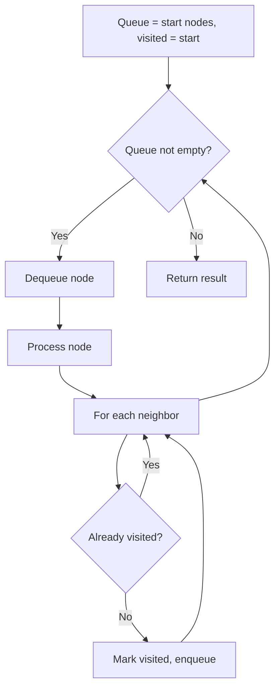
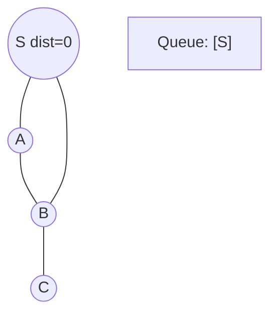
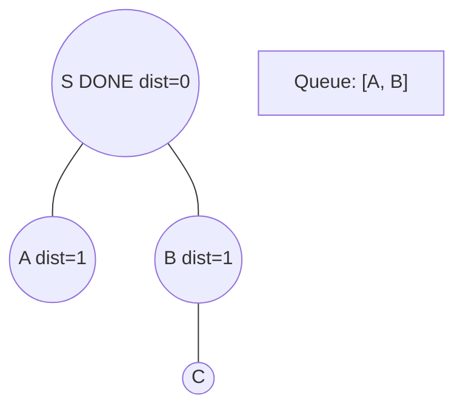
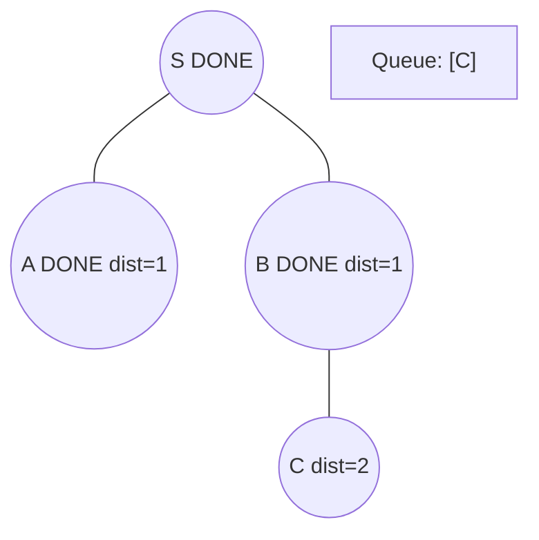
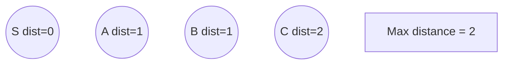

# Problem 488: Zuma Game

**Difficulty:** Hard  
**Tags:** String, Dynamic Programming, Stack, Breadth-First Search, Memoization  
**Pattern:** BFS Graph Traversal  
**Link:** [leetcode.com/problems/zuma-game](https://leetcode.com/problems/zuma-game/)

## Description

You are playing a variation of the game Zuma.

In this variation of Zuma, there is a **single row** of colored balls on a board, where each ball can be colored red `'R'`, yellow `'Y'`, blue `'B'`, green `'G'`, or white `'W'`. You also have several colored balls in your hand.

Your goal is to **clear all** of the balls from the board. On each turn:

	- Pick **any** ball from your hand and insert it in between two balls in the row or on either end of the row.
	- If there is a group of **three or more consecutive balls** of the **same color**, remove the group of balls from the board.
	
		If this removal causes more groups of three or more of the same color to form, then continue removing each group until there are none left.
	
	
	- If there are no more balls on the board, then you win the game.
	- Repeat this process until you either win or do not have any more balls in your hand.

Given a string `board`, representing the row of balls on the board, and a string `hand`, representing the balls in your hand, return *the **minimum** number of balls you have to insert to clear all the balls from the board. If you cannot clear all the balls from the board using the balls in your hand, return *`-1`.

 

Example 1:

```

**Input:** board = "WRRBBW", hand = "RB"
**Output:** -1
**Explanation:** It is impossible to clear all the balls. The best you can do is:
- Insert 'R' so the board becomes WRRRBBW. WRRRBBW -> WBBW.
- Insert 'B' so the board becomes WBBBW. WBBBW -> WW.
There are still balls remaining on the board, and you are out of balls to insert.
```

Example 2:

```

**Input:** board = "WWRRBBWW", hand = "WRBRW"
**Output:** 2
**Explanation:** To make the board empty:
- Insert 'R' so the board becomes WWRRRBBWW. WWRRRBBWW -> WWBBWW.
- Insert 'B' so the board becomes WWBBBWW. WWBBBWW -> WWWW -> empty.
2 balls from your hand were needed to clear the board.

```

Example 3:

```

**Input:** board = "G", hand = "GGGGG"
**Output:** 2
**Explanation:** To make the board empty:
- Insert 'G' so the board becomes GG.
- Insert 'G' so the board becomes GGG. GGG -> empty.
2 balls from your hand were needed to clear the board.

```

 

**Constraints:**

	- `1 <= board.length <= 16`
	- `1 <= hand.length <= 5`
	- `board` and `hand` consist of the characters `'R'`, `'Y'`, `'B'`, `'G'`, and `'W'`.
	- The initial row of balls on the board will **not** have any groups of three or more consecutive balls of the same color.

## Approach: BFS Graph Traversal

Explore the graph breadth-first using a queue. Process nodes level by level; BFS finds shortest paths in unweighted graphs.

## Pseudocode

```
1. Initialize queue with start node(s), visited set
2. While queue not empty:
   a. Dequeue node
   b. Process node
   c. For each unvisited neighbor:
      - Mark visited, enqueue
3. Return result
```

## Algorithm Flow



## Visual State Transitions

**BFS Level-by-Level Traversal:**

**Frame 1: Start BFS from source**


**Frame 2: Process level 0, enqueue neighbors**


**Frame 3: Process level 1**


**Frame 4: All nodes reached**



## Complexity Analysis

- **Time:** O(V + E)
- **Space:** O(V)

## Solution (Python3)

```python
class Solution:
    def findMinStep(self, board: str, hand: str) -> int:
        # BFS on graph - O(V+E) time
        from collections import deque
        if not board:
            return 0
        visited = set()
        queue = deque([0])
        visited.add(0)
        dist = 0
        while queue:
            for _ in range(len(queue)):
                node = queue.popleft()
                # Process node
            dist += 1
        return dist
```

## Solution (C++)

```cpp
#include <queue>
#include <string>
#include <unordered_set>
#include <vector>
using namespace std;

class Solution {
public:
    int findMinStep(string& board, string& hand) {
        // BFS on graph - O(V+E) time
        if (board.empty()) return 0;
        queue<int> q;
        unordered_set<int> visited;
        q.push(0);
        visited.insert(0);
        int dist = 0;
        while (!q.empty()) {
            int sz = q.size();
            for (int i = 0; i < sz; i++) {
                int node = q.front(); q.pop();
                // Process node
            }
            dist++;
        }
        return dist;
    }
};
```
