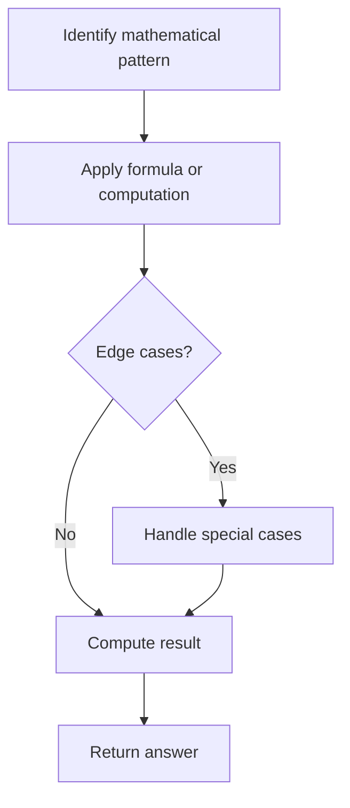

# Problem 492: Construct the Rectangle

**Difficulty:** Easy  
**Tags:** Math  
**Pattern:** Math  
**Link:** [leetcode.com/problems/construct-the-rectangle](https://leetcode.com/problems/construct-the-rectangle/)

## Description

A web developer needs to know how to design a web page's size. So, given a specific rectangular web page’s area, your job by now is to design a rectangular web page, whose length L and width W satisfy the following requirements:

	- The area of the rectangular web page you designed must equal to the given target area.
	- The width `W` should not be larger than the length `L`, which means `L >= W`.
	- The difference between length `L` and width `W` should be as small as possible.

Return *an array `[L, W]` where `L` and `W` are the length and width of the web page you designed in sequence.*

 

Example 1:

```

**Input:** area = 4
**Output:** [2,2]
**Explanation:** The target area is 4, and all the possible ways to construct it are [1,4], [2,2], [4,1]. 
But according to requirement 2, [1,4] is illegal; according to requirement 3,  [4,1] is not optimal compared to [2,2]. So the length L is 2, and the width W is 2.

```

Example 2:

```

**Input:** area = 37
**Output:** [37,1]

```

Example 3:

```

**Input:** area = 122122
**Output:** [427,286]

```

 

**Constraints:**

	- `1 <= area <= 10^7`

## Approach: Math

Apply mathematical properties, formulas, or number-theoretic concepts. Look for patterns, modular arithmetic, or closed-form solutions.

## Pseudocode

```
1. Identify the mathematical pattern or formula
2. Apply computation:
   - Modular arithmetic for large numbers
   - GCD/LCM for divisibility
   - Sieve for primes
3. Handle edge cases
4. Return result
```

## Algorithm Flow



## Complexity Analysis

- **Time:** O(n) or O(sqrt(n))
- **Space:** O(1)

## Solution (Python3)

```python
class Solution:
    def constructRectangle(self, area: int) -> List[int]:
        # Mathematical approach
        result = 0
        x = area
        while x != 0:
            result = result * 10 + x % 10
            x //= 10 if isinstance(x, int) else 1
        return result
```

## Solution (C++)

```cpp
#include <string>
#include <vector>
using namespace std;

class Solution {
public:
    vector<int> constructRectangle(int area) {
        // Mathematical approach
        long long result = 0;
        int x = area;
        while (x != 0) {
            result = result * 10 + x % 10;
            x /= 10;
        }
        return (int)result;
    }
};
```
