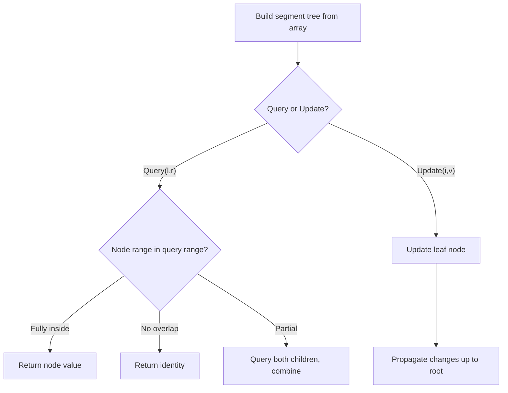

# Problem 493: Reverse Pairs

**Difficulty:** Hard  
**Tags:** Array, Binary Search, Divide and Conquer, Binary Indexed Tree, Segment Tree, Merge Sort, Ordered Set  
**Pattern:** Segment Tree  
**Link:** [leetcode.com/problems/reverse-pairs](https://leetcode.com/problems/reverse-pairs/)

## Description

Given an integer array `nums`, return *the number of **reverse pairs** in the array*.

A **reverse pair** is a pair `(i, j)` where:

	- `0 <= i < j < nums.length` and
	- `nums[i] > 2 * nums[j]`.

 

Example 1:

```

**Input:** nums = [1,3,2,3,1]
**Output:** 2
**Explanation:** The reverse pairs are:
(1, 4) --> nums[1] = 3, nums[4] = 1, 3 > 2 * 1
(3, 4) --> nums[3] = 3, nums[4] = 1, 3 > 2 * 1

```

Example 2:

```

**Input:** nums = [2,4,3,5,1]
**Output:** 3
**Explanation:** The reverse pairs are:
(1, 4) --> nums[1] = 4, nums[4] = 1, 4 > 2 * 1
(2, 4) --> nums[2] = 3, nums[4] = 1, 3 > 2 * 1
(3, 4) --> nums[3] = 5, nums[4] = 1, 5 > 2 * 1

```

 

**Constraints:**

	- `1 <= nums.length <= 5 * 10^4`
	- `-2^31 <= nums[i] <= 2^31 - 1`

## Approach: Segment Tree

Build a segment tree for range queries (sum, min, max) with point or range updates. Each node covers a range; queries are answered by combining relevant segments.

## Pseudocode

```
1. Build segment tree from array (O(n))
2. Query(l, r):
   - If node range within [l,r]: return node value
   - If no overlap: return identity
   - Else: combine query(left_child) and query(right_child)
3. Update(i, val): update leaf and propagate up
```

## Algorithm Flow



## Complexity Analysis

- **Time:** O(n log n) build, O(log n) query/update
- **Space:** O(n)

## Solution (Python3)

```python
class Solution:
    def reversePairs(self, nums: List[int]) -> int:
        # Segment tree for range queries - O(n log n) build, O(log n) query
        n = len(nums)
        tree = [0] * (4 * n)
        
        def build(node, start, end):
            if start == end:
                tree[node] = nums[start]
                return
            mid = (start + end) // 2
            build(2*node, start, mid)
            build(2*node+1, mid+1, end)
            tree[node] = tree[2*node] + tree[2*node+1]
        
        def query(node, start, end, l, r):
            if r < start or end < l:
                return 0
            if l <= start and end <= r:
                return tree[node]
            mid = (start + end) // 2
            return query(2*node, start, mid, l, r) + query(2*node+1, mid+1, end, l, r)
        
        build(1, 0, n-1)
        return 0
```

## Solution (C++)

```cpp
#include <functional>
#include <string>
#include <vector>
using namespace std;

class Solution {
public:
    int reversePairs(vector<int>& nums) {
        // Segment tree for range queries
        int n = nums.size();
        vector<int> tree(4 * n, 0);
        function<void(int, int, int)> build = [&](int node, int s, int e) {
            if (s == e) { tree[node] = nums[s]; return; }
            int mid = (s + e) / 2;
            build(2*node, s, mid);
            build(2*node+1, mid+1, e);
            tree[node] = tree[2*node] + tree[2*node+1];
        };
        function<int(int, int, int, int, int)> query = [&](int node, int s, int e, int l, int r) -> int {
            if (r < s || e < l) return 0;
            if (l <= s && e <= r) return tree[node];
            int mid = (s + e) / 2;
            return query(2*node, s, mid, l, r) + query(2*node+1, mid+1, e, l, r);
        };
        build(1, 0, n-1);
        return 0;
    }
};
```
