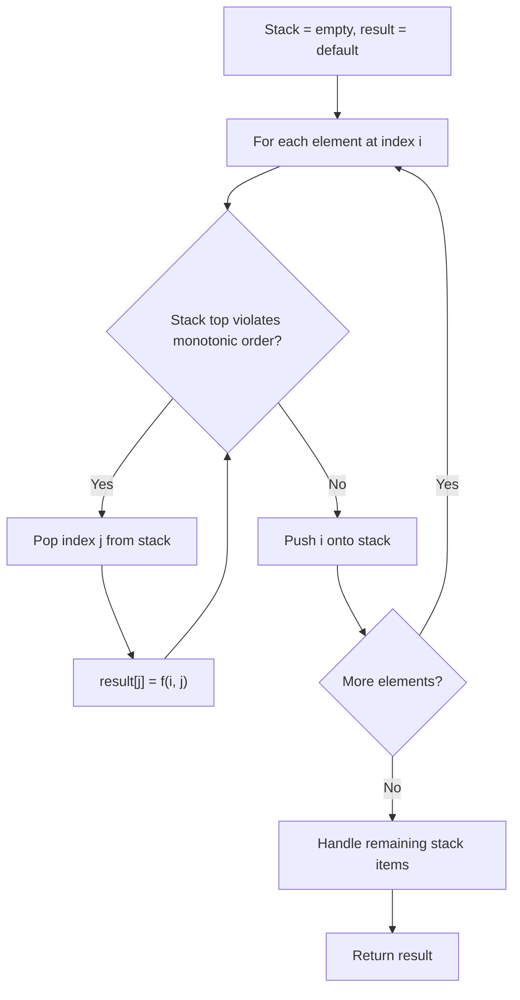
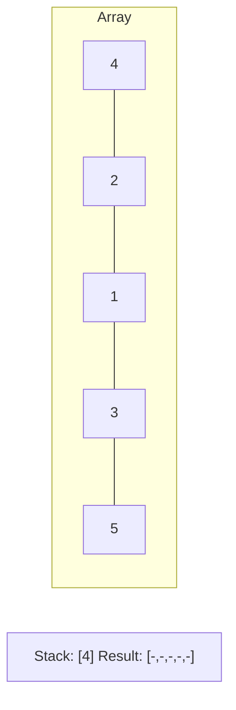
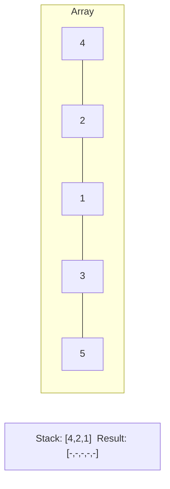
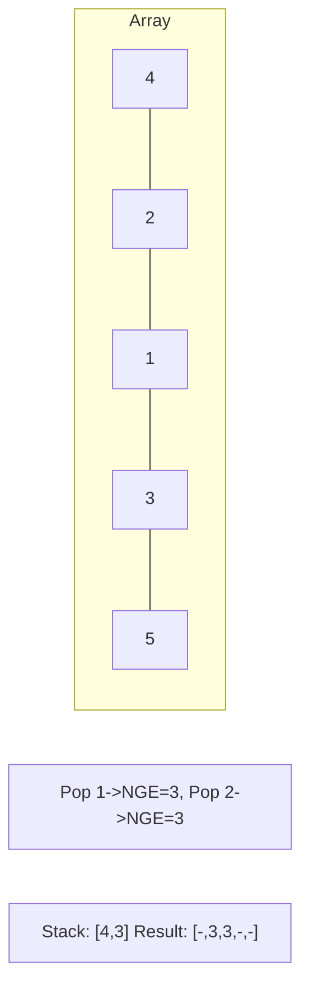
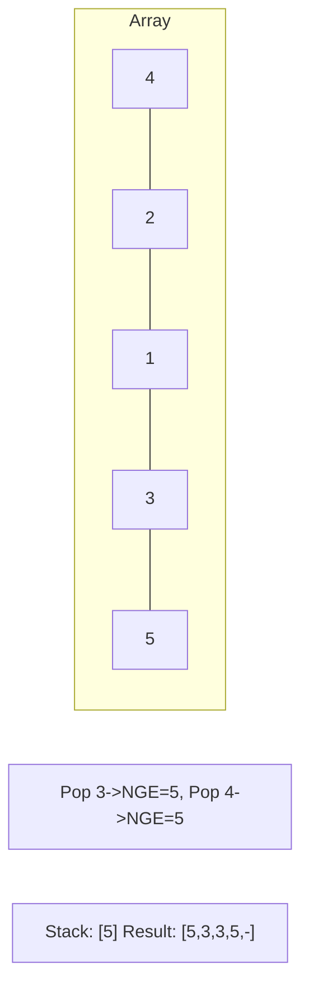

# Problem 496: Next Greater Element I

**Difficulty:** Easy  
**Tags:** Array, Hash Table, Stack, Monotonic Stack  
**Pattern:** Monotonic Stack  
**Link:** [leetcode.com/problems/next-greater-element-i](https://leetcode.com/problems/next-greater-element-i/)

## Description

The **next greater element** of some element `x` in an array is the **first greater** element that is **to the right** of `x` in the same array.

You are given two **distinct 0-indexed** integer arrays `nums1` and `nums2`, where `nums1` is a subset of `nums2`.

For each `0 <= i < nums1.length`, find the index `j` such that `nums1[i] == nums2[j]` and determine the **next greater element** of `nums2[j]` in `nums2`. If there is no next greater element, then the answer for this query is `-1`.

Return *an array *`ans`* of length *`nums1.length`* such that *`ans[i]`* is the **next greater element** as described above.*

 

Example 1:

```

**Input:** nums1 = [4,1,2], nums2 = [1,3,4,2]
**Output:** [-1,3,-1]
**Explanation:** The next greater element for each value of nums1 is as follows:
- 4 is underlined in nums2 = [1,3,4,2]. There is no next greater element, so the answer is -1.
- 1 is underlined in nums2 = [1,3,4,2]. The next greater element is 3.
- 2 is underlined in nums2 = [1,3,4,2]. There is no next greater element, so the answer is -1.

```

Example 2:

```

**Input:** nums1 = [2,4], nums2 = [1,2,3,4]
**Output:** [3,-1]
**Explanation:** The next greater element for each value of nums1 is as follows:
- 2 is underlined in nums2 = [1,2,3,4]. The next greater element is 3.
- 4 is underlined in nums2 = [1,2,3,4]. There is no next greater element, so the answer is -1.

```

 

**Constraints:**

	- `1 <= nums1.length <= nums2.length <= 1000`
	- `0 <= nums1[i], nums2[i] <= 10^4`
	- All integers in `nums1` and `nums2` are **unique**.
	- All the integers of `nums1` also appear in `nums2`.

 

**Follow up:** Could you find an `O(nums1.length + nums2.length)` solution?

## Approach: Monotonic Stack

Maintain a stack where elements are always in monotonic order (increasing or decreasing). When a new element violates the monotonic property, pop elements and compute results (e.g., next greater/smaller element, spans, areas).

## Pseudocode

```
1. Initialize empty stack, result array
2. For each element (index i):
   a. While stack not empty and arr[i] breaks monotonic order:
      - Pop index j from stack
      - result[j] = compute(i, j)
   b. Push i onto stack
3. Handle remaining elements in stack
4. Return result
```

## Algorithm Flow



## Visual State Transitions

**Monotonic Stack (Next Greater Element):**

**Frame 1: Process first elements**


**Frame 2: Push smaller elements**


**Frame 3: Element 3 pops 1 and 2**


**Frame 4: Element 5 pops all**



## Complexity Analysis

- **Time:** O(n)
- **Space:** O(n)

## Solution (Python3)

```python
class Solution:
    def nextGreaterElement(self, nums1: List[int], nums2: List[int]) -> List[int]:
        # Monotonic stack - O(n) time, O(n) space
        n = len(nums1)
        result = [0] * n
        stack = []  # indices
        for i in range(n):
            while stack and nums1[i] > nums1[stack[-1]]:
                idx = stack.pop()
                result[idx] = i - idx
            stack.append(i)
        return result
```

## Solution (C++)

```cpp
#include <stack>
#include <string>
#include <vector>
using namespace std;

class Solution {
public:
    vector<int> nextGreaterElement(vector<int>& nums1, vector<int>& nums2) {
        // Monotonic stack - O(n) time, O(n) space
        int n = nums1.size();
        vector<int> result(n, 0);
        stack<int> st;
        for (int i = 0; i < n; i++) {
            while (!st.empty() && nums1[i] > nums1[st.top()]) {
                int idx = st.top(); st.pop();
                result[idx] = i - idx;
            }
            st.push(i);
        }
        return result;
    }
};
```
