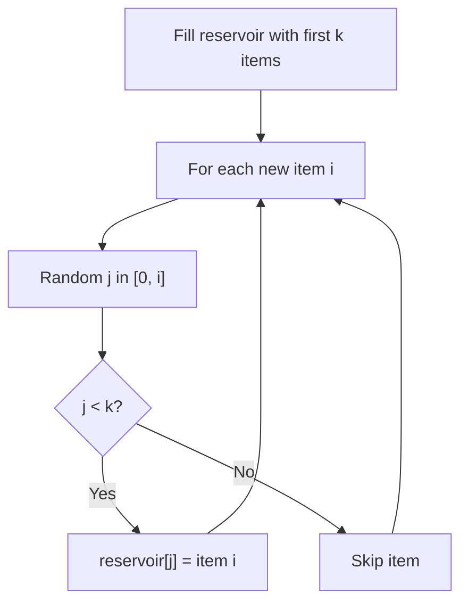

# Problem 497: Random Point in Non-overlapping Rectangles

**Difficulty:** Medium  
**Tags:** Array, Math, Binary Search, Reservoir Sampling, Prefix Sum, Ordered Set, Randomized  
**Pattern:** Reservoir Sampling  
**Link:** [leetcode.com/problems/random-point-in-non-overlapping-rectangles](https://leetcode.com/problems/random-point-in-non-overlapping-rectangles/)

## Description

You are given an array of non-overlapping axis-aligned rectangles `rects` where `rects[i] = [ai, bi, xi, yi]` indicates that `(ai, bi)` is the bottom-left corner point of the `i^th` rectangle and `(xi, yi)` is the top-right corner point of the `i^th` rectangle. Design an algorithm to pick a random integer point inside the space covered by one of the given rectangles. A point on the perimeter of a rectangle is included in the space covered by the rectangle.

Any integer point inside the space covered by one of the given rectangles should be equally likely to be returned.

**Note** that an integer point is a point that has integer coordinates.

Implement the `Solution` class:

	- `Solution(int[][] rects)` Initializes the object with the given rectangles `rects`.
	- `int[] pick()` Returns a random integer point `[u, v]` inside the space covered by one of the given rectangles.

 

Example 1:

```

**Input**
["Solution", "pick", "pick", "pick", "pick", "pick"]
[[[[-2, -2, 1, 1], [2, 2, 4, 6]]], [], [], [], [], []]
**Output**
[null, [1, -2], [1, -1], [-1, -2], [-2, -2], [0, 0]]

**Explanation**
Solution solution = new Solution([[-2, -2, 1, 1], [2, 2, 4, 6]]);
solution.pick(); // return [1, -2]
solution.pick(); // return [1, -1]
solution.pick(); // return [-1, -2]
solution.pick(); // return [-2, -2]
solution.pick(); // return [0, 0]

```

 

**Constraints:**

	- `1 <= rects.length <= 100`
	- `rects[i].length == 4`
	- `-10^9 <= ai < xi <= 10^9`
	- `-10^9 <= bi < yi <= 10^9`
	- `xi - ai <= 2000`
	- `yi - bi <= 2000`
	- All the rectangles do not overlap.
	- At most `10^4` calls will be made to `pick`.

## Approach: Reservoir Sampling

Select k random items from a stream of unknown length with uniform probability. Keep a reservoir of k items; replace items with decreasing probability.

## Pseudocode

```
1. Fill reservoir with first k items
2. For each subsequent item i (i >= k):
   a. Generate random j in [0, i]
   b. If j < k: replace reservoir[j] with item i
3. Return reservoir
```

## Algorithm Flow



## Complexity Analysis

- **Time:** O(n)
- **Space:** O(k)

## Solution (Python3)

```python
class Solution:
    def __init__(self, rects: List[List[int]]):
        # Initialize data structure
        self.rects = rects

    def pick(self) -> List[int]:
        return []

```

## Solution (C++)

```cpp
#include <cstdlib>
#include <ctime>
#include <string>
#include <vector>
using namespace std;

class Solution {
public:
    Solution(vector<vector<int>>& rects) {
        // Initialize
    }

    vector<int> pick() {
        return {};
    }

};
```
