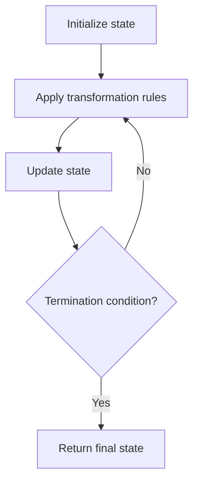

# Problem 498: Diagonal Traverse

**Difficulty:** Medium  
**Tags:** Array, Matrix, Simulation  
**Pattern:** Simulation  
**Link:** [leetcode.com/problems/diagonal-traverse](https://leetcode.com/problems/diagonal-traverse/)

## Description

Given an `m x n` matrix `mat`, return *an array of all the elements of the array in a diagonal order*.

 

Example 1:

```

**Input:** mat = [[1,2,3],[4,5,6],[7,8,9]]
**Output:** [1,2,4,7,5,3,6,8,9]

```

Example 2:

```

**Input:** mat = [[1,2],[3,4]]
**Output:** [1,2,3,4]

```

 

**Constraints:**

	- `m == mat.length`
	- `n == mat[i].length`
	- `1 <= m, n <= 10^4`
	- `1 <= m * n <= 10^4`
	- `-10^5 <= mat[i][j] <= 10^5`

## Approach: Simulation

Simulate the process described in the problem step by step. Follow the rules exactly, tracking state at each step.

## Pseudocode

```
1. Initialize state (grid, pointers, counters)
2. For each step / iteration:
   a. Apply the transformation rules
   b. Update state
   c. Check termination condition
3. Return final state or result
```

## Algorithm Flow



## Complexity Analysis

- **Time:** O(n) or O(n * k)
- **Space:** O(n)

## Solution (Python3)

```python
class Solution:
    def findDiagonalOrder(self, mat: List[List[int]]) -> List[int]:
        # Simulation approach - follow the rules step by step
        result = []
        for i in range(len(mat) if isinstance(mat, list) else mat):
            # Simulate each step
            pass
        return result
```

## Solution (C++)

```cpp
#include <string>
#include <vector>
using namespace std;

class Solution {
public:
    vector<int> findDiagonalOrder(vector<vector<int>>& mat) {
        // Simulation approach
        int n = mat.size();
        for (int i = 0; i < n; i++) {
            // Simulate each step
        }
        return {};
    }
};
```
