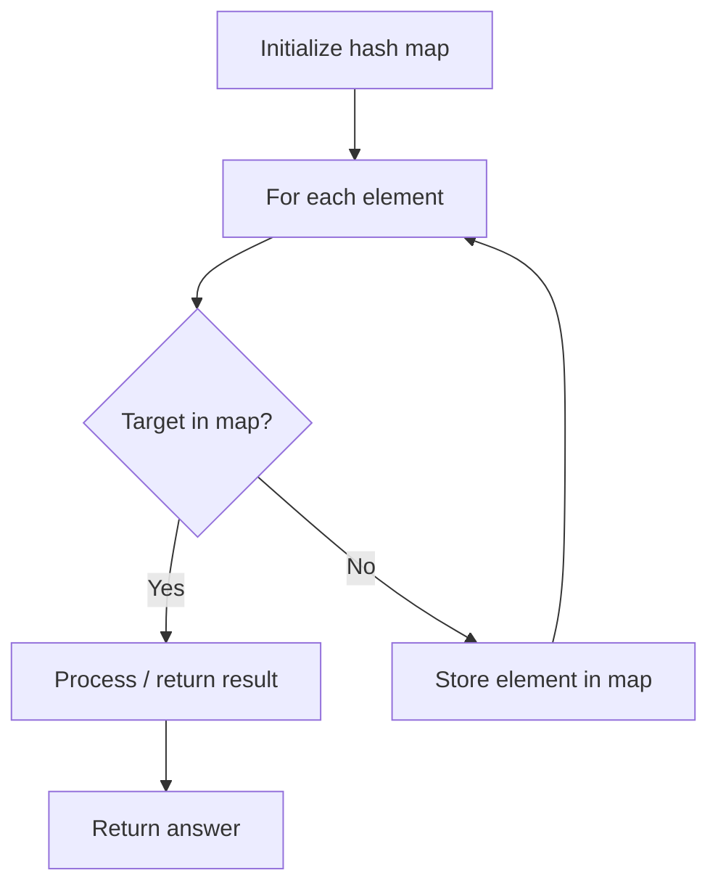

# Problem 500: Keyboard Row

**Difficulty:** Easy  
**Tags:** Array, Hash Table, String  
**Pattern:** Hash Map Lookup  
**Link:** [leetcode.com/problems/keyboard-row](https://leetcode.com/problems/keyboard-row/)

## Description

Given an array of strings `words`, return *the words that can be typed using letters of the alphabet on only one row of American keyboard like the image below*.

**Note** that the strings are **case-insensitive**, both lowercased and uppercased of the same letter are treated as if they are at the same row.

In the **American keyboard**:

	- the first row consists of the characters `"qwertyuiop"`,
	- the second row consists of the characters `"asdfghjkl"`, and
	- the third row consists of the characters `"zxcvbnm"`.

 

Example 1:

**Input:** words = ["Hello","Alaska","Dad","Peace"]

**Output:** ["Alaska","Dad"]

**Explanation:**

Both `"a"` and `"A"` are in the 2nd row of the American keyboard due to case insensitivity.

Example 2:

**Input:** words = ["omk"]

**Output:** []

Example 3:

**Input:** words = ["adsdf","sfd"]

**Output:** ["adsdf","sfd"]

 

**Constraints:**

	- `1 <= words.length <= 20`
	- `1 <= words[i].length <= 100`
	- `words[i]` consists of English letters (both lowercase and uppercase).

## Approach: Hash Map Lookup

Use a hash map (dictionary) to store elements for O(1) lookup. Iterate through the input, checking membership or counting frequencies in the map.

## Pseudocode

```
1. Initialize hash map
2. Iterate through elements:
   a. Check if target/complement exists in map
   b. If found: process result
   c. Otherwise: store element in map
3. Return result
```

## Algorithm Flow



## Complexity Analysis

- **Time:** O(n)
- **Space:** O(n)

## Solution (Python3)

```python
class Solution:
    def findWords(self, words: List[str]) -> List[str]:
        # Hash map approach - O(n) time, O(n) space
        seen = {}
        for i, val in enumerate(words):
            complement = words - val
            if complement in seen:
                return [seen[complement], i]
            seen[val] = i
        return []
```

## Solution (C++)

```cpp
#include <string>
#include <unordered_map>
#include <vector>
using namespace std;

class Solution {
public:
    vector<string> findWords(vector<string>& words) {
        // Hash map approach - O(n) time, O(n) space
        unordered_map<int, int> seen;
        for (int i = 0; i < words.size(); i++) {
            int complement = words - words[i];
            if (seen.count(complement)) {
                return {seen[complement], i};
            }
            seen[words[i]] = i;
        }
        return {};
    }
};
```
