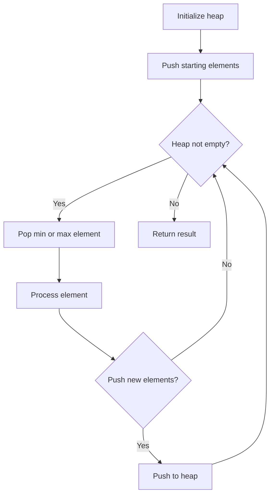
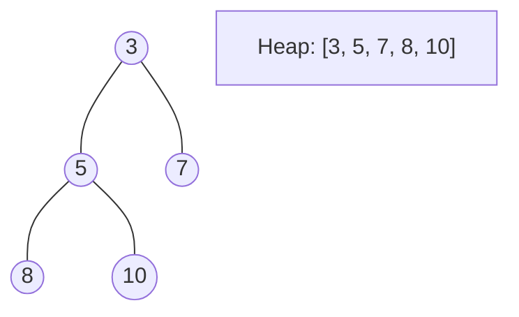
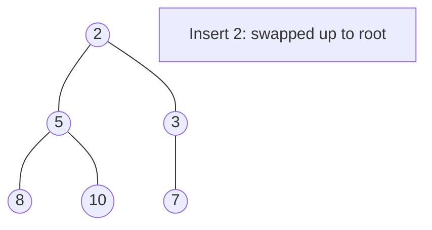
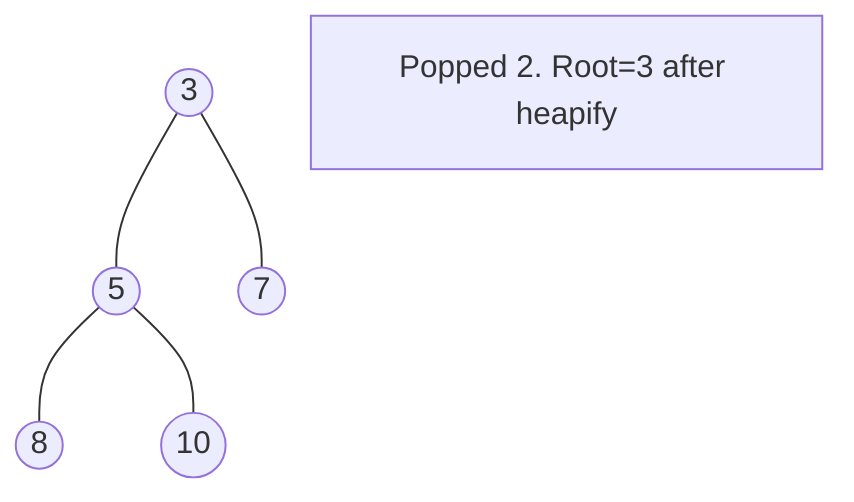

# Problem 502: IPO

**Difficulty:** Hard  
**Tags:** Array, Greedy, Sorting, Heap (Priority Queue)  
**Pattern:** Heap / Priority Queue  
**Link:** [leetcode.com/problems/ipo](https://leetcode.com/problems/ipo/)

## Description

Suppose LeetCode will start its **IPO** soon. In order to sell a good price of its shares to Venture Capital, LeetCode would like to work on some projects to increase its capital before the **IPO**. Since it has limited resources, it can only finish at most `k` distinct projects before the **IPO**. Help LeetCode design the best way to maximize its total capital after finishing at most `k` distinct projects.

You are given `n` projects where the `i^th` project has a pure profit `profits[i]` and a minimum capital of `capital[i]` is needed to start it.

Initially, you have `w` capital. When you finish a project, you will obtain its pure profit and the profit will be added to your total capital.

Pick a list of **at most** `k` distinct projects from given projects to **maximize your final capital**, and return *the final maximized capital*.

The answer is guaranteed to fit in a 32-bit signed integer.

 

Example 1:

```

**Input:** k = 2, w = 0, profits = [1,2,3], capital = [0,1,1]
**Output:** 4
**Explanation:** Since your initial capital is 0, you can only start the project indexed 0.
After finishing it you will obtain profit 1 and your capital becomes 1.
With capital 1, you can either start the project indexed 1 or the project indexed 2.
Since you can choose at most 2 projects, you need to finish the project indexed 2 to get the maximum capital.
Therefore, output the final maximized capital, which is 0 + 1 + 3 = 4.

```

Example 2:

```

**Input:** k = 3, w = 0, profits = [1,2,3], capital = [0,1,2]
**Output:** 6

```

 

**Constraints:**

	- `1 <= k <= 10^5`
	- `0 <= w <= 10^9`
	- `n == profits.length`
	- `n == capital.length`
	- `1 <= n <= 10^5`
	- `0 <= profits[i] <= 10^4`
	- `0 <= capital[i] <= 10^9`

## Approach: Heap / Priority Queue

Use a min-heap or max-heap to efficiently access the smallest/largest element. Push elements and pop the top to process in priority order.

## Pseudocode

```
1. Initialize heap (min or max)
2. Push initial elements onto heap
3. While heap not empty and condition:
   a. Pop top element (min or max)
   b. Process element
   c. Push new elements if needed
4. Return result
```

## Algorithm Flow



## Visual State Transitions

**Heap Operations (Min-Heap):**

**Frame 1: Initial heap**


**Frame 2: Insert 2 - bubble up**


**Frame 3: Pop minimum (2) - heapify down**



## Complexity Analysis

- **Time:** O(n log n)
- **Space:** O(n)

## Solution (Python3)

```python
class Solution:
    def findMaximizedCapital(self, k: int, w: int, profits: List[int], capital: List[int]) -> int:
        # Heap/Priority Queue - O(n log k) time
        import heapq
        if not k:
            return 0
        # Min heap (negate for max heap)
        heap = []
        for val in k:
            heapq.heappush(heap, val)
            if len(heap) > (w if isinstance(w, int) else len(k)):
                heapq.heappop(heap)
        return heap[0] if heap else 0
```

## Solution (C++)

```cpp
#include <queue>
#include <string>
#include <vector>
using namespace std;

class Solution {
public:
    int findMaximizedCapital(int k, int w, vector<int>& profits, vector<int>& capital) {
        // Heap/Priority Queue - O(n log k) time
        priority_queue<int, vector<int>, greater<int>> pq;
        for (int val : k) {
            pq.push(val);
            if ((int)pq.size() > w)
                pq.pop();
        }
        return pq.empty() ? 0 : pq.top();
    }
};
```
