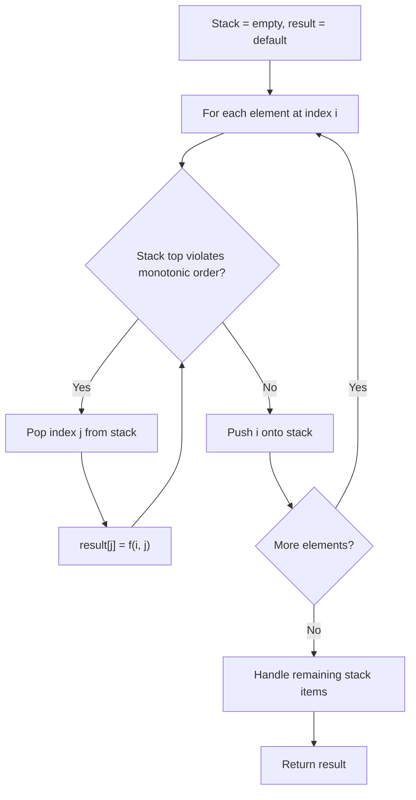
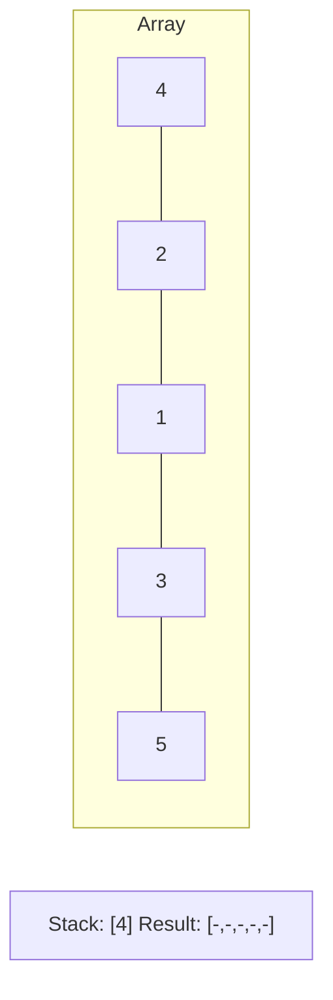
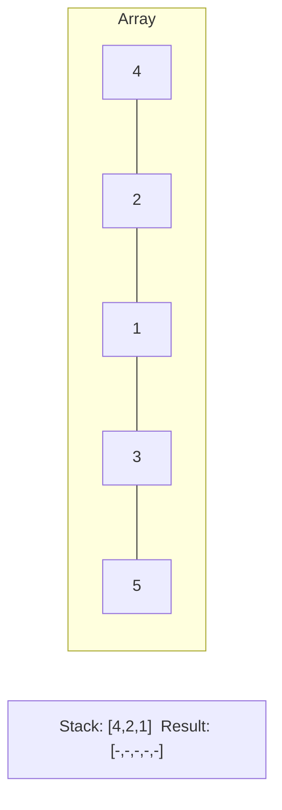
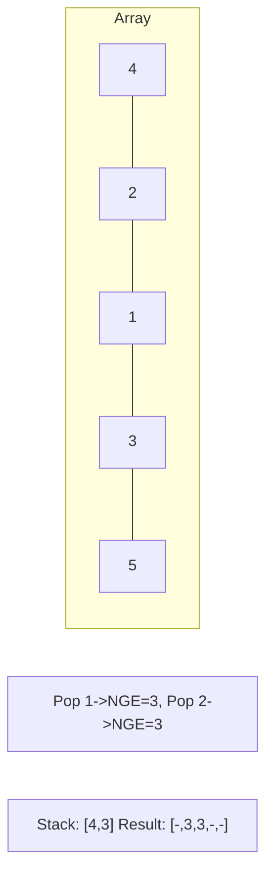
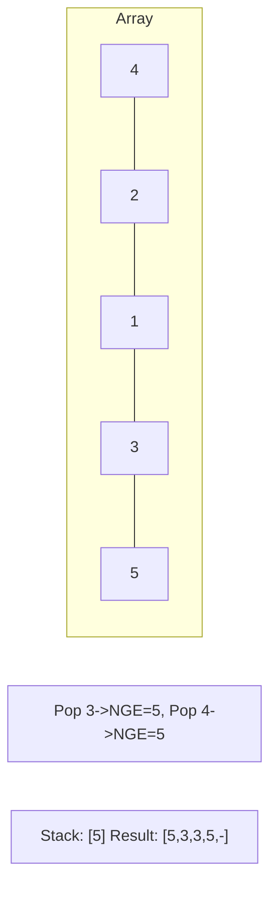

# Problem 503: Next Greater Element II

**Difficulty:** Medium  
**Tags:** Array, Stack, Monotonic Stack  
**Pattern:** Monotonic Stack (Circular)  
**Link:** [leetcode.com/problems/next-greater-element-ii](https://leetcode.com/problems/next-greater-element-ii/)

## Description

Given a circular integer array `nums` (i.e., the next element of `nums[nums.length - 1]` is `nums[0]`), return *the **next greater number** for every element in* `nums`.

The **next greater number** of a number `x` is the first greater number to its traversing-order next in the array, which means you could search circularly to find its next greater number. If it doesn't exist, return `-1` for this number.

 

Example 1:

```

**Input:** nums = [1,2,1]
**Output:** [2,-1,2]
Explanation: The first 1's next greater number is 2; 
The number 2 can't find next greater number. 
The second 1's next greater number needs to search circularly, which is also 2.

```

Example 2:

```

**Input:** nums = [1,2,3,4,3]
**Output:** [2,3,4,-1,4]

```

 

**Constraints:**

	- `1 <= nums.length <= 10^4`
	- `-10^9 <= nums[i] <= 10^9`

## Approach: Monotonic Stack (Circular)

Iterate twice through array (circular). Monotonic stack to find next greater element.

## Pseudocode

```
1. Initialize empty stack, result array
2. For each element (index i):
   a. While stack not empty and arr[i] breaks monotonic order:
      - Pop index j from stack
      - result[j] = compute(i, j)
   b. Push i onto stack
3. Handle remaining elements in stack
4. Return result
```

## Algorithm Flow



## Visual State Transitions

**Monotonic Stack (Next Greater Element):**

**Frame 1: Process first elements**


**Frame 2: Push smaller elements**


**Frame 3: Element 3 pops 1 and 2**


**Frame 4: Element 5 pops all**



## Complexity Analysis

- **Time:** O(n)
- **Space:** O(n)

## Solution (Python3)

```python
class Solution:
    def nextGreaterElements(self, nums: list[int]) -> list[int]:
        n = len(nums)
        result = [-1] * n
        stack = []
        for i in range(2 * n):
            while stack and nums[stack[-1]] < nums[i % n]:
                result[stack.pop()] = nums[i % n]
            if i < n:
                stack.append(i)
        return result
```

## Solution (C++)

```cpp
#include <stack>
#include <string>
#include <vector>
using namespace std;

class Solution {
public:
    vector<int> nextGreaterElements(vector<int>& nums) {
        // Monotonic stack - O(n) time, O(n) space
        int n = nums.size();
        vector<int> result(n, 0);
        stack<int> st;
        for (int i = 0; i < n; i++) {
            while (!st.empty() && nums[i] > nums[st.top()]) {
                int idx = st.top(); st.pop();
                result[idx] = i - idx;
            }
            st.push(i);
        }
        return result;
    }
};
```
