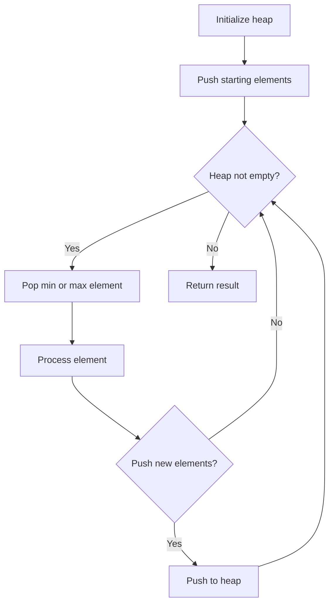
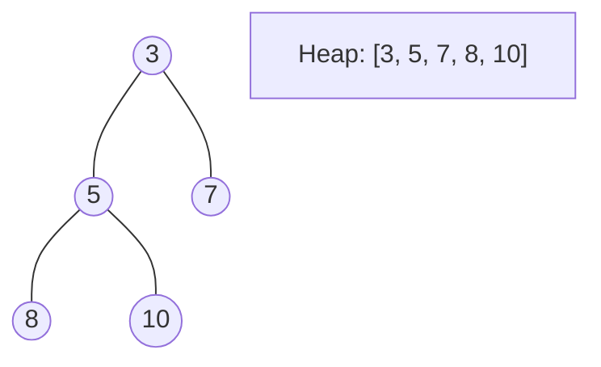
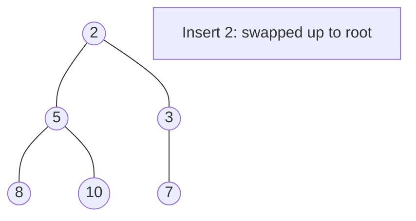
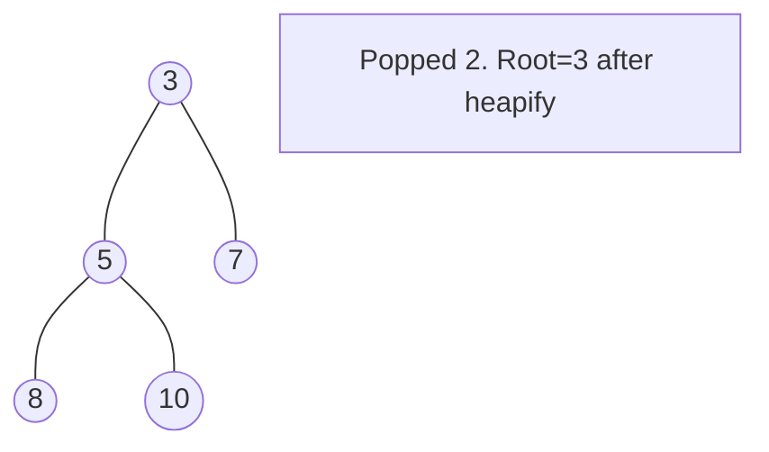

# Problem 506: Relative Ranks

**Difficulty:** Easy  
**Tags:** Array, Sorting, Heap (Priority Queue)  
**Pattern:** Heap / Priority Queue  
**Link:** [leetcode.com/problems/relative-ranks](https://leetcode.com/problems/relative-ranks/)

## Description

You are given an integer array `score` of size `n`, where `score[i]` is the score of the `i^th` athlete in a competition. All the scores are guaranteed to be **unique**.

The athletes are **placed** based on their scores, where the `1^st` place athlete has the highest score, the `2^nd` place athlete has the `2^nd` highest score, and so on. The placement of each athlete determines their rank:

	- The `1^st` place athlete's rank is `"Gold Medal"`.
	- The `2^nd` place athlete's rank is `"Silver Medal"`.
	- The `3^rd` place athlete's rank is `"Bronze Medal"`.
	- For the `4^th` place to the `n^th` place athlete, their rank is their placement number (i.e., the `x^th` place athlete's rank is `"x"`).

Return an array `answer` of size `n` where `answer[i]` is the **rank** of the `i^th` athlete.

 

Example 1:

```

**Input:** score = [5,4,3,2,1]
**Output:** ["Gold Medal","Silver Medal","Bronze Medal","4","5"]
**Explanation:** The placements are [1st, 2nd, 3rd, 4th, 5th].
```

Example 2:

```

**Input:** score = [10,3,8,9,4]
**Output:** ["Gold Medal","5","Bronze Medal","Silver Medal","4"]
**Explanation:** The placements are [1st, 5th, 3rd, 2nd, 4th].

```

 

**Constraints:**

	- `n == score.length`
	- `1 <= n <= 10^4`
	- `0 <= score[i] <= 10^6`
	- All the values in `score` are **unique**.

## Approach: Heap / Priority Queue

Use a min-heap or max-heap to efficiently access the smallest/largest element. Push elements and pop the top to process in priority order.

## Pseudocode

```
1. Initialize heap (min or max)
2. Push initial elements onto heap
3. While heap not empty and condition:
   a. Pop top element (min or max)
   b. Process element
   c. Push new elements if needed
4. Return result
```

## Algorithm Flow



## Visual State Transitions

**Heap Operations (Min-Heap):**

**Frame 1: Initial heap**


**Frame 2: Insert 2 - bubble up**


**Frame 3: Pop minimum (2) - heapify down**



## Complexity Analysis

- **Time:** O(n log n)
- **Space:** O(n)

## Solution (Python3)

```python
class Solution:
    def findRelativeRanks(self, score: List[int]) -> List[str]:
        # Heap/Priority Queue - O(n log k) time
        import heapq
        if not score:
            return []
        # Min heap (negate for max heap)
        heap = []
        for val in score:
            heapq.heappush(heap, val)
            if len(heap) > (score if isinstance(score, int) else len(score)):
                heapq.heappop(heap)
        return heap[0] if heap else []
```

## Solution (C++)

```cpp
#include <queue>
#include <string>
#include <vector>
using namespace std;

class Solution {
public:
    vector<string> findRelativeRanks(vector<int>& score) {
        // Heap/Priority Queue - O(n log k) time
        priority_queue<int, vector<int>, greater<int>> pq;
        for (int val : score) {
            pq.push(val);
            if ((int)pq.size() > score)
                pq.pop();
        }
        return pq.empty() ? {} : pq.top();
    }
};
```
