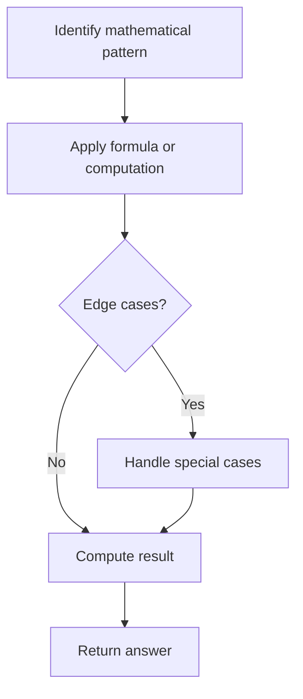

# Problem 507: Perfect Number

**Difficulty:** Easy  
**Tags:** Math  
**Pattern:** Math  
**Link:** [leetcode.com/problems/perfect-number](https://leetcode.com/problems/perfect-number/)

## Description

A **perfect number** is a **positive integer** that is equal to the sum of its **positive divisors**, excluding the number itself. A **divisor** of an integer `x` is an integer that can divide `x` evenly.

Given an integer `n`, return `true`* if *`n`* is a perfect number, otherwise return *`false`.

 

Example 1:

```

**Input:** num = 28
**Output:** true
**Explanation:** 28 = 1 + 2 + 4 + 7 + 14
1, 2, 4, 7, and 14 are all divisors of 28.

```

Example 2:

```

**Input:** num = 7
**Output:** false

```

 

**Constraints:**

	- `1 <= num <= 10^8`

## Approach: Math

Apply mathematical properties, formulas, or number-theoretic concepts. Look for patterns, modular arithmetic, or closed-form solutions.

## Pseudocode

```
1. Identify the mathematical pattern or formula
2. Apply computation:
   - Modular arithmetic for large numbers
   - GCD/LCM for divisibility
   - Sieve for primes
3. Handle edge cases
4. Return result
```

## Algorithm Flow



## Complexity Analysis

- **Time:** O(n) or O(sqrt(n))
- **Space:** O(1)

## Solution (Python3)

```python
class Solution:
    def checkPerfectNumber(self, num: int) -> bool:
        # Mathematical approach
        result = 0
        x = num
        while x != 0:
            result = result * 10 + x % 10
            x //= 10 if isinstance(x, int) else 1
        return result
```

## Solution (C++)

```cpp
#include <string>
#include <vector>
using namespace std;

class Solution {
public:
    bool checkPerfectNumber(int num) {
        // Mathematical approach
        long long result = 0;
        int x = num;
        while (x != 0) {
            result = result * 10 + x % 10;
            x /= 10;
        }
        return (int)result;
    }
};
```
