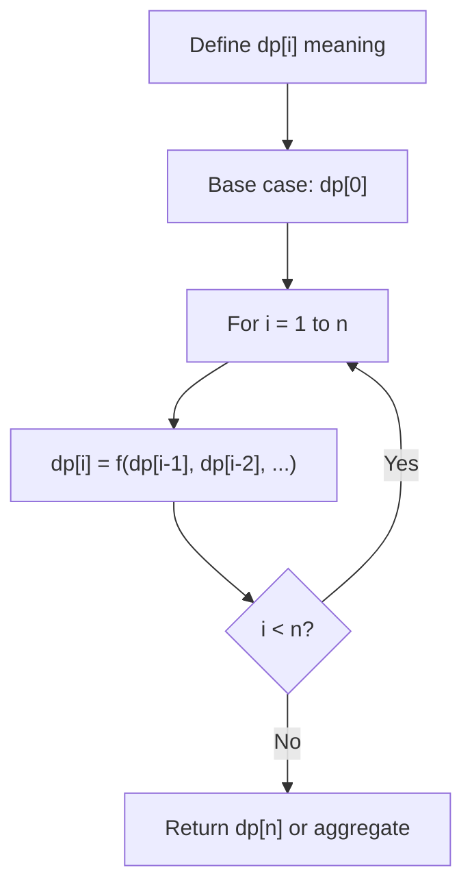
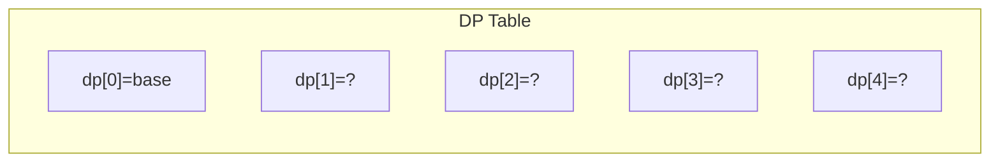
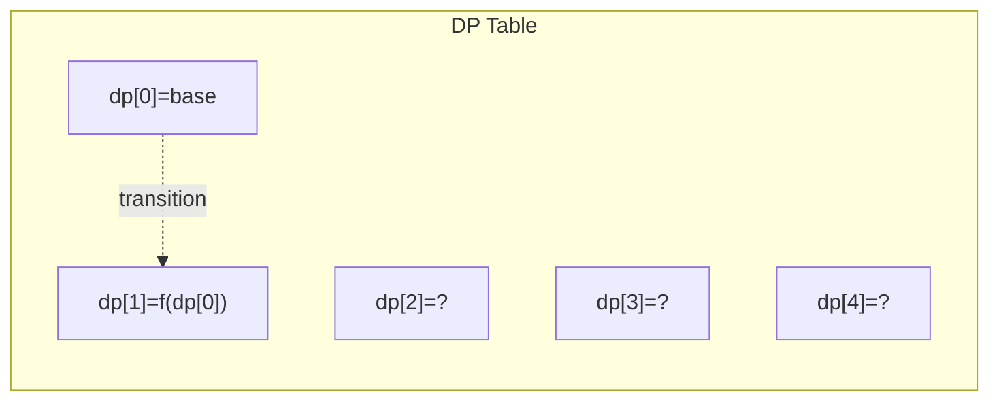
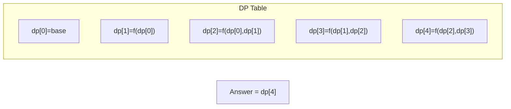

# Problem 509: Fibonacci Number

**Difficulty:** Easy  
**Tags:** Math, Dynamic Programming, Recursion, Memoization  
**Pattern:** Dynamic Programming (Fibonacci)  
**Link:** [leetcode.com/problems/fibonacci-number](https://leetcode.com/problems/fibonacci-number/)

## Description

The **Fibonacci numbers**, commonly denoted `F(n)` form a sequence, called the **Fibonacci sequence**, such that each number is the sum of the two preceding ones, starting from `0` and `1`. That is,

```

F(0) = 0, F(1) = 1
F(n) = F(n - 1) + F(n - 2), for n > 1.

```

Given `n`, calculate `F(n)`.

 

Example 1:

```

**Input:** n = 2
**Output:** 1
**Explanation:** F(2) = F(1) + F(0) = 1 + 0 = 1.

```

Example 2:

```

**Input:** n = 3
**Output:** 2
**Explanation:** F(3) = F(2) + F(1) = 1 + 1 = 2.

```

Example 3:

```

**Input:** n = 4
**Output:** 3
**Explanation:** F(4) = F(3) + F(2) = 2 + 1 = 3.

```

 

**Constraints:**

	- `0 <= n <= 30`

## Approach: Dynamic Programming (Fibonacci)

Iterative Fibonacci with two variables.

## Pseudocode

```
1. Define dp[i] = optimal value for subproblem i
2. Base case: dp[0] = initial value
3. For i from 1 to n:
   a. dp[i] = recurrence(dp[i-1], dp[i-2], ...)
4. Return dp[n] or max/min of dp
```

## Algorithm Flow



## Visual State Transitions

**1D Dynamic Programming Table Build:**

**Frame 1: Initialize base cases**


**Frame 2: Fill dp[1] from dp[0]**


**Frame 3: Fill remaining cells**



## Complexity Analysis

- **Time:** O(n)
- **Space:** O(1)

## Solution (Python3)

```python
class Solution:
    def fib(self, n: int) -> int:
        if n <= 1:
            return n
        a, b = 0, 1
        for _ in range(2, n + 1):
            a, b = b, a + b
        return b
```

## Solution (C++)

```cpp
#include <string>
#include <vector>
using namespace std;

class Solution {
public:
    int fib(int n) {
        // Dynamic programming (1D) - O(n) time, O(n) space
        int n = n;
        if (n <= 0) return 0;
        vector<int> dp(n + 1, 0);
        dp[0] = 1;
        for (int i = 1; i <= n; i++) {
            dp[i] = dp[i-1];
            if (i >= 2) dp[i] += dp[i-2];
        }
        return dp[n];
    }
};
```
