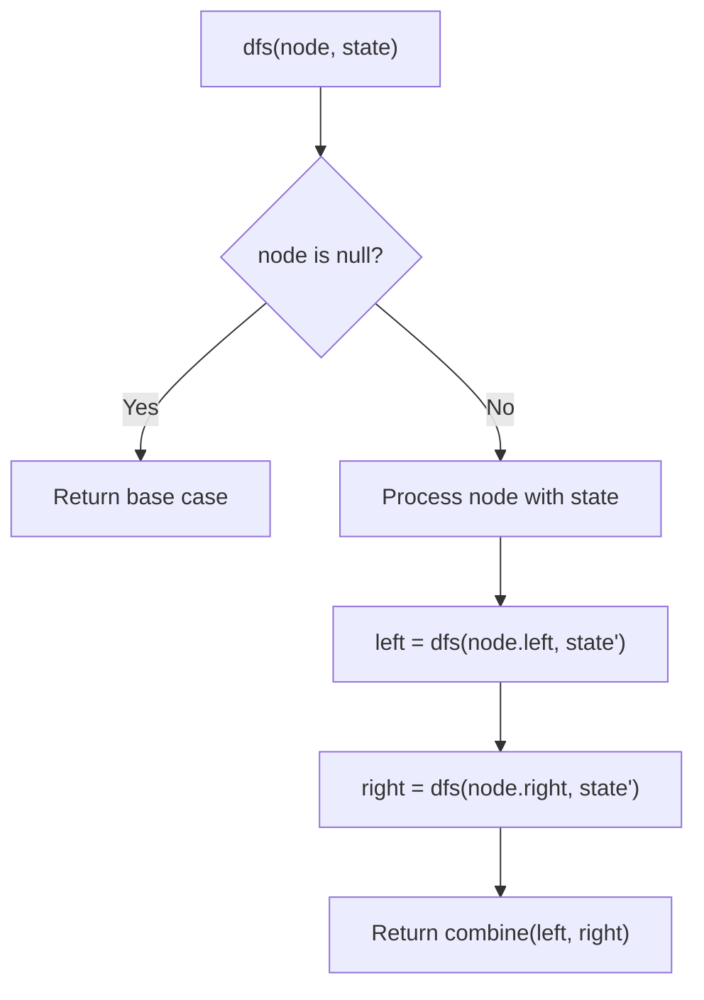
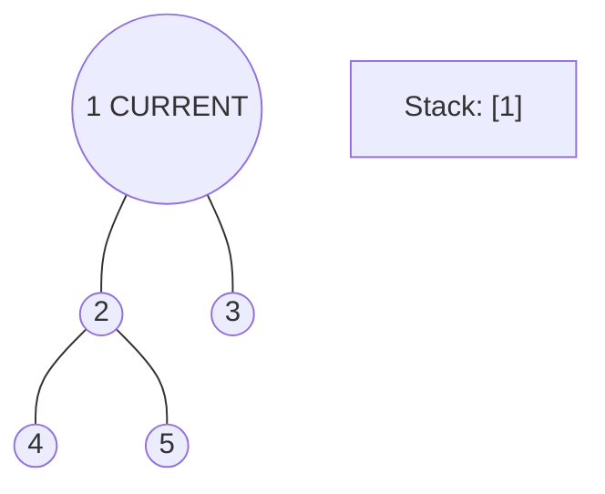
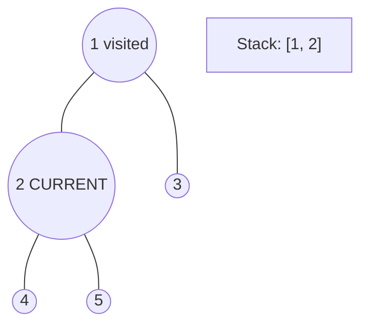
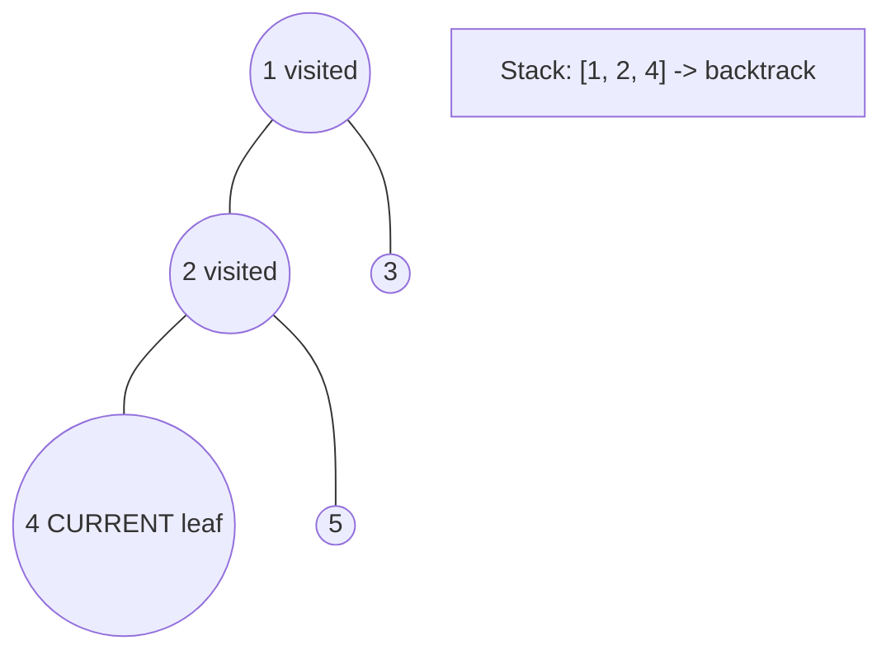
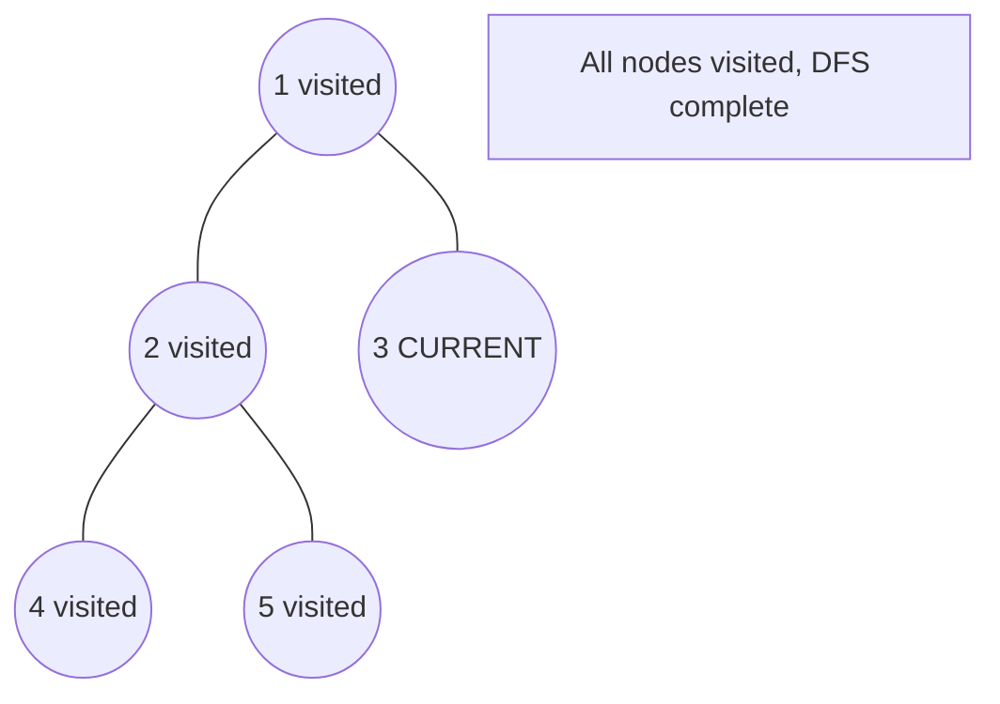

# Problem 513: Find Bottom Left Tree Value

**Difficulty:** Medium  
**Tags:** Tree, Depth-First Search, Breadth-First Search, Binary Tree  
**Pattern:** BFS / Tree  
**Link:** [leetcode.com/problems/find-bottom-left-tree-value](https://leetcode.com/problems/find-bottom-left-tree-value/)

## Description

Given the `root` of a binary tree, return the leftmost value in the last row of the tree.

 

Example 1:

```

**Input:** root = [2,1,3]
**Output:** 1

```

Example 2:

```

**Input:** root = [1,2,3,4,null,5,6,null,null,7]
**Output:** 7

```

 

**Constraints:**

	- The number of nodes in the tree is in the range `[1, 10^4]`.
	- `-2^31 <= Node.val <= 2^31 - 1`

## Approach: BFS / Tree

Level-order traversal. Track first node of each level. Last level's first node is answer.

## Pseudocode

```
1. Define dfs(node, state):
   a. Base case: if null, return default
   b. Process node with current state
   c. left_result = dfs(node.left, updated_state)
   d. right_result = dfs(node.right, updated_state)
   e. Return combine(left_result, right_result)
2. Return dfs(root, initial_state)
```

## Algorithm Flow



## Visual State Transitions

**DFS Tree Traversal Step-by-Step:**

**Frame 1: Start at root**


**Frame 2: Go left - visit node 2**


**Frame 3: Go left - visit node 4 (leaf)**


**Frame 4: Backtrack, visit node 5, then node 3**



## Complexity Analysis

- **Time:** O(n)
- **Space:** O(n)

## Solution (Python3)

```python
from collections import deque

class Solution:
    def findBottomLeftValue(self, root) -> int:
        queue = deque([root])
        result = root.val
        while queue:
            for i in range(len(queue)):
                node = queue.popleft()
                if i == 0:
                    result = node.val
                if node.left:
                    queue.append(node.left)
                if node.right:
                    queue.append(node.right)
        return result
```

## Solution (C++)

```cpp
#include <algorithm>
#include <functional>
#include <string>
#include <vector>
using namespace std;

class Solution {
public:
    int findBottomLeftValue(TreeNode* root) {
        // DFS on binary tree - O(n) time, O(h) space
        function<int(TreeNode*)> dfs = [&](TreeNode* node) -> int {
            if (!node) return 0;
            int left = dfs(node->left);
            int right = dfs(node->right);
            return 1 + max(left, right);
        };
        return dfs(root);
    }
};
```
