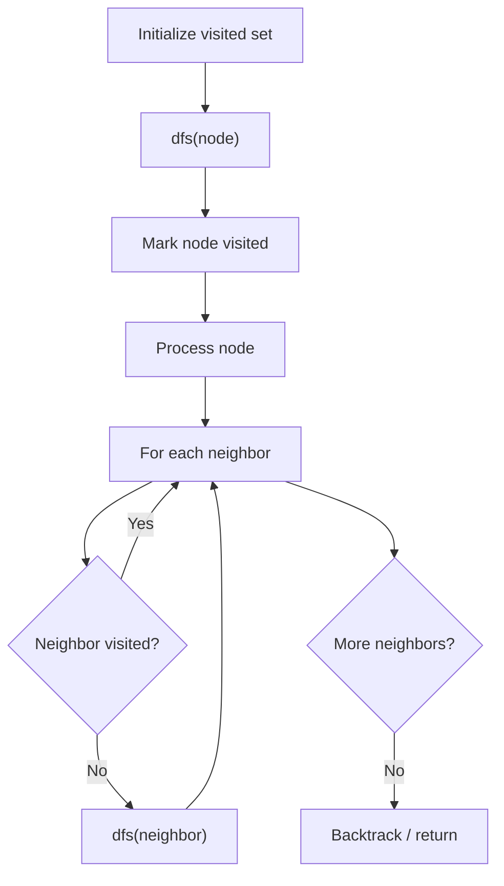

# Problem 514: Freedom Trail

**Difficulty:** Hard  
**Tags:** String, Dynamic Programming, Depth-First Search, Breadth-First Search  
**Pattern:** DFS Graph Traversal  
**Link:** [leetcode.com/problems/freedom-trail](https://leetcode.com/problems/freedom-trail/)

## Description

In the video game Fallout 4, the quest **"Road to Freedom"** requires players to reach a metal dial called the **"Freedom Trail Ring"** and use the dial to spell a specific keyword to open the door.

Given a string `ring` that represents the code engraved on the outer ring and another string `key` that represents the keyword that needs to be spelled, return *the minimum number of steps to spell all the characters in the keyword*.

Initially, the first character of the ring is aligned at the `"12:00"` direction. You should spell all the characters in `key` one by one by rotating `ring` clockwise or anticlockwise to make each character of the string key aligned at the `"12:00"` direction and then by pressing the center button.

At the stage of rotating the ring to spell the key character `key[i]`:

	- You can rotate the ring clockwise or anticlockwise by one place, which counts as **one step**. The final purpose of the rotation is to align one of `ring`'s characters at the `"12:00"` direction, where this character must equal `key[i]`.
	- If the character `key[i]` has been aligned at the `"12:00"` direction, press the center button to spell, which also counts as **one step**. After the pressing, you could begin to spell the next character in the key (next stage). Otherwise, you have finished all the spelling.

 

Example 1:

```

**Input:** ring = "godding", key = "gd"
**Output:** 4
**Explanation:**
For the first key character 'g', since it is already in place, we just need 1 step to spell this character. 
For the second key character 'd', we need to rotate the ring "godding" anticlockwise by two steps to make it become "ddinggo".
Also, we need 1 more step for spelling.
So the final output is 4.

```

Example 2:

```

**Input:** ring = "godding", key = "godding"
**Output:** 13

```

 

**Constraints:**

	- `1 <= ring.length, key.length <= 100`
	- `ring` and `key` consist of only lower case English letters.
	- It is guaranteed that `key` could always be spelled by rotating `ring`.

## Approach: DFS Graph Traversal

Explore the graph depth-first using recursion or a stack. Mark nodes as visited to avoid cycles. Process each node and explore all unvisited neighbors.

## Pseudocode

```
1. Initialize visited set
2. Define dfs(node):
   a. Mark node as visited
   b. Process node
   c. For each neighbor of node:
      - If not visited: dfs(neighbor)
3. Call dfs(start) for each unvisited node
```

## Algorithm Flow



## Complexity Analysis

- **Time:** O(V + E)
- **Space:** O(V)

## Solution (Python3)

```python
class Solution:
    def findRotateSteps(self, ring: str, key: str) -> int:
        # DFS on graph - O(V+E) time
        visited = set()
        result = []
        
        def dfs(node):
            if node in visited:
                return
            visited.add(node)
            result.append(node)
            # Traverse neighbors (adjust based on adjacency representation)
        
        dfs(0)
        return result if isinstance(0, list) else len(result)
```

## Solution (C++)

```cpp
#include <functional>
#include <string>
#include <vector>
using namespace std;

class Solution {
public:
    int findRotateSteps(string& ring, string& key) {
        // DFS on graph - O(V+E) time
        vector<bool> visited(ring.size(), false);
        vector<int> result;
        function<void(int)> dfs = [&](int node) {
            if (visited[node]) return;
            visited[node] = true;
            result.push_back(node);
            // Traverse neighbors
        };
        dfs(0);
        return result;
    }
};
```
