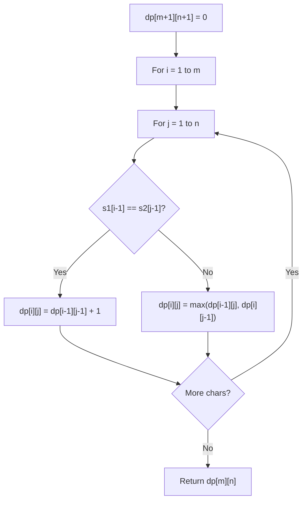

# Problem 516: Longest Palindromic Subsequence

**Difficulty:** Medium  
**Tags:** String, Dynamic Programming  
**Pattern:** Dynamic Programming  
**Link:** [leetcode.com/problems/longest-palindromic-subsequence](https://leetcode.com/problems/longest-palindromic-subsequence/)

## Description

Given a string `s`, find *the longest palindromic **subsequence**'s length in* `s`.

A **subsequence** is a sequence that can be derived from another sequence by deleting some or no elements without changing the order of the remaining elements.

 

Example 1:

```

**Input:** s = "bbbab"
**Output:** 4
**Explanation:** One possible longest palindromic subsequence is "bbbb".

```

Example 2:

```

**Input:** s = "cbbd"
**Output:** 2
**Explanation:** One possible longest palindromic subsequence is "bb".

```

 

**Constraints:**

	- `1 <= s.length <= 1000`
	- `s` consists only of lowercase English letters.

## Approach: Dynamic Programming

LPS is LCS of s and reverse(s). DP with space optimization.

## Pseudocode

```
1. Create dp[m+1][n+1]
2. Initialize base cases
3. For i from 1 to m:
   For j from 1 to n:
     If s1[i-1] == s2[j-1]: dp[i][j] = dp[i-1][j-1] + 1
     Else: dp[i][j] = best of (dp[i-1][j], dp[i][j-1], dp[i-1][j-1])
4. Return dp[m][n]
```

## Algorithm Flow



## Complexity Analysis

- **Time:** O(n^2)
- **Space:** O(n)

## Solution (Python3)

```python
class Solution:
    def longestPalindromeSubseq(self, s: str) -> int:
        n = len(s)
        dp = [0] * n
        for i in range(n - 1, -1, -1):
            new_dp = [0] * n
            new_dp[i] = 1
            for j in range(i + 1, n):
                if s[i] == s[j]:
                    new_dp[j] = dp[j-1] + 2
                else:
                    new_dp[j] = max(dp[j], new_dp[j-1])
            dp = new_dp
        return dp[n-1]
```

## Solution (C++)

```cpp
#include <algorithm>
#include <string>
#include <vector>
using namespace std;

class Solution {
public:
    int longestPalindromeSubseq(string& s) {
        // String DP - O(m*n) time and space
        int m = s.size(), n = s.size();
        vector<vector<int>> dp(m + 1, vector<int>(n + 1, 0));
        for (int i = 1; i <= m; i++) {
            for (int j = 1; j <= n; j++) {
                if (s[i-1] == s[j-1])
                    dp[i][j] = dp[i-1][j-1] + 1;
                else
                    dp[i][j] = max(dp[i-1][j], dp[i][j-1]);
            }
        }
        return dp[m][n];
    }
};
```
