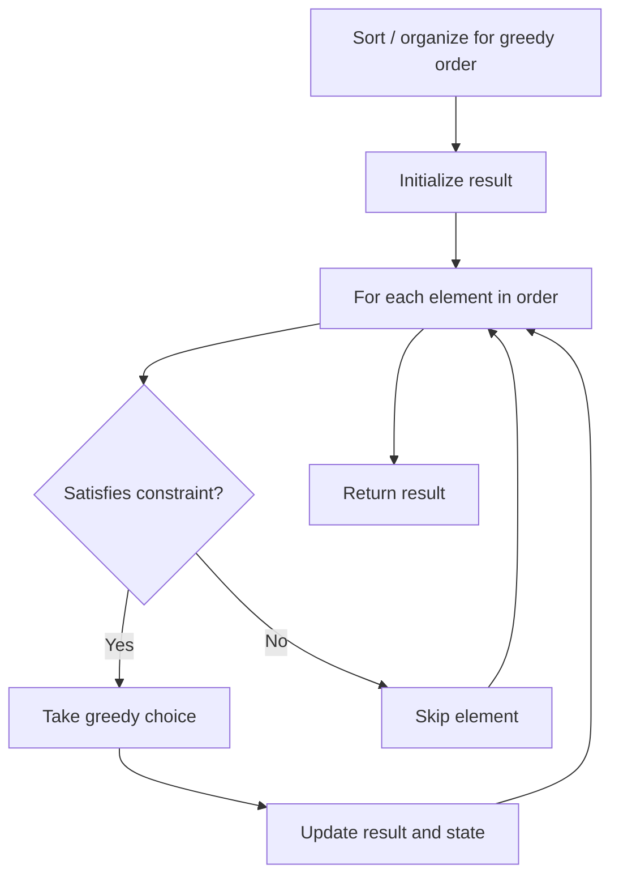

# Problem 517: Super Washing Machines

**Difficulty:** Hard  
**Tags:** Array, Greedy  
**Pattern:** Greedy  
**Link:** [leetcode.com/problems/super-washing-machines](https://leetcode.com/problems/super-washing-machines/)

## Description

You have `n` super washing machines on a line. Initially, each washing machine has some dresses or is empty.

For each move, you could choose any `m` (`1 <= m <= n`) washing machines, and pass one dress of each washing machine to one of its adjacent washing machines at the same time.

Given an integer array `machines` representing the number of dresses in each washing machine from left to right on the line, return *the minimum number of moves to make all the washing machines have the same number of dresses*. If it is not possible to do it, return `-1`.

 

Example 1:

```

**Input:** machines = [1,0,5]
**Output:** 3
**Explanation:**
1st move:    1     0 <-- 5    =>    1     1     4
2nd move:    1 <-- 1 <-- 4    =>    2     1     3
3rd move:    2     1 <-- 3    =>    2     2     2

```

Example 2:

```

**Input:** machines = [0,3,0]
**Output:** 2
**Explanation:**
1st move:    0 <-- 3     0    =>    1     2     0
2nd move:    1     2 --> 0    =>    1     1     1

```

Example 3:

```

**Input:** machines = [0,2,0]
**Output:** -1
**Explanation:**
It's impossible to make all three washing machines have the same number of dresses.

```

 

**Constraints:**

	- `n == machines.length`
	- `1 <= n <= 10^4`
	- `0 <= machines[i] <= 10^5`

## Approach: Greedy

Make the locally optimal choice at each step, trusting it leads to a global optimum. Greedy works when the problem has the greedy-choice property and optimal substructure.

## Pseudocode

```
1. Sort or organize data for greedy ordering
2. Initialize result
3. For each element in greedy order:
   a. If element satisfies constraint:
      - Take the greedy choice
      - Update result and state
4. Return result
```

## Algorithm Flow



## Complexity Analysis

- **Time:** O(n log n)
- **Space:** O(1)

## Solution (Python3)

```python
class Solution:
    def findMinMoves(self, machines: List[int]) -> int:
        # Greedy approach - O(n) time
        result = 0
        curr_max = 0
        for i in range(len(machines)):
            if isinstance(machines[i], int):
                curr_max = max(curr_max, machines[i])
                result = max(result, curr_max)
            else:
                result += 1
        return result
```

## Solution (C++)

```cpp
#include <algorithm>
#include <string>
#include <vector>
using namespace std;

class Solution {
public:
    int findMinMoves(vector<int>& machines) {
        // Greedy approach - O(n) time
        int result = 0, curr_max = 0;
        for (int i = 0; i < (int)machines.size(); i++) {
            curr_max = max(curr_max, machines[i]);
            result = max(result, curr_max);
        }
        return result;
    }
};
```
