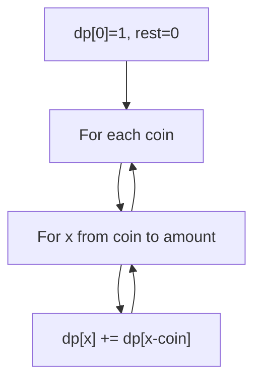
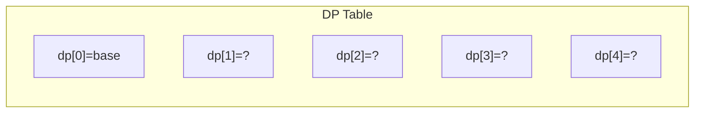
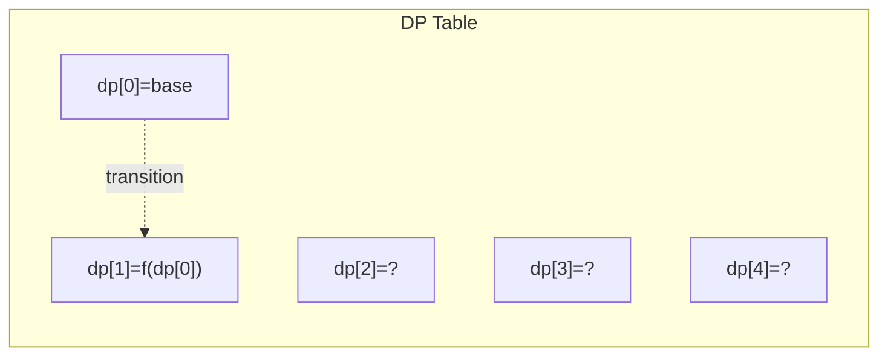
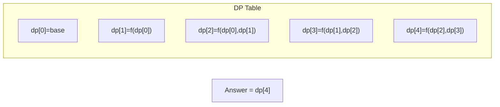

# Problem 518: Coin Change II

**Difficulty:** Medium  
**Tags:** Array, Dynamic Programming  
**Pattern:** Dynamic Programming (Unbounded Knapsack)  
**Link:** [leetcode.com/problems/coin-change-ii](https://leetcode.com/problems/coin-change-ii/)

## Description

You are given an integer array `coins` representing coins of different denominations and an integer `amount` representing a total amount of money.

Return *the number of combinations that make up that amount*. If that amount of money cannot be made up by any combination of the coins, return `0`.

You may assume that you have an infinite number of each kind of coin.

The answer is **guaranteed** to fit into a signed **32-bit** integer.

 

Example 1:

```

**Input:** amount = 5, coins = [1,2,5]
**Output:** 4
**Explanation:** there are four ways to make up the amount:
5=5
5=2+2+1
5=2+1+1+1
5=1+1+1+1+1

```

Example 2:

```

**Input:** amount = 3, coins = [2]
**Output:** 0
**Explanation:** the amount of 3 cannot be made up just with coins of 2.

```

Example 3:

```

**Input:** amount = 10, coins = [10]
**Output:** 1

```

 

**Constraints:**

	- `1 <= coins.length <= 300`
	- `1 <= coins[i] <= 5000`
	- All the values of `coins` are **unique**.
	- `0 <= amount <= 5000`

## Approach: Dynamic Programming (Unbounded Knapsack)

**Unbounded Knapsack:** dp[x] = number of ways to make amount x. Process coins in outer loop to avoid counting permutations.

## Pseudocode

```
1. Define dp[i] = optimal value for subproblem i
2. Base case: dp[0] = initial value
3. For i from 1 to n:
   a. dp[i] = recurrence(dp[i-1], dp[i-2], ...)
4. Return dp[n] or max/min of dp
```

## Algorithm Flow



## Visual State Transitions

**1D Dynamic Programming Table Build:**

**Frame 1: Initialize base cases**


**Frame 2: Fill dp[1] from dp[0]**


**Frame 3: Fill remaining cells**



## Complexity Analysis

- **Time:** O(n * amount)
- **Space:** O(amount)

## Solution (Python3)

```python
class Solution:
    def change(self, amount: int, coins: list[int]) -> int:
        dp = [0] * (amount + 1)
        dp[0] = 1
        for coin in coins:
            for x in range(coin, amount + 1):
                dp[x] += dp[x - coin]
        return dp[amount]
```

## Solution (C++)

```cpp
#include <string>
#include <vector>
using namespace std;

class Solution {
public:
    int change(int amount, vector<int>& coins) {
        // Dynamic programming (1D) - O(n) time, O(n) space
        int n = amount;
        if (n <= 0) return 0;
        vector<int> dp(n + 1, 0);
        dp[0] = 1;
        for (int i = 1; i <= n; i++) {
            dp[i] = dp[i-1];
            if (i >= 2) dp[i] += dp[i-2];
        }
        return dp[n];
    }
};
```
