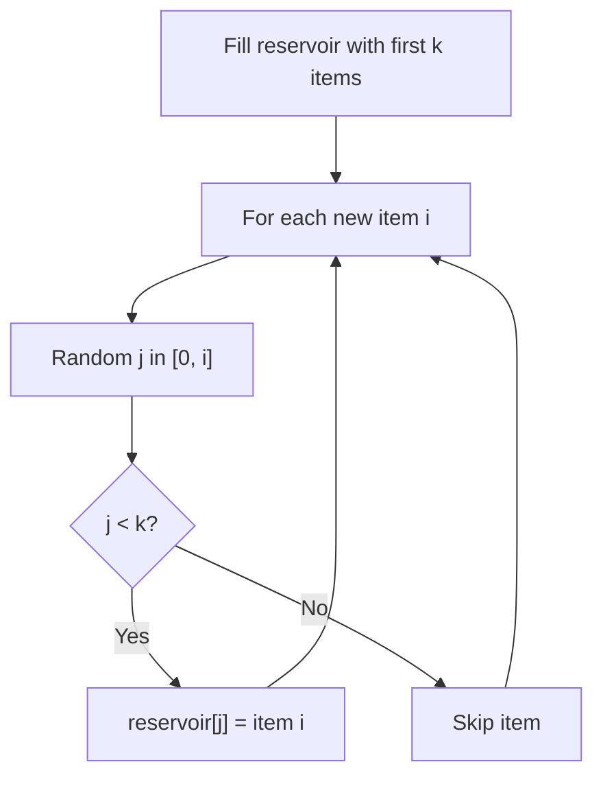

# Problem 519: Random Flip Matrix

**Difficulty:** Medium  
**Tags:** Hash Table, Math, Reservoir Sampling, Randomized  
**Pattern:** Reservoir Sampling  
**Link:** [leetcode.com/problems/random-flip-matrix](https://leetcode.com/problems/random-flip-matrix/)

## Description

There is an `m x n` binary grid `matrix` with all the values set `0` initially. Design an algorithm to randomly pick an index `(i, j)` where `matrix[i][j] == 0` and flips it to `1`. All the indices `(i, j)` where `matrix[i][j] == 0` should be equally likely to be returned.

Optimize your algorithm to minimize the number of calls made to the **built-in** random function of your language and optimize the time and space complexity.

Implement the `Solution` class:

	- `Solution(int m, int n)` Initializes the object with the size of the binary matrix `m` and `n`.
	- `int[] flip()` Returns a random index `[i, j]` of the matrix where `matrix[i][j] == 0` and flips it to `1`.
	- `void reset()` Resets all the values of the matrix to be `0`.

 

Example 1:

```

**Input**
["Solution", "flip", "flip", "flip", "reset", "flip"]
[[3, 1], [], [], [], [], []]
**Output**
[null, [1, 0], [2, 0], [0, 0], null, [2, 0]]

**Explanation**
Solution solution = new Solution(3, 1);
solution.flip();  // return [1, 0], [0,0], [1,0], and [2,0] should be equally likely to be returned.
solution.flip();  // return [2, 0], Since [1,0] was returned, [2,0] and [0,0]
solution.flip();  // return [0, 0], Based on the previously returned indices, only [0,0] can be returned.
solution.reset(); // All the values are reset to 0 and can be returned.
solution.flip();  // return [2, 0], [0,0], [1,0], and [2,0] should be equally likely to be returned.

```

 

**Constraints:**

	- `1 <= m, n <= 10^4`
	- There will be at least one free cell for each call to `flip`.
	- At most `1000` calls will be made to `flip` and `reset`.

## Approach: Reservoir Sampling

Select k random items from a stream of unknown length with uniform probability. Keep a reservoir of k items; replace items with decreasing probability.

## Pseudocode

```
1. Fill reservoir with first k items
2. For each subsequent item i (i >= k):
   a. Generate random j in [0, i]
   b. If j < k: replace reservoir[j] with item i
3. Return reservoir
```

## Algorithm Flow



## Complexity Analysis

- **Time:** O(n)
- **Space:** O(k)

## Solution (Python3)

```python
class Solution:
    def __init__(self, m: int, n: int):
        # Initialize data structure
        self.m = m
        self.n = n

    def flip(self) -> List[int]:
        return []

    def reset(self) -> None:
        return None

```

## Solution (C++)

```cpp
#include <cstdlib>
#include <ctime>
#include <string>
#include <vector>
using namespace std;

class Solution {
public:
    Solution(int m, int n) {
        // Initialize
    }

    vector<int> flip() {
        return {};
    }

    void reset() {
        return ;
    }

};
```
