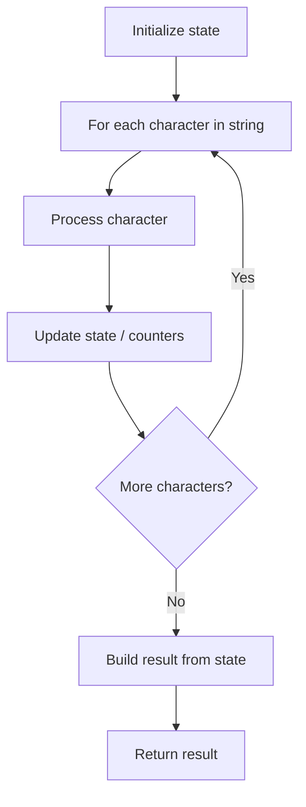

# Problem 520: Detect Capital

**Difficulty:** Easy  
**Tags:** String  
**Pattern:** String Processing  
**Link:** [leetcode.com/problems/detect-capital](https://leetcode.com/problems/detect-capital/)

## Description

We define the usage of capitals in a word to be right when one of the following cases holds:

	- All letters in this word are capitals, like `"USA"`.
	- All letters in this word are not capitals, like `"leetcode"`.
	- Only the first letter in this word is capital, like `"Google"`.

Given a string `word`, return `true` if the usage of capitals in it is right.

 

Example 1:

```
**Input:** word = "USA"
**Output:** true

```
Example 2:

```
**Input:** word = "FlaG"
**Output:** false

```

 

**Constraints:**

	- `1 <= word.length <= 100`
	- `word` consists of lowercase and uppercase English letters.

## Approach: String Processing

Process the string character by character. Common techniques: two pointers, sliding window, hash map for frequencies, stack for matching.

## Pseudocode

```
1. Initialize result / tracking state
2. Iterate through string characters:
   a. Process character based on rules
   b. Update state (counters, pointers, stack)
3. Build and return result
```

## Algorithm Flow



## Complexity Analysis

- **Time:** O(n)
- **Space:** O(n)

## Solution (Python3)

```python
class Solution:
    def detectCapitalUse(self, word: str) -> bool:
        # String processing approach - O(n) time
        result = []
        for ch in word:
            if ch.isalnum():
                result.append(ch.lower())
        # Check palindrome or process
        processed = ''.join(result)
        return processed == processed[::-1] if isinstance(False, bool) else processed
```

## Solution (C++)

```cpp
#include <algorithm>
#include <cctype>
#include <string>
#include <vector>
using namespace std;

class Solution {
public:
    bool detectCapitalUse(string& word) {
        // String processing approach - O(n) time
        string processed;
        for (char ch : word) {
            if (isalnum(ch)) {
                processed += tolower(ch);
            }
        }
        string rev = processed;
        reverse(rev.begin(), rev.end());
        return processed == rev;
    }
};
```
