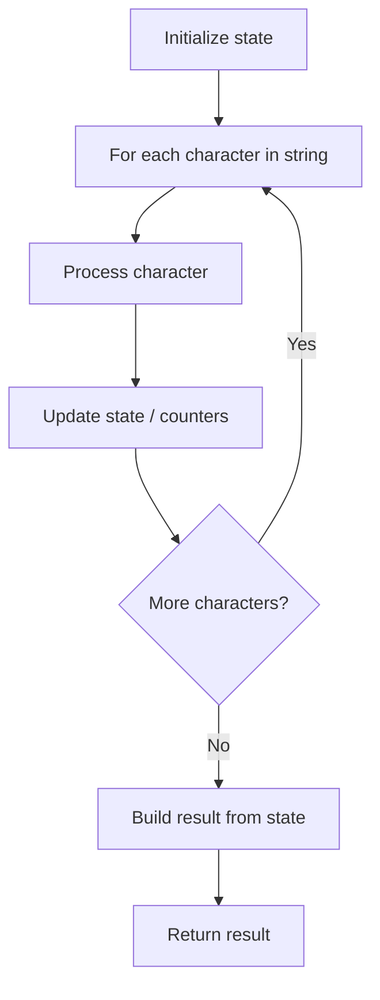

# Problem 521: Longest Uncommon Subsequence I

**Difficulty:** Easy  
**Tags:** String  
**Pattern:** String Processing  
**Link:** [leetcode.com/problems/longest-uncommon-subsequence-i](https://leetcode.com/problems/longest-uncommon-subsequence-i/)

## Description

Given two strings `a` and `b`, return *the length of the **longest uncommon subsequence** between *`a` *and* `b`. *If no such uncommon subsequence exists, return* `-1`*.*

An **uncommon subsequence** between two strings is a string that is a **subsequence of exactly one of them**.

 

Example 1:

```

**Input:** a = "aba", b = "cdc"
**Output:** 3
**Explanation:** One longest uncommon subsequence is "aba" because "aba" is a subsequence of "aba" but not "cdc".
Note that "cdc" is also a longest uncommon subsequence.

```

Example 2:

```

**Input:** a = "aaa", b = "bbb"
**Output:** 3
**Explanation:** The longest uncommon subsequences are "aaa" and "bbb".

```

Example 3:

```

**Input:** a = "aaa", b = "aaa"
**Output:** -1
**Explanation:** Every subsequence of string a is also a subsequence of string b. Similarly, every subsequence of string b is also a subsequence of string a. So the answer would be `-1`.

```

 

**Constraints:**

	- `1 <= a.length, b.length <= 100`
	- `a` and `b` consist of lower-case English letters.

## Approach: String Processing

Process the string character by character. Common techniques: two pointers, sliding window, hash map for frequencies, stack for matching.

## Pseudocode

```
1. Initialize result / tracking state
2. Iterate through string characters:
   a. Process character based on rules
   b. Update state (counters, pointers, stack)
3. Build and return result
```

## Algorithm Flow



## Complexity Analysis

- **Time:** O(n)
- **Space:** O(n)

## Solution (Python3)

```python
class Solution:
    def findLUSlength(self, a: str, b: str) -> int:
        # String processing approach - O(n) time
        result = []
        for ch in a:
            if ch.isalnum():
                result.append(ch.lower())
        # Check palindrome or process
        processed = ''.join(result)
        return processed == processed[::-1] if isinstance(0, bool) else processed
```

## Solution (C++)

```cpp
#include <algorithm>
#include <cctype>
#include <string>
#include <vector>
using namespace std;

class Solution {
public:
    int findLUSlength(string& a, string& b) {
        // String processing approach - O(n) time
        string processed;
        for (char ch : a) {
            if (isalnum(ch)) {
                processed += tolower(ch);
            }
        }
        string rev = processed;
        reverse(rev.begin(), rev.end());
        return processed == rev;
    }
};
```
