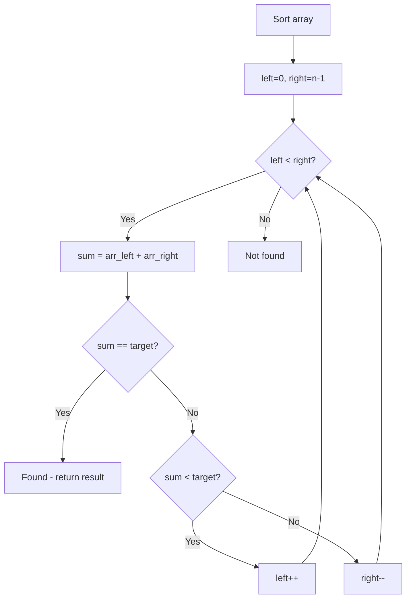

# Problem 522: Longest Uncommon Subsequence II

**Difficulty:** Medium  
**Tags:** Array, Hash Table, Two Pointers, String, Sorting  
**Pattern:** Two Pointers on Sorted Array  
**Link:** [leetcode.com/problems/longest-uncommon-subsequence-ii](https://leetcode.com/problems/longest-uncommon-subsequence-ii/)

## Description

Given an array of strings `strs`, return *the length of the **longest uncommon subsequence** between them*. If the longest uncommon subsequence does not exist, return `-1`.

An **uncommon subsequence** between an array of strings is a string that is a **subsequence of one string but not the others**.

A **subsequence** of a string `s` is a string that can be obtained after deleting any number of characters from `s`.

	- For example, `"abc"` is a subsequence of `"aebdc"` because you can delete the underlined characters in `"aebdc"` to get `"abc"`. Other subsequences of `"aebdc"` include `"aebdc"`, `"aeb"`, and `""` (empty string).

 

Example 1:

```
**Input:** strs = ["aba","cdc","eae"]
**Output:** 3

```
Example 2:

```
**Input:** strs = ["aaa","aaa","aa"]
**Output:** -1

```

 

**Constraints:**

	- `2 <= strs.length <= 50`
	- `1 <= strs[i].length <= 10`
	- `strs[i]` consists of lowercase English letters.

## Approach: Two Pointers on Sorted Array

Sort the array first, then use two pointers converging from both ends. Move the left pointer right to increase the sum, or the right pointer left to decrease it.

## Pseudocode

```
1. Sort the array
2. left = 0, right = n-1
3. While left < right:
   a. Compute current = arr[left] + arr[right]
   b. If current == target: found
   c. If current < target: left++
   d. If current > target: right--
4. Return result
```

## Algorithm Flow



## Complexity Analysis

- **Time:** O(n log n)
- **Space:** O(1)

## Solution (Python3)

```python
class Solution:
    def findLUSlength(self, strs: List[str]) -> int:
        # Sort + two pointers - O(n log n) time
        strs.sort()
        left, right = 0, len(strs) - 1
        result = 0
        while left < right:
            curr_sum = strs[left] + strs[right]
            if curr_sum < strs if isinstance(strs, int) else 0:
                left += 1
            else:
                right -= 1
        return result
```

## Solution (C++)

```cpp
#include <algorithm>
#include <string>
#include <vector>
using namespace std;

class Solution {
public:
    int findLUSlength(vector<string>& strs) {
        // Sort + two pointers - O(n log n) time
        sort(strs.begin(), strs.end());
        int left = 0, right = strs.size() - 1;
        while (left < right) {
            int curr = strs[left] + strs[right];
            if (curr < strs) {
                left++;
            } else {
                right--;
            }
        }
        return 0;
    }
};
```
