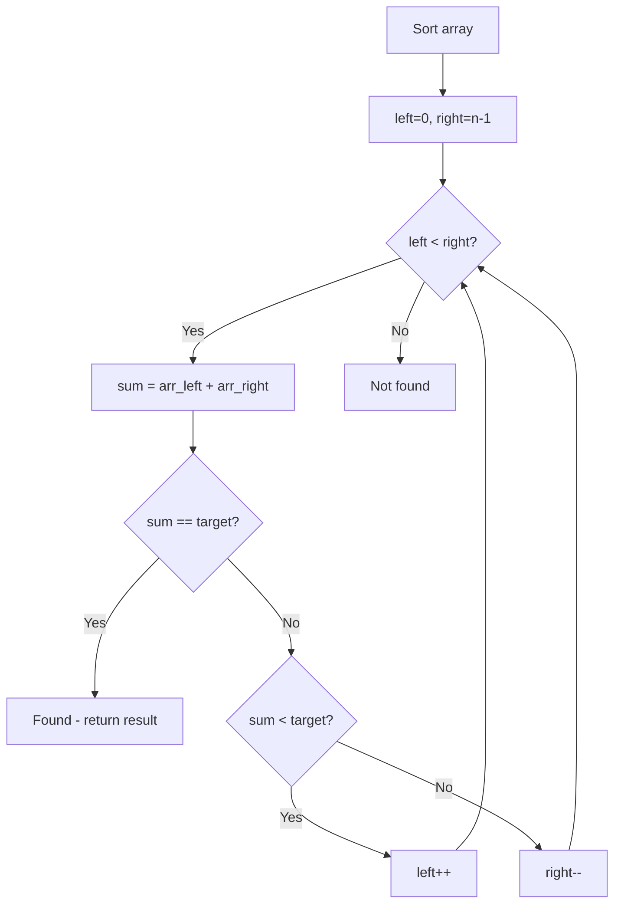

# Problem 524: Longest Word in Dictionary through Deleting

**Difficulty:** Medium  
**Tags:** Array, Two Pointers, String, Sorting  
**Pattern:** Two Pointers on Sorted Array  
**Link:** [leetcode.com/problems/longest-word-in-dictionary-through-deleting](https://leetcode.com/problems/longest-word-in-dictionary-through-deleting/)

## Description

Given a string `s` and a string array `dictionary`, return *the longest string in the dictionary that can be formed by deleting some of the given string characters*. If there is more than one possible result, return the longest word with the smallest lexicographical order. If there is no possible result, return the empty string.

 

Example 1:

```

**Input:** s = "abpcplea", dictionary = ["ale","apple","monkey","plea"]
**Output:** "apple"

```

Example 2:

```

**Input:** s = "abpcplea", dictionary = ["a","b","c"]
**Output:** "a"

```

 

**Constraints:**

	- `1 <= s.length <= 1000`
	- `1 <= dictionary.length <= 1000`
	- `1 <= dictionary[i].length <= 1000`
	- `s` and `dictionary[i]` consist of lowercase English letters.

## Approach: Two Pointers on Sorted Array

Sort the array first, then use two pointers converging from both ends. Move the left pointer right to increase the sum, or the right pointer left to decrease it.

## Pseudocode

```
1. Sort the array
2. left = 0, right = n-1
3. While left < right:
   a. Compute current = arr[left] + arr[right]
   b. If current == target: found
   c. If current < target: left++
   d. If current > target: right--
4. Return result
```

## Algorithm Flow



## Complexity Analysis

- **Time:** O(n log n)
- **Space:** O(1)

## Solution (Python3)

```python
class Solution:
    def findLongestWord(self, s: str, dictionary: List[str]) -> str:
        # Sort + two pointers - O(n log n) time
        s.sort()
        left, right = 0, len(s) - 1
        result = ""
        while left < right:
            curr_sum = s[left] + s[right]
            if curr_sum < dictionary if isinstance(dictionary, int) else 0:
                left += 1
            else:
                right -= 1
        return result
```

## Solution (C++)

```cpp
#include <algorithm>
#include <string>
#include <vector>
using namespace std;

class Solution {
public:
    string findLongestWord(string& s, vector<string>& dictionary) {
        // Sort + two pointers - O(n log n) time
        sort(s.begin(), s.end());
        int left = 0, right = s.size() - 1;
        while (left < right) {
            int curr = s[left] + s[right];
            if (curr < dictionary) {
                left++;
            } else {
                right--;
            }
        }
        return "";
    }
};
```
