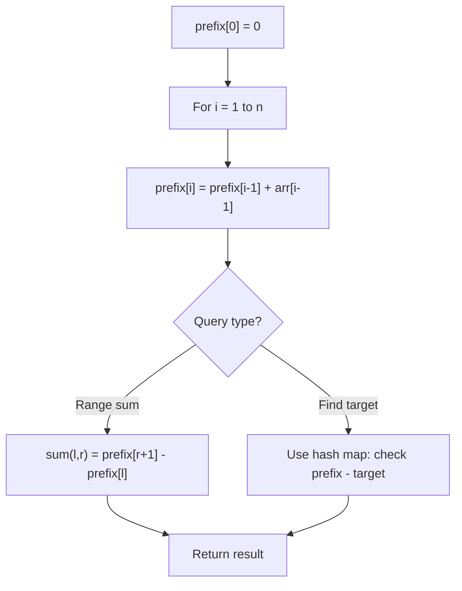

# Problem 525: Contiguous Array

**Difficulty:** Medium  
**Tags:** Array, Hash Table, Prefix Sum  
**Pattern:** Prefix Sum + Hash Map  
**Link:** [leetcode.com/problems/contiguous-array](https://leetcode.com/problems/contiguous-array/)

## Description

Given a binary array `nums`, return *the maximum length of a contiguous subarray with an equal number of *`0`* and *`1`.

 

Example 1:

```

**Input:** nums = [0,1]
**Output:** 2
**Explanation:** [0, 1] is the longest contiguous subarray with an equal number of 0 and 1.

```

Example 2:

```

**Input:** nums = [0,1,0]
**Output:** 2
**Explanation:** [0, 1] (or [1, 0]) is a longest contiguous subarray with equal number of 0 and 1.

```

Example 3:

```

**Input:** nums = [0,1,1,1,1,1,0,0,0]
**Output:** 6
**Explanation:** [1,1,1,0,0,0] is the longest contiguous subarray with equal number of 0 and 1.

```

 

**Constraints:**

	- `1 <= nums.length <= 10^5`
	- `nums[i]` is either `0` or `1`.

## Approach: Prefix Sum + Hash Map

Convert 0->-1, track running sum. Equal 0s and 1s means sum returns to same value.

## Pseudocode

```
1. Build prefix sum array: prefix[0]=0, prefix[i]=prefix[i-1]+arr[i-1]
2. Use prefix sums to answer queries:
   - Subarray sum [l..r] = prefix[r+1] - prefix[l]
   - Or use hash map to find prefix[j]-prefix[i] == target
3. Return result
```

## Algorithm Flow



## Complexity Analysis

- **Time:** O(n)
- **Space:** O(n)

## Solution (Python3)

```python
class Solution:
    def findMaxLength(self, nums: list[int]) -> int:
        count = 0
        max_len = 0
        map = {0: -1}
        for i, num in enumerate(nums):
            count += 1 if num == 1 else -1
            if count in map:
                max_len = max(max_len, i - map[count])
            else:
                map[count] = i
        return max_len
```

## Solution (C++)

```cpp
#include <algorithm>
#include <string>
#include <unordered_map>
#include <vector>
using namespace std;

class Solution {
public:
    int findMaxLength(vector<int>& nums) {
        // Prefix sum approach - O(n) time, O(n) space
        unordered_map<int, int> prefix;
        prefix[0] = -1;
        int curr_sum = 0, result = 0;
        int target = nums;
        for (int i = 0; i < (int)nums.size(); i++) {
            curr_sum += nums[i];
            if (prefix.count(curr_sum - target)) {
                result = max(result, i - prefix[curr_sum - target]);
            }
            if (!prefix.count(curr_sum)) {
                prefix[curr_sum] = i;
            }
        }
        return result;
    }
};
```
