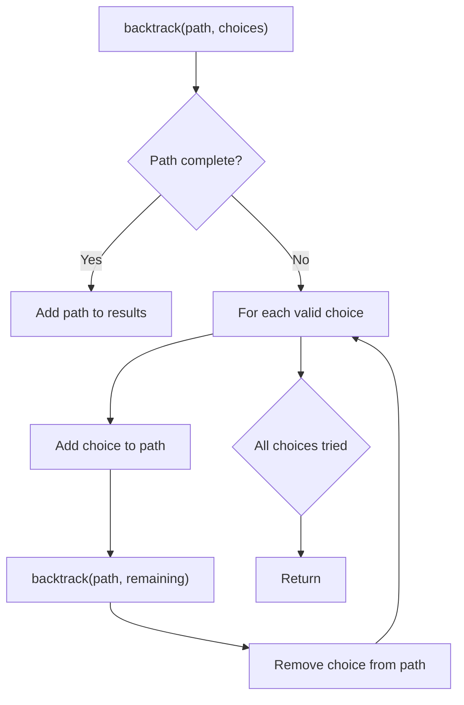
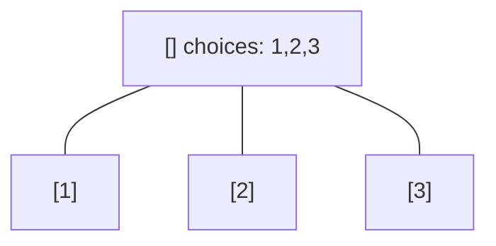
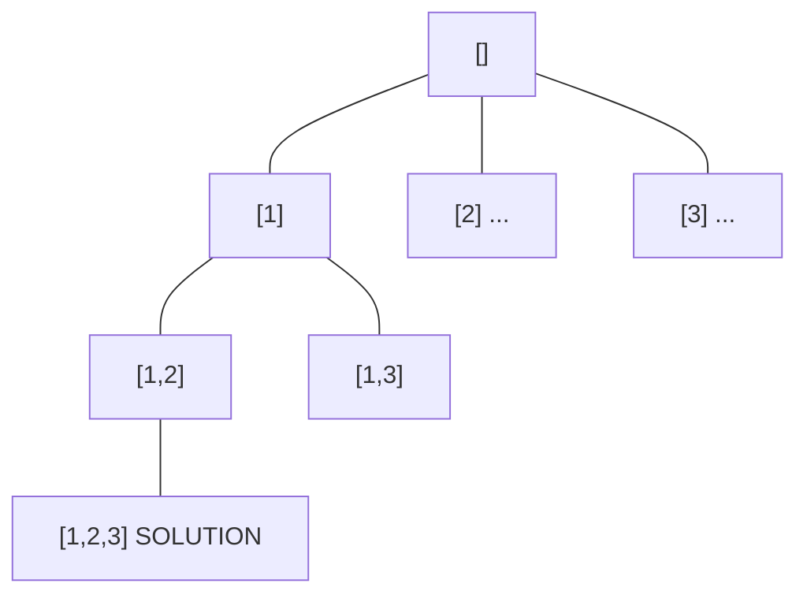
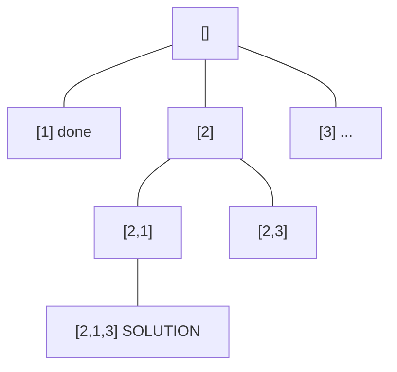
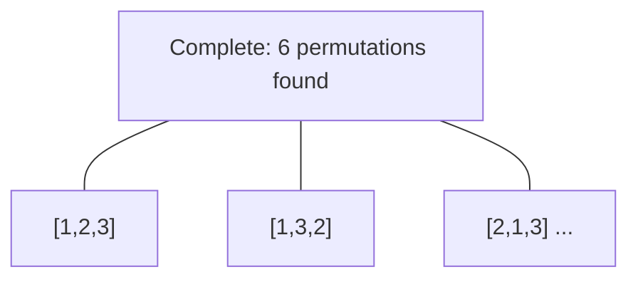

# Problem 526: Beautiful Arrangement

**Difficulty:** Medium  
**Tags:** Array, Dynamic Programming, Backtracking, Bit Manipulation, Bitmask  
**Pattern:** Backtracking  
**Link:** [leetcode.com/problems/beautiful-arrangement](https://leetcode.com/problems/beautiful-arrangement/)

## Description

Suppose you have `n` integers labeled `1` through `n`. A permutation of those `n` integers `perm` (**1-indexed**) is considered a **beautiful arrangement** if for every `i` (`1 <= i <= n`), **either** of the following is true:

	- `perm[i]` is divisible by `i`.
	- `i` is divisible by `perm[i]`.

Given an integer `n`, return *the **number** of the **beautiful arrangements** that you can construct*.

 

Example 1:

```

**Input:** n = 2
**Output:** 2
**Explanation:** 
The first beautiful arrangement is [1,2]:
    - perm[1] = 1 is divisible by i = 1
    - perm[2] = 2 is divisible by i = 2
The second beautiful arrangement is [2,1]:
    - perm[1] = 2 is divisible by i = 1
    - i = 2 is divisible by perm[2] = 1

```

Example 2:

```

**Input:** n = 1
**Output:** 1

```

 

**Constraints:**

	- `1 <= n <= 15`

## Approach: Backtracking

Explore all possible solutions by building candidates incrementally. At each step, make a choice and recurse. If the choice leads to a dead end, undo the choice (backtrack) and try the next option.

## Pseudocode

```
1. Define backtrack(path, choices):
   a. If path is a complete solution: add to results
   b. For each choice in choices:
      - If choice is valid:
        * Add choice to path
        * backtrack(path, remaining_choices)
        * Remove choice from path (backtrack)
2. Call backtrack([], all_choices)
```

## Algorithm Flow



## Visual State Transitions

**Backtracking Decision Tree:**

**Frame 1: Root - start with empty path**


**Frame 2: Explore branch [1]**


**Frame 3: Backtrack, explore [2]**


**Frame 4: All solutions found**



## Complexity Analysis

- **Time:** O(k^n) or O(n!)
- **Space:** O(n)

## Solution (Python3)

```python
class Solution:
    def countArrangement(self, n: int) -> int:
        # Backtracking - O(2^n) or O(n!) time
        result = []
        
        def backtrack(path, start):
            result.append(path[:])
            for i in range(start, len(n)):
                path.append(n[i])
                backtrack(path, i + 1)
                path.pop()
        
        backtrack([], 0)
        return result
```

## Solution (C++)

```cpp
#include <functional>
#include <string>
#include <vector>
using namespace std;

class Solution {
public:
    int countArrangement(int n) {
        // Backtracking - O(2^n) or O(n!) time
        vector<vector<int>> result;
        vector<int> path;
        function<void(int)> backtrack = [&](int start) {
            result.push_back(path);
            for (int i = start; i < (int)n.size(); i++) {
                path.push_back(n[i]);
                backtrack(i + 1);
                path.pop_back();
            }
        };
        backtrack(0);
        return result;
    }
};
```
