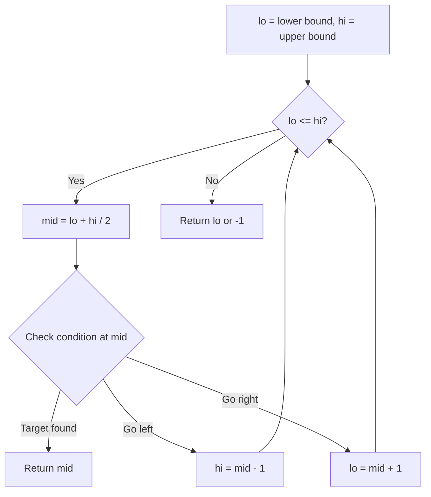
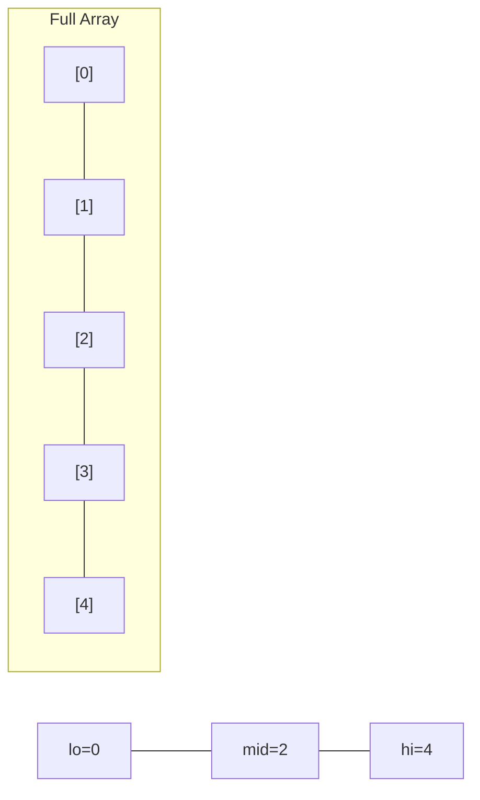
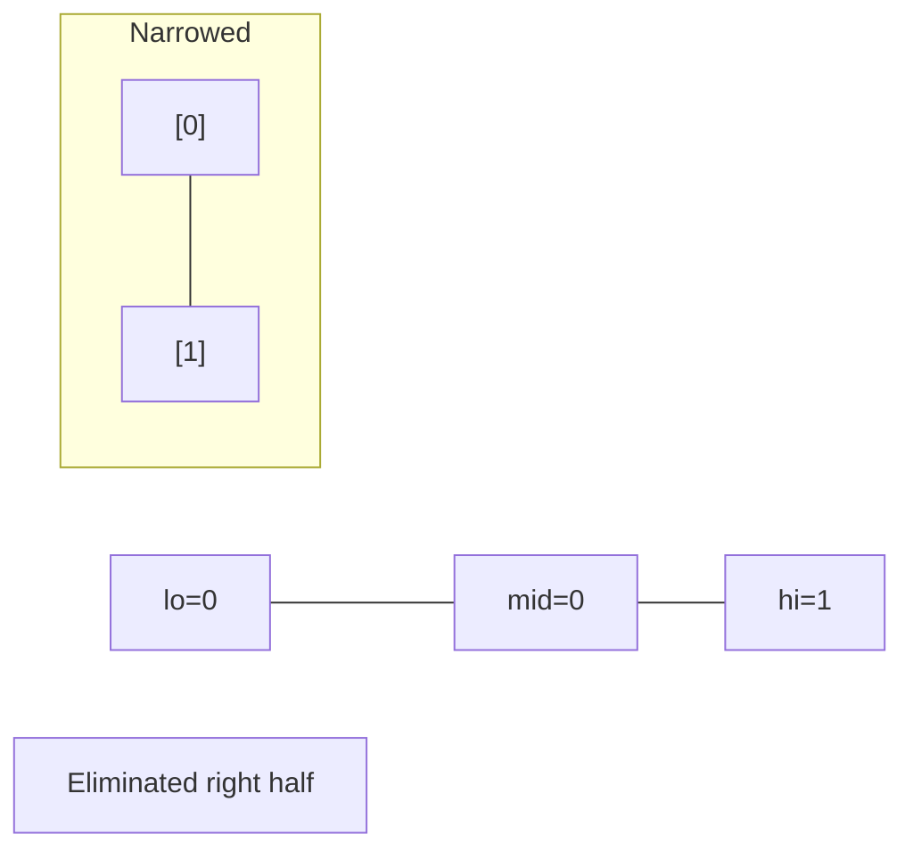
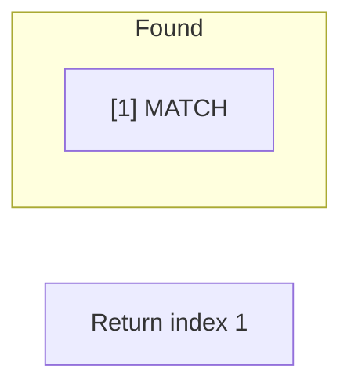

# Problem 528: Random Pick with Weight

**Difficulty:** Medium  
**Tags:** Array, Math, Binary Search, Prefix Sum, Randomized  
**Pattern:** Binary Search  
**Link:** [leetcode.com/problems/random-pick-with-weight](https://leetcode.com/problems/random-pick-with-weight/)

## Description

You are given a **0-indexed** array of positive integers `w` where `w[i]` describes the **weight** of the `i^th` index.

You need to implement the function `pickIndex()`, which **randomly** picks an index in the range `[0, w.length - 1]` (**inclusive**) and returns it. The **probability** of picking an index `i` is `w[i] / sum(w)`.

	- For example, if `w = [1, 3]`, the probability of picking index `0` is `1 / (1 + 3) = 0.25` (i.e., `25%`), and the probability of picking index `1` is `3 / (1 + 3) = 0.75` (i.e., `75%`).

 

Example 1:

```

**Input**
["Solution","pickIndex"]
[[[1]],[]]
**Output**
[null,0]

**Explanation**
Solution solution = new Solution([1]);
solution.pickIndex(); // return 0. The only option is to return 0 since there is only one element in w.

```

Example 2:

```

**Input**
["Solution","pickIndex","pickIndex","pickIndex","pickIndex","pickIndex"]
[[[1,3]],[],[],[],[],[]]
**Output**
[null,1,1,1,1,0]

**Explanation**
Solution solution = new Solution([1, 3]);
solution.pickIndex(); // return 1. It is returning the second element (index = 1) that has a probability of 3/4.
solution.pickIndex(); // return 1
solution.pickIndex(); // return 1
solution.pickIndex(); // return 1
solution.pickIndex(); // return 0. It is returning the first element (index = 0) that has a probability of 1/4.

Since this is a randomization problem, multiple answers are allowed.
All of the following outputs can be considered correct:
[null,1,1,1,1,0]
[null,1,1,1,1,1]
[null,1,1,1,0,0]
[null,1,1,1,0,1]
[null,1,0,1,0,0]
......
and so on.

```

 

**Constraints:**

	- `1 <= w.length <= 10^4`
	- `1 <= w[i] <= 10^5`
	- `pickIndex` will be called at most `10^4` times.

## Approach: Binary Search

Use binary search to halve the search space each iteration. Define the search range [lo, hi], compute mid, and decide which half to keep based on the problem's monotonic condition.

## Pseudocode

```
1. lo = lower_bound, hi = upper_bound
2. While lo <= hi (or lo < hi):
   a. mid = (lo + hi) // 2
   b. If condition(mid) is satisfied: record answer, search left half
   c. Else: search right half
3. Return answer
```

## Algorithm Flow



## Visual State Transitions

**Binary Search Step-by-Step:**

**Frame 1: Initial search space**


**Frame 2: Compare mid, narrow search**


**Frame 3: Found target**



## Complexity Analysis

- **Time:** O(log n)
- **Space:** O(1)

## Solution (Python3)

```python
class Solution:
    def __init__(self, w: List[int]):
        # Initialize data structure
        self.w = w

    def pickIndex(self) -> int:
        return 0

```

## Solution (C++)

```cpp
#include <string>
#include <vector>
using namespace std;

class Solution {
public:
    Solution(vector<int>& w) {
        // Initialize
    }

    int pickIndex() {
        return 0;
    }

};
```
