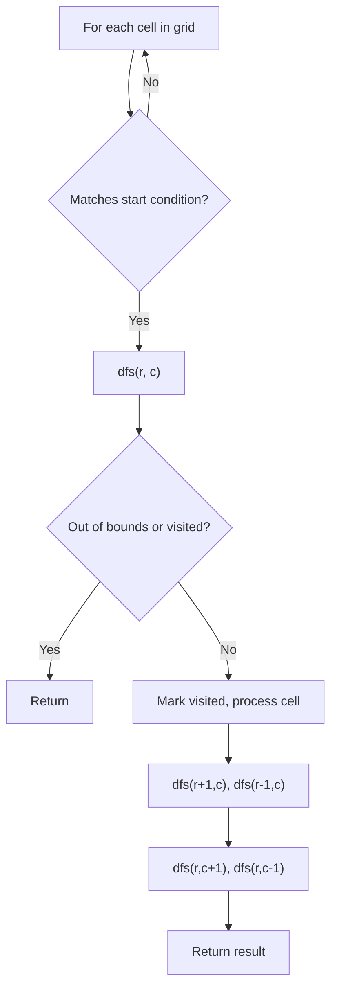
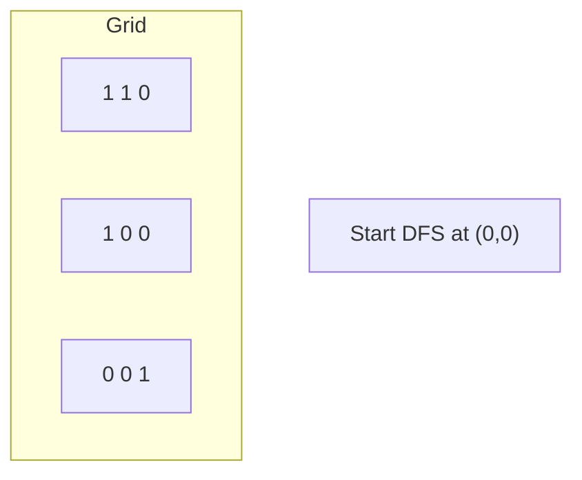
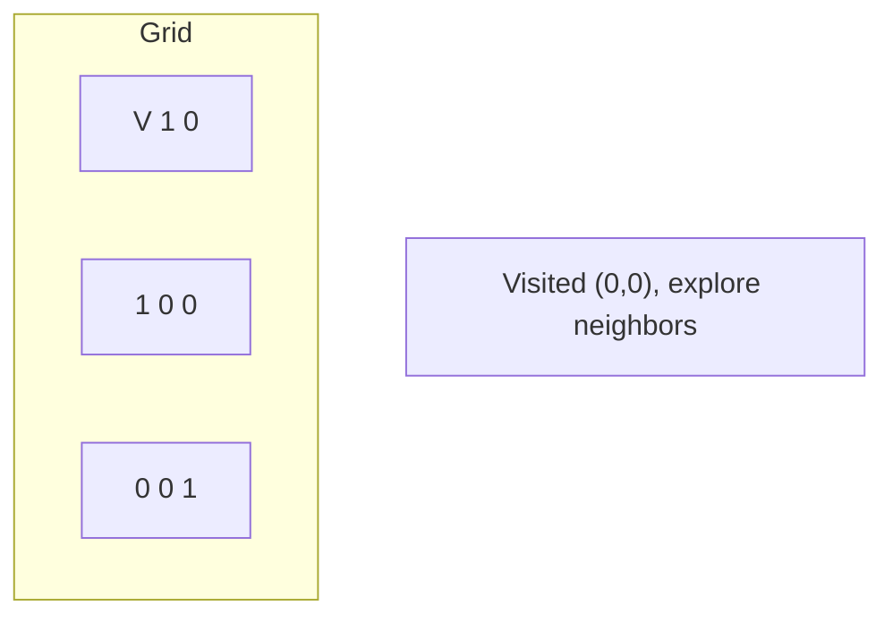
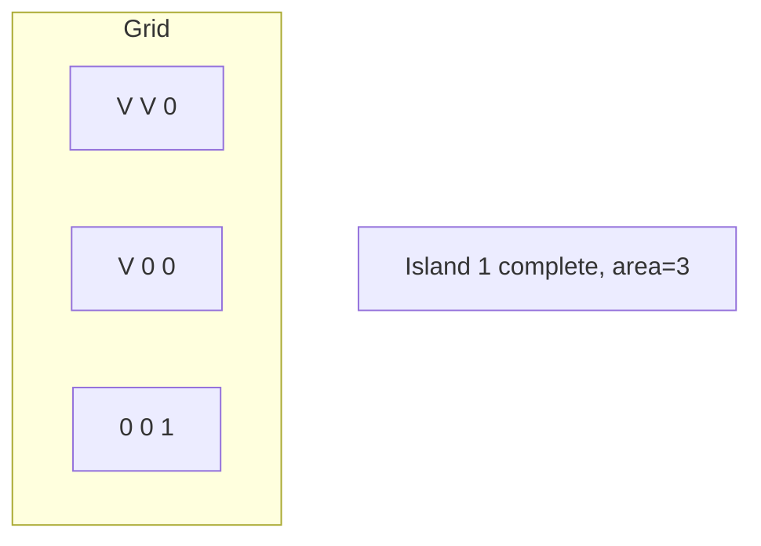
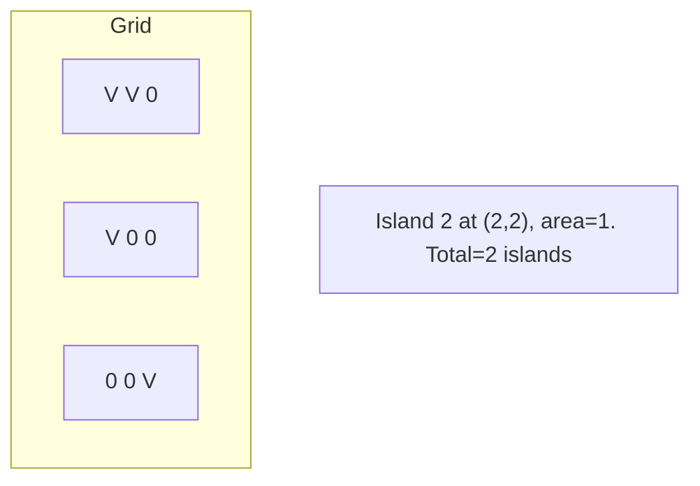

# Problem 529: Minesweeper

**Difficulty:** Medium  
**Tags:** Array, Depth-First Search, Breadth-First Search, Matrix  
**Pattern:** DFS on Matrix / Grid  
**Link:** [leetcode.com/problems/minesweeper](https://leetcode.com/problems/minesweeper/)

## Description

Let's play the minesweeper game (Wikipedia, online game)!

You are given an `m x n` char matrix `board` representing the game board where:

	- `'M'` represents an unrevealed mine,
	- `'E'` represents an unrevealed empty square,
	- `'B'` represents a revealed blank square that has no adjacent mines (i.e., above, below, left, right, and all 4 diagonals),
	- digit (`'1'` to `'8'`) represents how many mines are adjacent to this revealed square, and
	- `'X'` represents a revealed mine.

You are also given an integer array `click` where `click = [clickr, clickc]` represents the next click position among all the unrevealed squares (`'M'` or `'E'`).

Return *the board after revealing this position according to the following rules*:

	- If a mine `'M'` is revealed, then the game is over. You should change it to `'X'`.
	- If an empty square `'E'` with no adjacent mines is revealed, then change it to a revealed blank `'B'` and all of its adjacent unrevealed squares should be revealed recursively.
	- If an empty square `'E'` with at least one adjacent mine is revealed, then change it to a digit (`'1'` to `'8'`) representing the number of adjacent mines.
	- Return the board when no more squares will be revealed.

 

Example 1:

```

**Input:** board = [["E","E","E","E","E"],["E","E","M","E","E"],["E","E","E","E","E"],["E","E","E","E","E"]], click = [3,0]
**Output:** [["B","1","E","1","B"],["B","1","M","1","B"],["B","1","1","1","B"],["B","B","B","B","B"]]

```

Example 2:

```

**Input:** board = [["B","1","E","1","B"],["B","1","M","1","B"],["B","1","1","1","B"],["B","B","B","B","B"]], click = [1,2]
**Output:** [["B","1","E","1","B"],["B","1","X","1","B"],["B","1","1","1","B"],["B","B","B","B","B"]]

```

 

**Constraints:**

	- `m == board.length`
	- `n == board[i].length`
	- `1 <= m, n <= 50`
	- `board[i][j]` is either `'M'`, `'E'`, `'B'`, or a digit from `'1'` to `'8'`.
	- `click.length == 2`
	- `0 <= clickr < m`
	- `0 <= clickc < n`
	- `board[clickr][clickc]` is either `'M'` or `'E'`.

## Approach: DFS on Matrix / Grid

Treat the grid as a graph where each cell connects to its 4 (or 8) neighbors. DFS from target cells, marking visited to avoid revisiting.

## Pseudocode

```
1. For each cell (r, c) in grid:
   a. If cell meets start condition:
      - Call dfs(r, c)
2. dfs(r, c):
   a. If out of bounds or visited or invalid: return
   b. Mark cell visited
   c. Recurse on 4 neighbors: up, down, left, right
3. Return result
```

## Algorithm Flow



## Visual State Transitions

**DFS on Grid (Island/Flood Fill):**

**Frame 1: Find first land cell**


**Frame 2: DFS explores connected cells**


**Frame 3: Mark entire island**


**Frame 4: Find second island**



## Complexity Analysis

- **Time:** O(m * n)
- **Space:** O(m * n)

## Solution (Python3)

```python
class Solution:
    def updateBoard(self, board: List[List[str]], click: List[int]) -> List[List[str]]:
        # DFS on grid - O(m*n) time
        if not board:
            return 0
        rows, cols = len(board), len(board[0])
        count = 0
        
        def dfs(r, c):
            if r < 0 or r >= rows or c < 0 or c >= cols:
                return
            if board[r][c] == '0' or board[r][c] == 0:
                return
            board[r][c] = '0'
            dfs(r+1, c); dfs(r-1, c)
            dfs(r, c+1); dfs(r, c-1)
        
        for r in range(rows):
            for c in range(cols):
                if board[r][c] == '1' or board[r][c] == 1:
                    dfs(r, c)
                    count += 1
        return count
```

## Solution (C++)

```cpp
#include <functional>
#include <string>
#include <vector>
using namespace std;

class Solution {
public:
    vector<vector<string>> updateBoard(vector<vector<string>>& board, vector<int>& click) {
        // DFS on grid - O(m*n) time
        if (board.empty()) return 0;
        int rows = board.size(), cols = board[0].size();
        int count = 0;
        function<void(int, int)> dfs = [&](int r, int c) {
            if (r < 0 || r >= rows || c < 0 || c >= cols) return;
            if (board[r][c] == '0') return;
            board[r][c] = '0';
            dfs(r+1, c); dfs(r-1, c);
            dfs(r, c+1); dfs(r, c-1);
        };
        for (int r = 0; r < rows; r++) {
            for (int c = 0; c < cols; c++) {
                if (board[r][c] == '1') {
                    dfs(r, c);
                    count++;
                }
            }
        }
        return count;
    }
};
```
