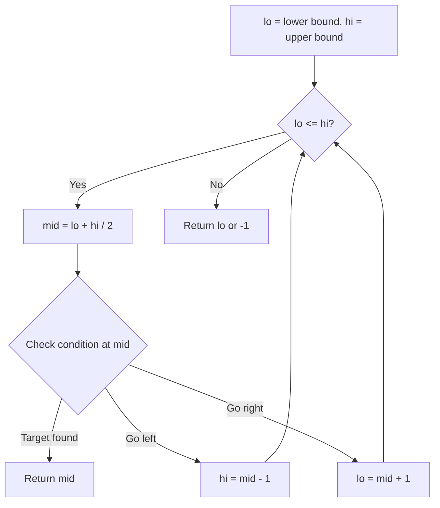
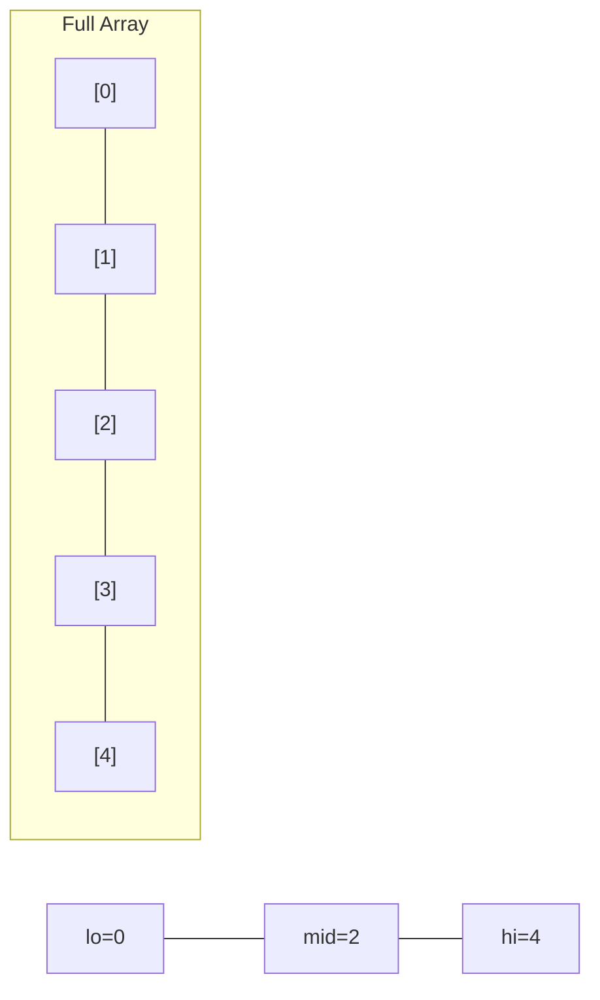
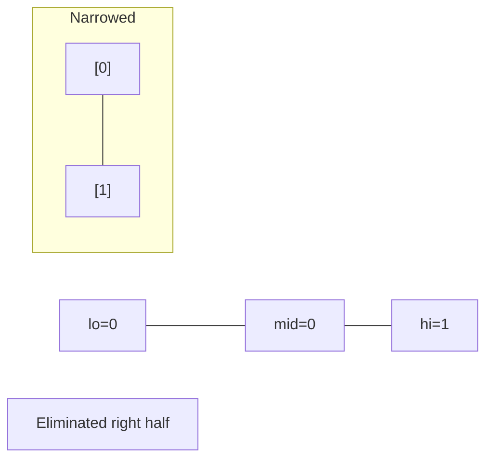
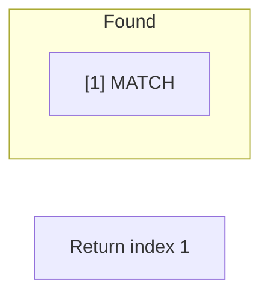

# Problem 532: K-diff Pairs in an Array

**Difficulty:** Medium  
**Tags:** Array, Hash Table, Two Pointers, Binary Search, Sorting  
**Pattern:** Hash Map  
**Link:** [leetcode.com/problems/k-diff-pairs-in-an-array](https://leetcode.com/problems/k-diff-pairs-in-an-array/)

## Description

Given an array of integers `nums` and an integer `k`, return *the number of **unique** k-diff pairs in the array*.

A **k-diff** pair is an integer pair `(nums[i], nums[j])`, where the following are true:

	- `0 <= i, j < nums.length`
	- `i != j`
	- `|nums[i] - nums[j]| == k`

**Notice** that `|val|` denotes the absolute value of `val`.

 

Example 1:

```

**Input:** nums = [3,1,4,1,5], k = 2
**Output:** 2
**Explanation:** There are two 2-diff pairs in the array, (1, 3) and (3, 5).
Although we have two 1s in the input, we should only return the number of **unique** pairs.

```

Example 2:

```

**Input:** nums = [1,2,3,4,5], k = 1
**Output:** 4
**Explanation:** There are four 1-diff pairs in the array, (1, 2), (2, 3), (3, 4) and (4, 5).

```

Example 3:

```

**Input:** nums = [1,3,1,5,4], k = 0
**Output:** 1
**Explanation:** There is one 0-diff pair in the array, (1, 1).

```

 

**Constraints:**

	- `1 <= nums.length <= 10^4`
	- `-10^7 <= nums[i] <= 10^7`
	- `0 <= k <= 10^7`

## Approach: Hash Map

Count occurrences. For k=0 check duplicates, else check if num+k exists.

## Pseudocode

```
1. lo = lower_bound, hi = upper_bound
2. While lo <= hi (or lo < hi):
   a. mid = (lo + hi) // 2
   b. If condition(mid) is satisfied: record answer, search left half
   c. Else: search right half
3. Return answer
```

## Algorithm Flow



## Visual State Transitions

**Binary Search Step-by-Step:**

**Frame 1: Initial search space**


**Frame 2: Compare mid, narrow search**


**Frame 3: Found target**



## Complexity Analysis

- **Time:** O(n)
- **Space:** O(n)

## Solution (Python3)

```python
class Solution:
    def findPairs(self, nums: list[int], k: int) -> int:
        from collections import Counter
        counter = Counter(nums)
        result = 0
        for num in counter:
            if k == 0 and counter[num] > 1:
                result += 1
            elif k > 0 and num + k in counter:
                result += 1
        return result
```

## Solution (C++)

```cpp
#include <string>
#include <vector>
using namespace std;

class Solution {
public:
    int findPairs(vector<int>& nums, int k) {
        // Binary search - O(log n) time, O(1) space
        int lo = 0, hi = nums.size() - 1;
        while (lo <= hi) {
            int mid = lo + (hi - lo) / 2;
            if (nums[mid] == k) {
                return mid;
            } else if (nums[mid] < k) {
                lo = mid + 1;
            } else {
                hi = mid - 1;
            }
        }
        return 0;
    }
};
```
