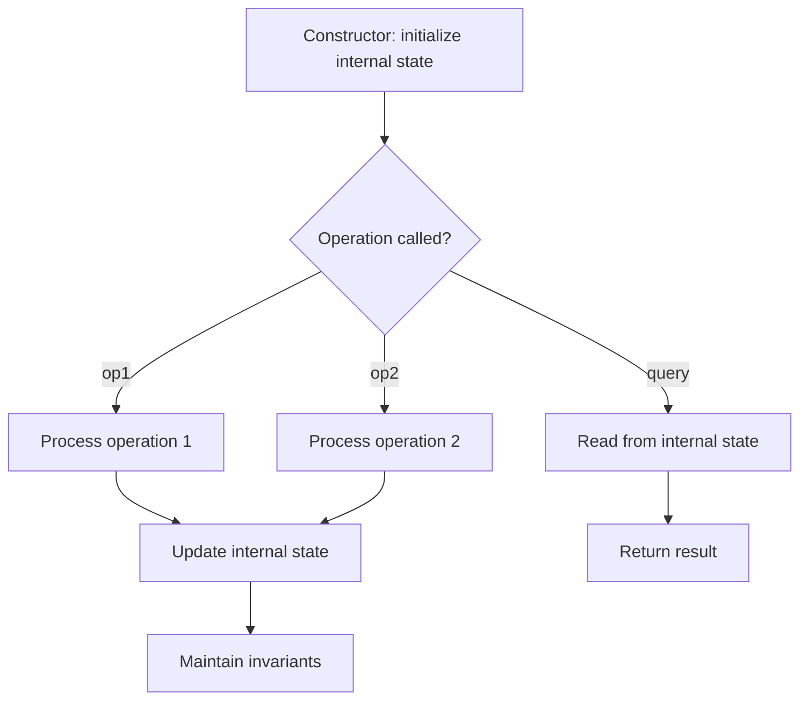

# Problem 535: Encode and Decode TinyURL

**Difficulty:** Medium  
**Tags:** Hash Table, String, Design, Hash Function  
**Pattern:** Design  
**Link:** [leetcode.com/problems/encode-and-decode-tinyurl](https://leetcode.com/problems/encode-and-decode-tinyurl/)

## Description

Note: This is a companion problem to the System Design problem: Design TinyURL.

TinyURL is a URL shortening service where you enter a URL such as `https://leetcode.com/problems/design-tinyurl` and it returns a short URL such as `http://tinyurl.com/4e9iAk`. Design a class to encode a URL and decode a tiny URL.

There is no restriction on how your encode/decode algorithm should work. You just need to ensure that a URL can be encoded to a tiny URL and the tiny URL can be decoded to the original URL.

Implement the `Solution` class:

	- `Solution()` Initializes the object of the system.
	- `String encode(String longUrl)` Returns a tiny URL for the given `longUrl`.
	- `String decode(String shortUrl)` Returns the original long URL for the given `shortUrl`. It is guaranteed that the given `shortUrl` was encoded by the same object.

 

Example 1:

```

**Input:** url = "https://leetcode.com/problems/design-tinyurl"
**Output:** "https://leetcode.com/problems/design-tinyurl"

**Explanation:**
Solution obj = new Solution();
string tiny = obj.encode(url); // returns the encoded tiny url.
string ans = obj.decode(tiny); // returns the original url after decoding it.

```

 

**Constraints:**

	- `1 <= url.length <= 10^4`
	- `url` is guranteed to be a valid URL.

## Approach: Design

Design a data structure or system that supports specific operations efficiently. Choose appropriate underlying data structures (hash map, linked list, heap, etc.).

## Pseudocode

```
1. Choose data structures for internal state
2. Implement constructor: initialize state
3. Implement each operation:
   - Maintain invariants
   - Optimize for target time complexity
4. Handle edge cases
```

## Algorithm Flow



## Complexity Analysis

- **Time:** O(1) per operation
- **Space:** O(n)

## Solution (Python3)

```python
class Codec:
    def encode(self, longUrl: str) -> str:
        return ""

    def decode(self, shortUrl: str) -> str:
        return ""

```

## Solution (C++)

```cpp
#include <string>
#include <vector>
using namespace std;

class Codec {
public:
    string encode(string& longUrl) {
        return "";
    }

    string decode(string& shortUrl) {
        return "";
    }

};
```
