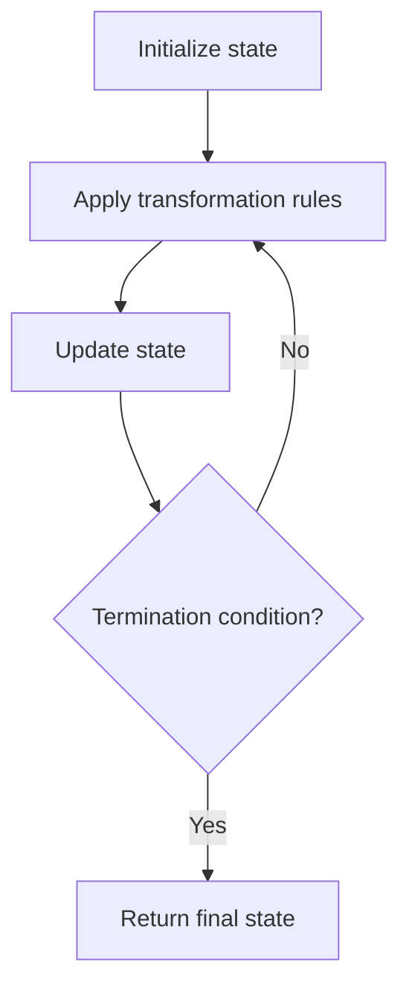

# Problem 537: Complex Number Multiplication

**Difficulty:** Medium  
**Tags:** Math, String, Simulation  
**Pattern:** Simulation  
**Link:** [leetcode.com/problems/complex-number-multiplication](https://leetcode.com/problems/complex-number-multiplication/)

## Description

A complex number can be represented as a string on the form `"**real**+**imaginary**i"` where:

	- `real` is the real part and is an integer in the range `[-100, 100]`.
	- `imaginary` is the imaginary part and is an integer in the range `[-100, 100]`.
	- `i^2 == -1`.

Given two complex numbers `num1` and `num2` as strings, return *a string of the complex number that represents their multiplications*.

 

Example 1:

```

**Input:** num1 = "1+1i", num2 = "1+1i"
**Output:** "0+2i"
**Explanation:** (1 + i) * (1 + i) = 1 + i2 + 2 * i = 2i, and you need convert it to the form of 0+2i.

```

Example 2:

```

**Input:** num1 = "1+-1i", num2 = "1+-1i"
**Output:** "0+-2i"
**Explanation:** (1 - i) * (1 - i) = 1 + i2 - 2 * i = -2i, and you need convert it to the form of 0+-2i.

```

 

**Constraints:**

	- `num1` and `num2` are valid complex numbers.

## Approach: Simulation

Simulate the process described in the problem step by step. Follow the rules exactly, tracking state at each step.

## Pseudocode

```
1. Initialize state (grid, pointers, counters)
2. For each step / iteration:
   a. Apply the transformation rules
   b. Update state
   c. Check termination condition
3. Return final state or result
```

## Algorithm Flow



## Complexity Analysis

- **Time:** O(n) or O(n * k)
- **Space:** O(n)

## Solution (Python3)

```python
class Solution:
    def complexNumberMultiply(self, num1: str, num2: str) -> str:
        # Simulation approach - follow the rules step by step
        result = ""
        for i in range(len(num1) if isinstance(num1, list) else num1):
            # Simulate each step
            pass
        return result
```

## Solution (C++)

```cpp
#include <string>
#include <vector>
using namespace std;

class Solution {
public:
    string complexNumberMultiply(string& num1, string& num2) {
        // Simulation approach
        int n = num1.size();
        for (int i = 0; i < n; i++) {
            // Simulate each step
        }
        return "";
    }
};
```
