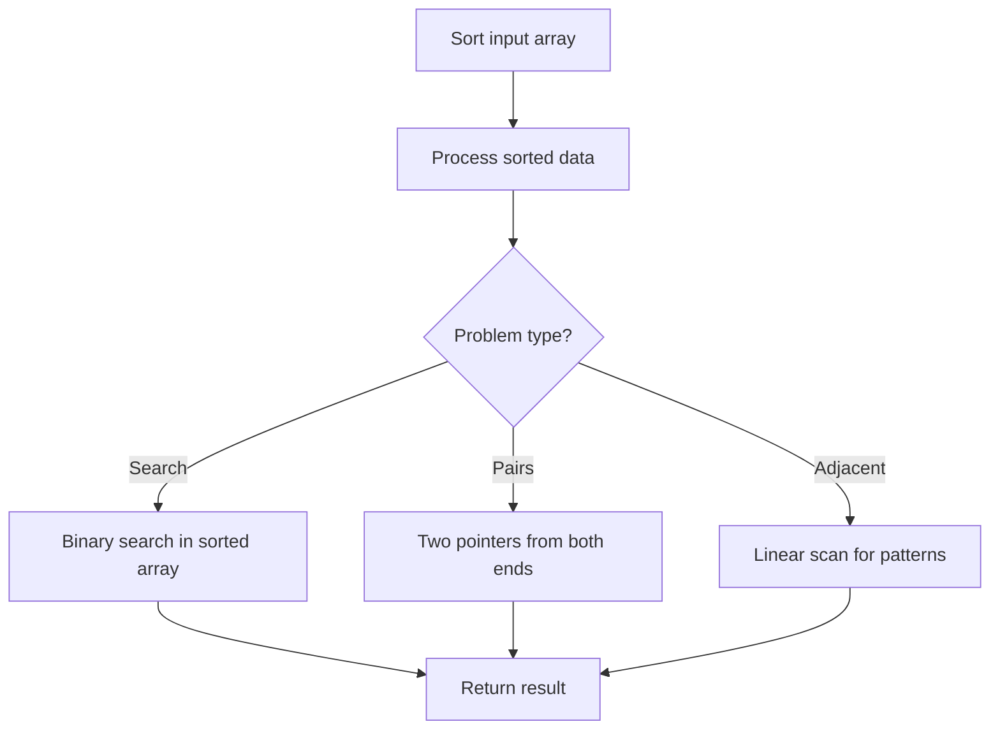

# Problem 539: Minimum Time Difference

**Difficulty:** Medium  
**Tags:** Array, Math, String, Sorting  
**Pattern:** Sorting  
**Link:** [leetcode.com/problems/minimum-time-difference](https://leetcode.com/problems/minimum-time-difference/)

## Description

Given a list of 24-hour clock time points in **"HH:MM"** format, return *the minimum **minutes** difference between any two time-points in the list*.
 

Example 1:

```
**Input:** timePoints = ["23:59","00:00"]
**Output:** 1

```
Example 2:

```
**Input:** timePoints = ["00:00","23:59","00:00"]
**Output:** 0

```

 

**Constraints:**

	- `2 <= timePoints.length <= 2 * 10^4`
	- `timePoints[i]` is in the format **"HH:MM"**.

## Approach: Sorting

Sort the data to enable efficient processing. After sorting, use techniques like binary search, two pointers, or linear scan to solve the problem.

## Pseudocode

```
1. Sort the input array
2. Process sorted data:
   - Use binary search for lookups
   - Use two pointers for pair finding
   - Scan for adjacent patterns
3. Return result
```

## Algorithm Flow



## Complexity Analysis

- **Time:** O(n log n)
- **Space:** O(n)

## Solution (Python3)

```python
class Solution:
    def findMinDifference(self, timePoints: List[str]) -> int:
        # Sort-based approach - O(n log n) time
        timePoints.sort(key=lambda x: x[0] if isinstance(x, (list, tuple)) else x)
        result = [timePoints[0]]
        for i in range(1, len(timePoints)):
            curr = timePoints[i]
            if isinstance(curr, (list, tuple)) and isinstance(result[-1], (list, tuple)):
                if curr[0] <= result[-1][1]:
                    result[-1] = [result[-1][0], max(result[-1][1], curr[1])]
                else:
                    result.append(curr)
            else:
                result.append(curr)
        return result
```

## Solution (C++)

```cpp
#include <algorithm>
#include <string>
#include <vector>
using namespace std;

class Solution {
public:
    int findMinDifference(vector<string>& timePoints) {
        // Sort-based approach - O(n log n) time
        sort(timePoints.begin(), timePoints.end());
        vector<vector<int>> result;
        result.push_back(timePoints[0]);
        for (int i = 1; i < (int)timePoints.size(); i++) {
            if (timePoints[i][0] <= result.back()[1]) {
                result.back()[1] = max(result.back()[1], timePoints[i][1]);
            } else {
                result.push_back(timePoints[i]);
            }
        }
        return result;
    }
};
```
