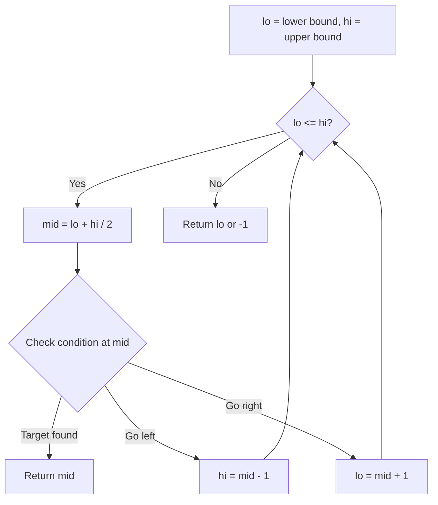
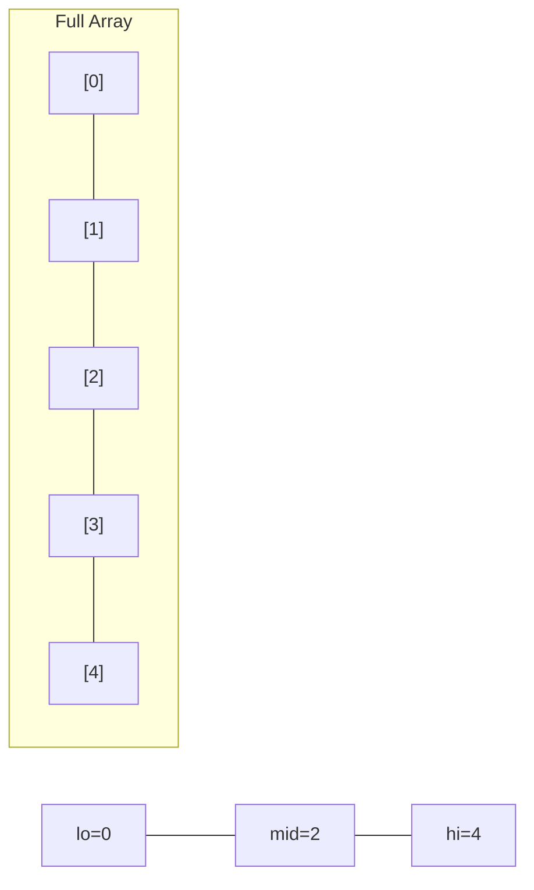
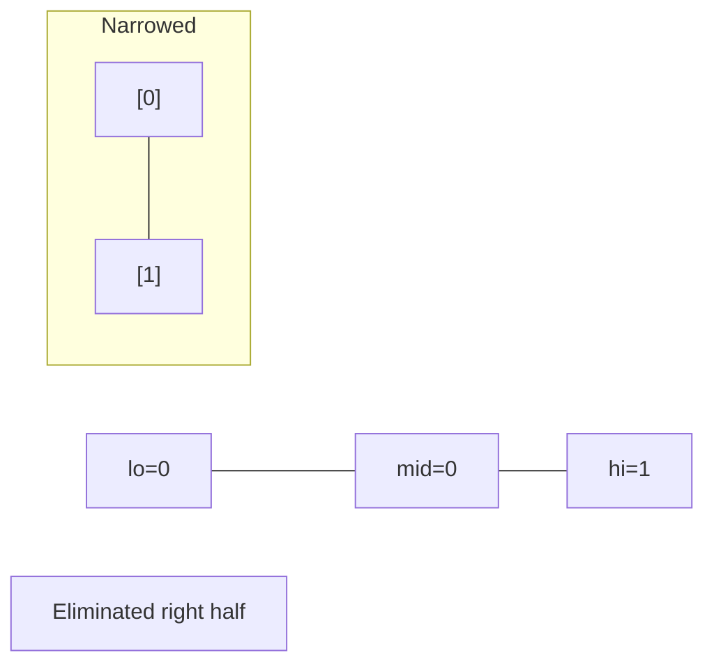
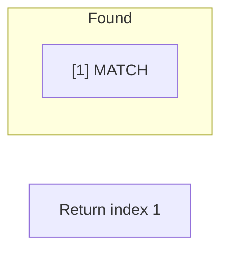

# Problem 540: Single Element in a Sorted Array

**Difficulty:** Medium  
**Tags:** Array, Binary Search  
**Pattern:** Binary Search  
**Link:** [leetcode.com/problems/single-element-in-a-sorted-array](https://leetcode.com/problems/single-element-in-a-sorted-array/)

## Description

You are given a sorted array consisting of only integers where every element appears exactly twice, except for one element which appears exactly once.

Return *the single element that appears only once*.

Your solution must run in `O(log n)` time and `O(1)` space.

 

Example 1:

```
**Input:** nums = [1,1,2,3,3,4,4,8,8]
**Output:** 2

```
Example 2:

```
**Input:** nums = [3,3,7,7,10,11,11]
**Output:** 10

```

 

**Constraints:**

	- `1 <= nums.length <= 10^5`
	- `0 <= nums[i] <= 10^5`

## Approach: Binary Search

Binary search: ensure mid is even. If pair matches, single element is on right.

## Pseudocode

```
1. lo = lower_bound, hi = upper_bound
2. While lo <= hi (or lo < hi):
   a. mid = (lo + hi) // 2
   b. If condition(mid) is satisfied: record answer, search left half
   c. Else: search right half
3. Return answer
```

## Algorithm Flow



## Visual State Transitions

**Binary Search Step-by-Step:**

**Frame 1: Initial search space**


**Frame 2: Compare mid, narrow search**


**Frame 3: Found target**



## Complexity Analysis

- **Time:** O(log n)
- **Space:** O(1)

## Solution (Python3)

```python
class Solution:
    def singleNonDuplicate(self, nums: list[int]) -> int:
        lo, hi = 0, len(nums) - 1
        while lo < hi:
            mid = lo + (hi - lo) // 2
            if mid % 2 == 1:
                mid -= 1
            if nums[mid] == nums[mid + 1]:
                lo = mid + 2
            else:
                hi = mid
        return nums[lo]
```

## Solution (C++)

```cpp
#include <string>
#include <vector>
using namespace std;

class Solution {
public:
    int singleNonDuplicate(vector<int>& nums) {
        // Binary search - O(log n) time, O(1) space
        int lo = 0, hi = nums.size() - 1;
        while (lo <= hi) {
            int mid = lo + (hi - lo) / 2;
            if (nums[mid] == nums) {
                return mid;
            } else if (nums[mid] < nums) {
                lo = mid + 1;
            } else {
                hi = mid - 1;
            }
        }
        return 0;
    }
};
```
