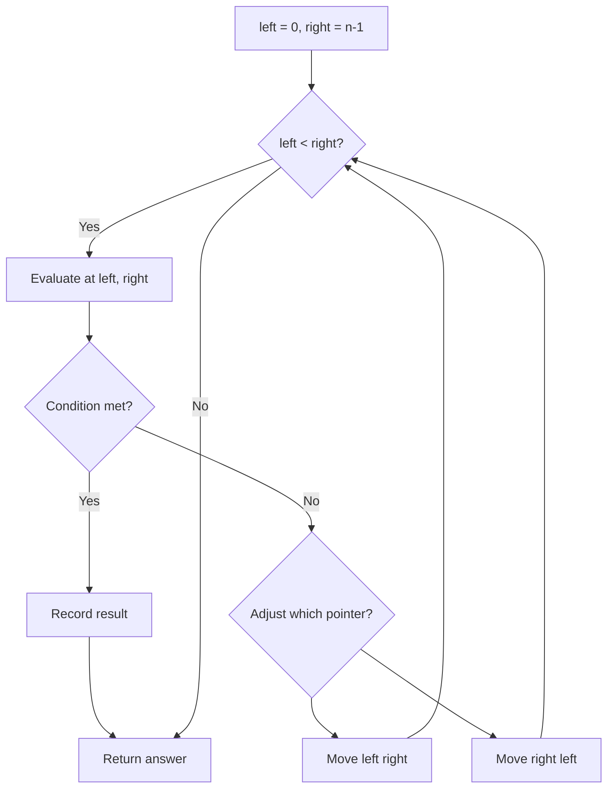
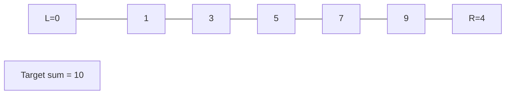
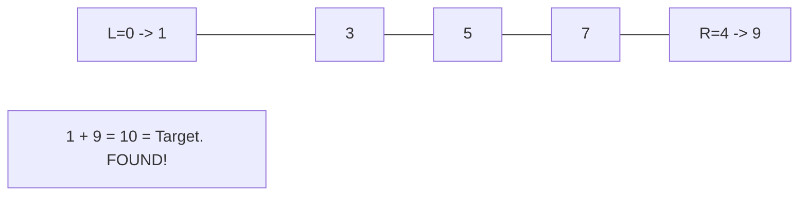

# Problem 541: Reverse String II

**Difficulty:** Easy  
**Tags:** Two Pointers, String  
**Pattern:** Two Pointers  
**Link:** [leetcode.com/problems/reverse-string-ii](https://leetcode.com/problems/reverse-string-ii/)

## Description

Given a string `s` and an integer `k`, reverse the first `k` characters for every `2k` characters counting from the start of the string.

If there are fewer than `k` characters left, reverse all of them. If there are less than `2k` but greater than or equal to `k` characters, then reverse the first `k` characters and leave the other as original.

 

Example 1:

```
**Input:** s = "abcdefg", k = 2
**Output:** "bacdfeg"

```
Example 2:

```
**Input:** s = "abcd", k = 2
**Output:** "bacd"

```

 

**Constraints:**

	- `1 <= s.length <= 10^4`
	- `s` consists of only lowercase English letters.
	- `1 <= k <= 10^4`

## Approach: Two Pointers

Use two pointers moving through the data structure. Depending on the problem, pointers may move toward each other (converging), in the same direction (fast/slow), or independently.

## Pseudocode

```
1. Initialize left = 0, right = n-1 (or two independent pointers)
2. While pointers haven't crossed:
   a. Evaluate condition at pointer positions
   b. Move left pointer right or right pointer left
3. Return result
```

## Algorithm Flow



## Visual State Transitions

**Two Pointer Convergence:**

**Frame 1: Initialize pointers**


**Frame 2: Sum = 1+9 = 10, found!**



## Complexity Analysis

- **Time:** O(n)
- **Space:** O(1)

## Solution (Python3)

```python
class Solution:
    def reverseStr(self, s: str, k: int) -> str:
        # Two pointer approach - O(n) time, O(1) space
        left, right = 0, len(s) - 1
        while left < right:
            curr = s[left] + s[right]
            if curr == k:
                return [left, right]
            elif curr < k:
                left += 1
            else:
                right -= 1
        return ""
```

## Solution (C++)

```cpp
#include <string>
#include <vector>
using namespace std;

class Solution {
public:
    string reverseStr(string& s, int k) {
        // Two pointer approach - O(n) time, O(1) space
        int left = 0, right = s.size() - 1;
        while (left < right) {
            int curr = s[left] + s[right];
            if (curr == k) {
                return {left, right};
            } else if (curr < k) {
                left++;
            } else {
                right--;
            }
        }
        return "";
    }
};
```
