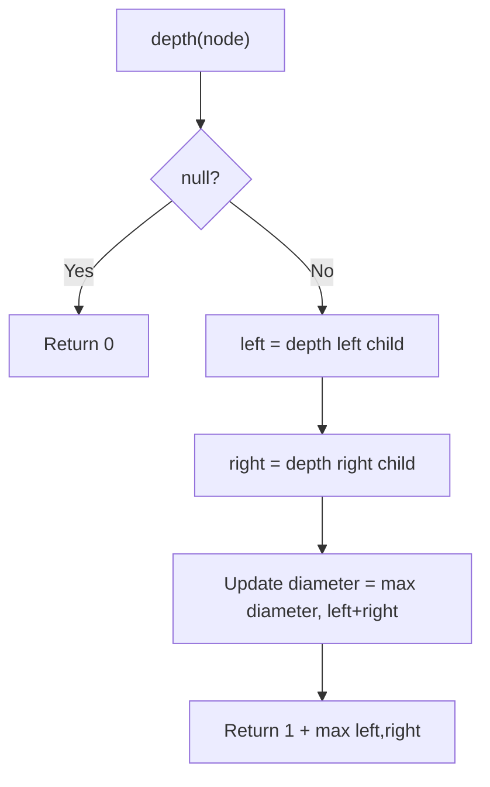
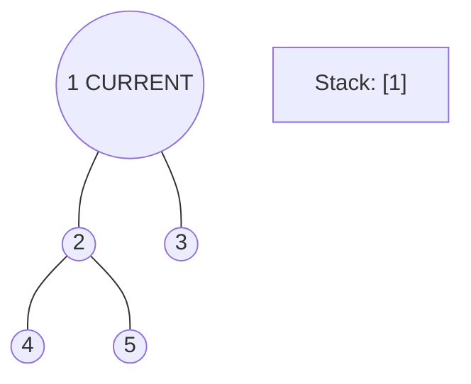
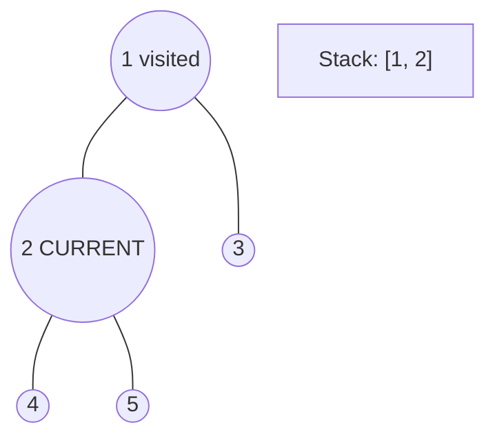
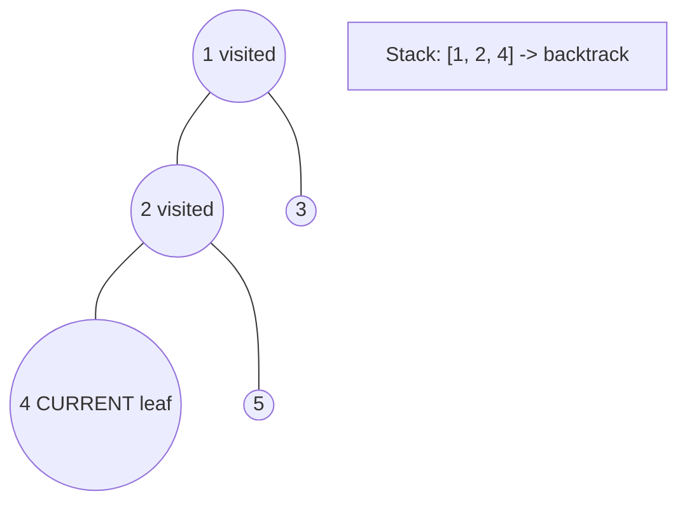
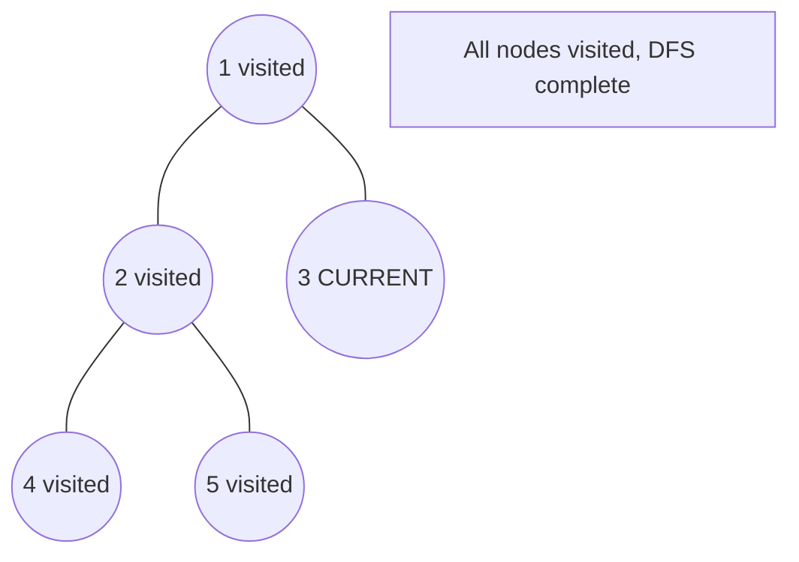

# Problem 543: Diameter of Binary Tree

**Difficulty:** Easy  
**Tags:** Tree, Depth-First Search, Binary Tree  
**Pattern:** Tree / DFS  
**Link:** [leetcode.com/problems/diameter-of-binary-tree](https://leetcode.com/problems/diameter-of-binary-tree/)

## Description

Given the `root` of a binary tree, return *the length of the **diameter** of the tree*.

The **diameter** of a binary tree is the **length** of the longest path between any two nodes in a tree. This path may or may not pass through the `root`.

The **length** of a path between two nodes is represented by the number of edges between them.

 

Example 1:

```

**Input:** root = [1,2,3,4,5]
**Output:** 3
**Explanation:** 3 is the length of the path [4,2,1,3] or [5,2,1,3].

```

Example 2:

```

**Input:** root = [1,2]
**Output:** 1

```

 

**Constraints:**

	- The number of nodes in the tree is in the range `[1, 10^4]`.
	- `-100 <= Node.val <= 100`

## Approach: Tree / DFS

At each node, diameter through it = left_depth + right_depth. Track global max.

## Pseudocode

```
1. Define dfs(node, state):
   a. Base case: if null, return default
   b. Process node with current state
   c. left_result = dfs(node.left, updated_state)
   d. right_result = dfs(node.right, updated_state)
   e. Return combine(left_result, right_result)
2. Return dfs(root, initial_state)
```

## Algorithm Flow



## Visual State Transitions

**DFS Tree Traversal Step-by-Step:**

**Frame 1: Start at root**


**Frame 2: Go left - visit node 2**


**Frame 3: Go left - visit node 4 (leaf)**


**Frame 4: Backtrack, visit node 5, then node 3**



## Complexity Analysis

- **Time:** O(n)
- **Space:** O(h)

## Solution (Python3)

```python
class Solution:
    def diameterOfBinaryTree(self, root) -> int:
        self.diameter = 0
        def depth(node):
            if not node:
                return 0
            left = depth(node.left)
            right = depth(node.right)
            self.diameter = max(self.diameter, left + right)
            return 1 + max(left, right)
        depth(root)
        return self.diameter
```

## Solution (C++)

```cpp
#include <algorithm>
#include <functional>
#include <string>
#include <vector>
using namespace std;

class Solution {
public:
    int diameterOfBinaryTree(TreeNode* root) {
        // DFS on binary tree - O(n) time, O(h) space
        function<int(TreeNode*)> dfs = [&](TreeNode* node) -> int {
            if (!node) return 0;
            int left = dfs(node->left);
            int right = dfs(node->right);
            return 1 + max(left, right);
        };
        return dfs(root);
    }
};
```
