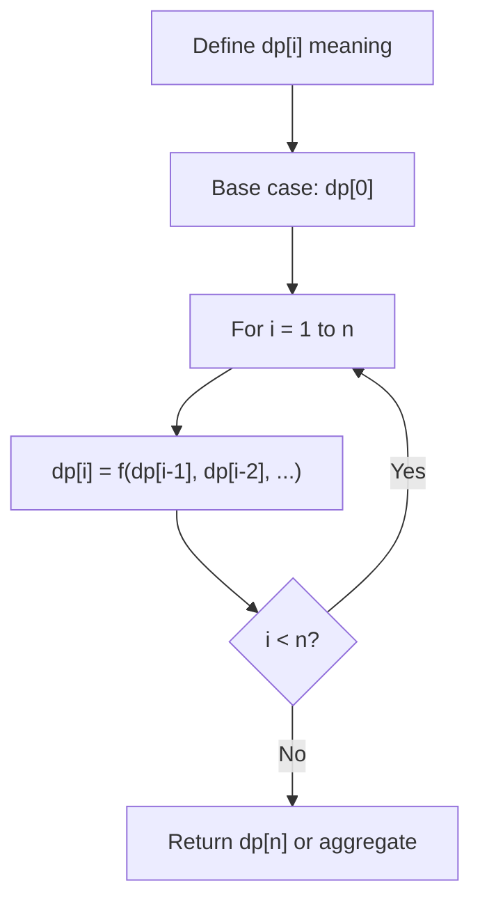
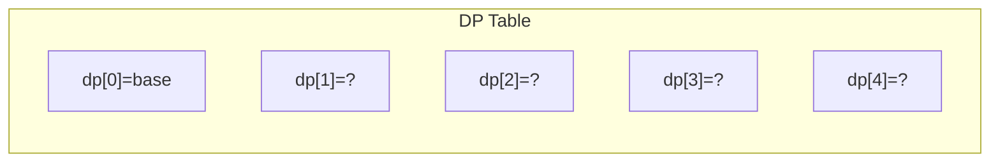
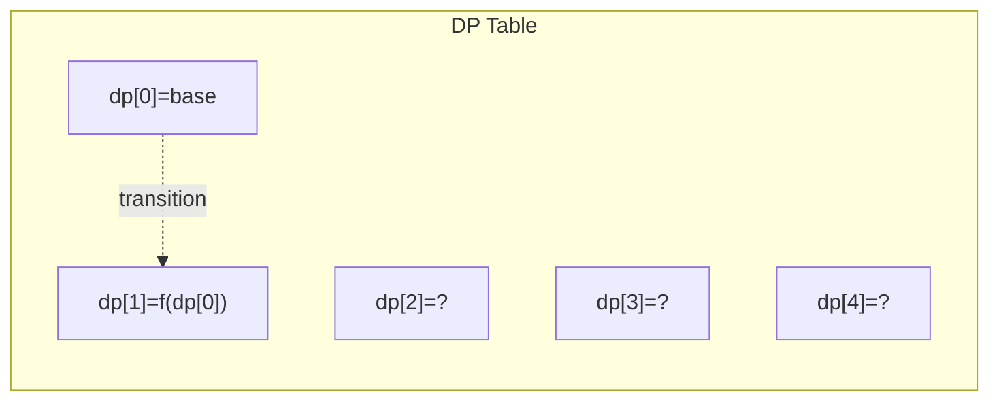
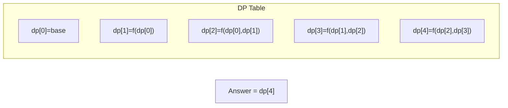

# Problem 546: Remove Boxes

**Difficulty:** Hard  
**Tags:** Array, Dynamic Programming, Memoization  
**Pattern:** Dynamic Programming (1D)  
**Link:** [leetcode.com/problems/remove-boxes](https://leetcode.com/problems/remove-boxes/)

## Description

You are given several `boxes` with different colors represented by different positive numbers.

You may experience several rounds to remove boxes until there is no box left. Each time you can choose some continuous boxes with the same color (i.e., composed of `k` boxes, `k >= 1`), remove them and get `k * k` points.

Return *the maximum points you can get*.

 

Example 1:

```

**Input:** boxes = [1,3,2,2,2,3,4,3,1]
**Output:** 23
**Explanation:**
[1, 3, 2, 2, 2, 3, 4, 3, 1] 
----> [1, 3, 3, 4, 3, 1] (3*3=9 points) 
----> [1, 3, 3, 3, 1] (1*1=1 points) 
----> [1, 1] (3*3=9 points) 
----> [] (2*2=4 points)

```

Example 2:

```

**Input:** boxes = [1,1,1]
**Output:** 9

```

Example 3:

```

**Input:** boxes = [1]
**Output:** 1

```

 

**Constraints:**

	- `1 <= boxes.length <= 100`
	- `1 <= boxes[i] <= 100`

## Approach: Dynamic Programming (1D)

Break the problem into overlapping subproblems. Define dp[i] as the optimal value for the subproblem ending at or considering index i. Build the solution bottom-up, using previously computed dp values.

## Pseudocode

```
1. Define dp[i] = optimal value for subproblem i
2. Base case: dp[0] = initial value
3. For i from 1 to n:
   a. dp[i] = recurrence(dp[i-1], dp[i-2], ...)
4. Return dp[n] or max/min of dp
```

## Algorithm Flow



## Visual State Transitions

**1D Dynamic Programming Table Build:**

**Frame 1: Initialize base cases**


**Frame 2: Fill dp[1] from dp[0]**


**Frame 3: Fill remaining cells**



## Complexity Analysis

- **Time:** O(n)
- **Space:** O(n)

## Solution (Python3)

```python
class Solution:
    def removeBoxes(self, boxes: List[int]) -> int:
        # Dynamic programming (1D) - O(n) time, O(n) space
        if not boxes:
            return 0
        n = len(boxes) if isinstance(boxes, list) else boxes
        dp = [0] * (n + 1)
        dp[0] = 1  # base case
        for i in range(1, n + 1):
            dp[i] = dp[i-1]  # transition (customize per problem)
            if i >= 2:
                dp[i] += dp[i-2]
        return dp[n]
```

## Solution (C++)

```cpp
#include <string>
#include <vector>
using namespace std;

class Solution {
public:
    int removeBoxes(vector<int>& boxes) {
        // Dynamic programming (1D) - O(n) time, O(n) space
        int n = boxes;
        if (n <= 0) return 0;
        vector<int> dp(n + 1, 0);
        dp[0] = 1;
        for (int i = 1; i <= n; i++) {
            dp[i] = dp[i-1];
            if (i >= 2) dp[i] += dp[i-2];
        }
        return dp[n];
    }
};
```
