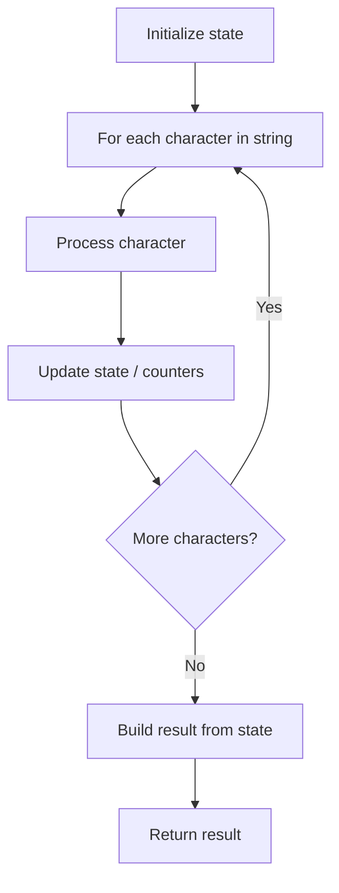

# Problem 551: Student Attendance Record I

**Difficulty:** Easy  
**Tags:** String  
**Pattern:** String Processing  
**Link:** [leetcode.com/problems/student-attendance-record-i](https://leetcode.com/problems/student-attendance-record-i/)

## Description

You are given a string `s` representing an attendance record for a student where each character signifies whether the student was absent, late, or present on that day. The record only contains the following three characters:

	- `'A'`: Absent.
	- `'L'`: Late.
	- `'P'`: Present.

The student is eligible for an attendance award if they meet **both** of the following criteria:

	- The student was absent (`'A'`) for **strictly** fewer than 2 days **total**.
	- The student was **never** late (`'L'`) for 3 or more **consecutive** days.

Return `true`* if the student is eligible for an attendance award, or *`false`* otherwise*.

 

Example 1:

```

**Input:** s = "PPALLP"
**Output:** true
**Explanation:** The student has fewer than 2 absences and was never late 3 or more consecutive days.

```

Example 2:

```

**Input:** s = "PPALLL"
**Output:** false
**Explanation:** The student was late 3 consecutive days in the last 3 days, so is not eligible for the award.

```

 

**Constraints:**

	- `1 <= s.length <= 1000`
	- `s[i]` is either `'A'`, `'L'`, or `'P'`.

## Approach: String Processing

Process the string character by character. Common techniques: two pointers, sliding window, hash map for frequencies, stack for matching.

## Pseudocode

```
1. Initialize result / tracking state
2. Iterate through string characters:
   a. Process character based on rules
   b. Update state (counters, pointers, stack)
3. Build and return result
```

## Algorithm Flow



## Complexity Analysis

- **Time:** O(n)
- **Space:** O(n)

## Solution (Python3)

```python
class Solution:
    def checkRecord(self, s: str) -> bool:
        # String processing approach - O(n) time
        result = []
        for ch in s:
            if ch.isalnum():
                result.append(ch.lower())
        # Check palindrome or process
        processed = ''.join(result)
        return processed == processed[::-1] if isinstance(False, bool) else processed
```

## Solution (C++)

```cpp
#include <algorithm>
#include <cctype>
#include <string>
#include <vector>
using namespace std;

class Solution {
public:
    bool checkRecord(string& s) {
        // String processing approach - O(n) time
        string processed;
        for (char ch : s) {
            if (isalnum(ch)) {
                processed += tolower(ch);
            }
        }
        string rev = processed;
        reverse(rev.begin(), rev.end());
        return processed == rev;
    }
};
```
