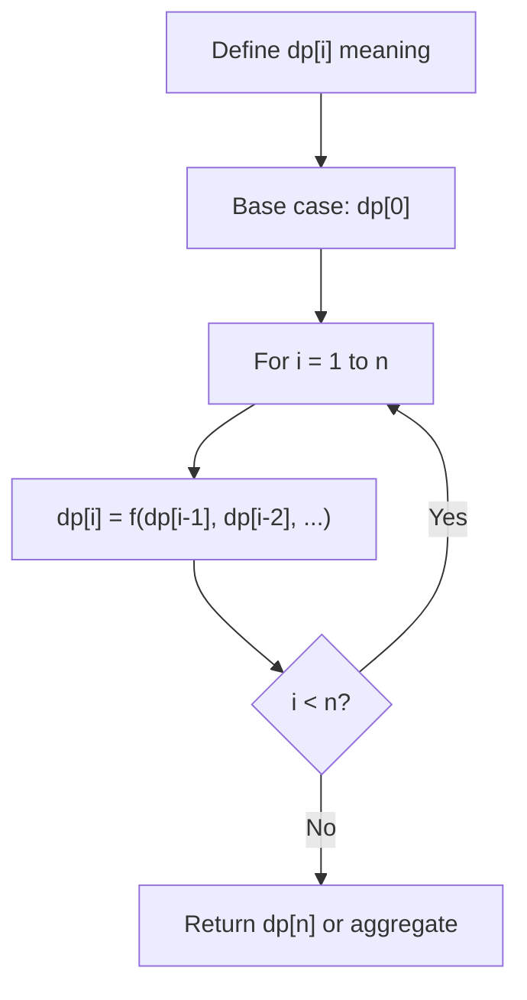
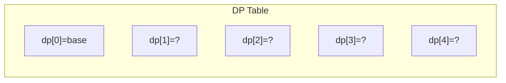
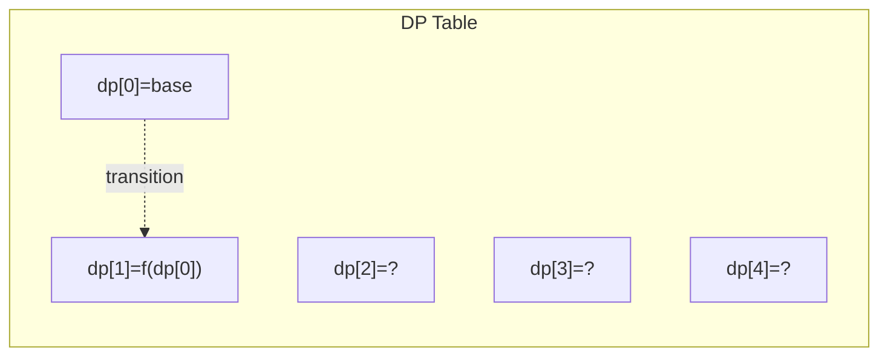
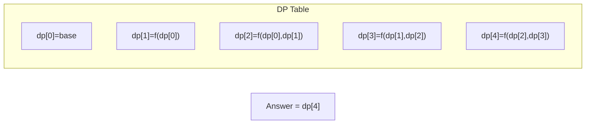

# Problem 552: Student Attendance Record II

**Difficulty:** Hard  
**Tags:** Dynamic Programming  
**Pattern:** Dynamic Programming (1D)  
**Link:** [leetcode.com/problems/student-attendance-record-ii](https://leetcode.com/problems/student-attendance-record-ii/)

## Description

An attendance record for a student can be represented as a string where each character signifies whether the student was absent, late, or present on that day. The record only contains the following three characters:

	- `'A'`: Absent.
	- `'L'`: Late.
	- `'P'`: Present.

Any student is eligible for an attendance award if they meet **both** of the following criteria:

	- The student was absent (`'A'`) for **strictly** fewer than 2 days **total**.
	- The student was **never** late (`'L'`) for 3 or more **consecutive** days.

Given an integer `n`, return *the **number** of possible attendance records of length* `n`* that make a student eligible for an attendance award. The answer may be very large, so return it **modulo** *`10^9 + 7`.

 

Example 1:

```

**Input:** n = 2
**Output:** 8
**Explanation:** There are 8 records with length 2 that are eligible for an award:
"PP", "AP", "PA", "LP", "PL", "AL", "LA", "LL"
Only "AA" is not eligible because there are 2 absences (there need to be fewer than 2).

```

Example 2:

```

**Input:** n = 1
**Output:** 3

```

Example 3:

```

**Input:** n = 10101
**Output:** 183236316

```

 

**Constraints:**

	- `1 <= n <= 10^5`

## Approach: Dynamic Programming (1D)

Break the problem into overlapping subproblems. Define dp[i] as the optimal value for the subproblem ending at or considering index i. Build the solution bottom-up, using previously computed dp values.

## Pseudocode

```
1. Define dp[i] = optimal value for subproblem i
2. Base case: dp[0] = initial value
3. For i from 1 to n:
   a. dp[i] = recurrence(dp[i-1], dp[i-2], ...)
4. Return dp[n] or max/min of dp
```

## Algorithm Flow



## Visual State Transitions

**1D Dynamic Programming Table Build:**

**Frame 1: Initialize base cases**


**Frame 2: Fill dp[1] from dp[0]**


**Frame 3: Fill remaining cells**



## Complexity Analysis

- **Time:** O(n)
- **Space:** O(n)

## Solution (Python3)

```python
class Solution:
    def checkRecord(self, n: int) -> int:
        # Dynamic programming (1D) - O(n) time, O(n) space
        if not n:
            return 0
        n = len(n) if isinstance(n, list) else n
        dp = [0] * (n + 1)
        dp[0] = 1  # base case
        for i in range(1, n + 1):
            dp[i] = dp[i-1]  # transition (customize per problem)
            if i >= 2:
                dp[i] += dp[i-2]
        return dp[n]
```

## Solution (C++)

```cpp
#include <string>
#include <vector>
using namespace std;

class Solution {
public:
    int checkRecord(int n) {
        // Dynamic programming (1D) - O(n) time, O(n) space
        int n = n;
        if (n <= 0) return 0;
        vector<int> dp(n + 1, 0);
        dp[0] = 1;
        for (int i = 1; i <= n; i++) {
            dp[i] = dp[i-1];
            if (i >= 2) dp[i] += dp[i-2];
        }
        return dp[n];
    }
};
```
