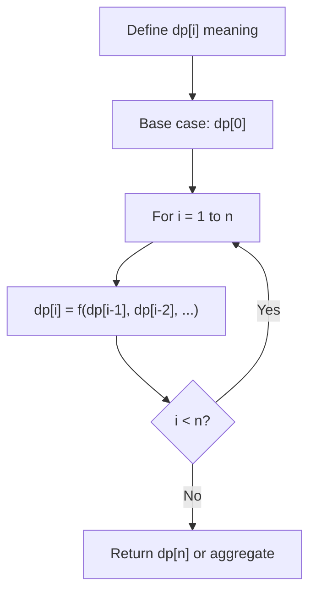
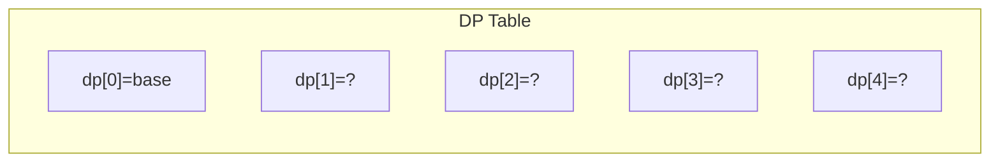
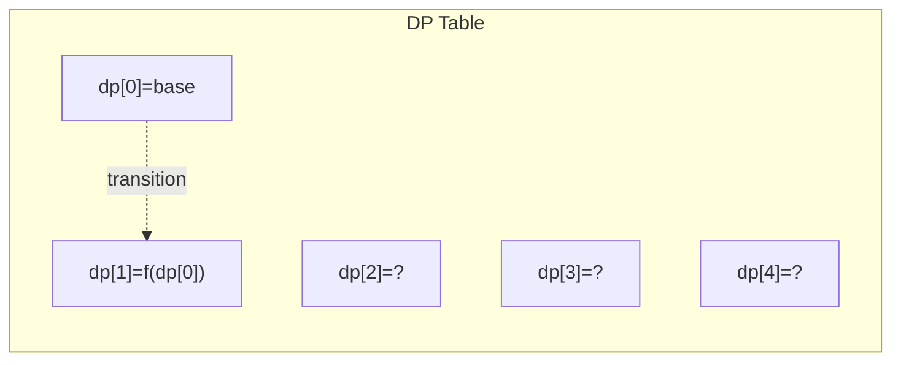
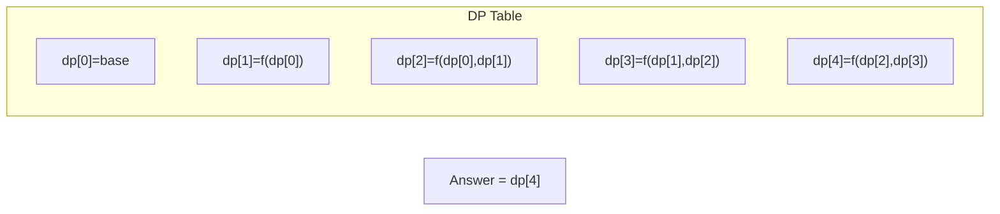

# Problem 553: Optimal Division

**Difficulty:** Medium  
**Tags:** Array, Math, Dynamic Programming  
**Pattern:** Dynamic Programming (1D)  
**Link:** [leetcode.com/problems/optimal-division](https://leetcode.com/problems/optimal-division/)

## Description

You are given an integer array `nums`. The adjacent integers in `nums` will perform the float division.

	- For example, for `nums = [2,3,4]`, we will evaluate the expression `"2/3/4"`.

However, you can add any number of parenthesis at any position to change the priority of operations. You want to add these parentheses such the value of the expression after the evaluation is maximum.

Return *the corresponding expression that has the maximum value in string format*.

**Note:** your expression should not contain redundant parenthesis.

 

Example 1:

```

**Input:** nums = [1000,100,10,2]
**Output:** "1000/(100/10/2)"
**Explanation:** 1000/(100/10/2) = 1000/((100/10)/2) = 200
However, the bold parenthesis in "1000/(**(**100/10**)**/2)" are redundant since they do not influence the operation priority.
So you should return "1000/(100/10/2)".
Other cases:
1000/(100/10)/2 = 50
1000/(100/(10/2)) = 50
1000/100/10/2 = 0.5
1000/100/(10/2) = 2

```

Example 2:

```

**Input:** nums = [2,3,4]
**Output:** "2/(3/4)"
**Explanation:** (2/(3/4)) = 8/3 = 2.667
It can be shown that after trying all possibilities, we cannot get an expression with evaluation greater than 2.667

```

 

**Constraints:**

	- `1 <= nums.length <= 10`
	- `2 <= nums[i] <= 1000`
	- There is only one optimal division for the given input.

## Approach: Dynamic Programming (1D)

Break the problem into overlapping subproblems. Define dp[i] as the optimal value for the subproblem ending at or considering index i. Build the solution bottom-up, using previously computed dp values.

## Pseudocode

```
1. Define dp[i] = optimal value for subproblem i
2. Base case: dp[0] = initial value
3. For i from 1 to n:
   a. dp[i] = recurrence(dp[i-1], dp[i-2], ...)
4. Return dp[n] or max/min of dp
```

## Algorithm Flow



## Visual State Transitions

**1D Dynamic Programming Table Build:**

**Frame 1: Initialize base cases**


**Frame 2: Fill dp[1] from dp[0]**


**Frame 3: Fill remaining cells**



## Complexity Analysis

- **Time:** O(n)
- **Space:** O(n)

## Solution (Python3)

```python
class Solution:
    def optimalDivision(self, nums: List[int]) -> str:
        # Dynamic programming (1D) - O(n) time, O(n) space
        if not nums:
            return 0
        n = len(nums) if isinstance(nums, list) else nums
        dp = [0] * (n + 1)
        dp[0] = 1  # base case
        for i in range(1, n + 1):
            dp[i] = dp[i-1]  # transition (customize per problem)
            if i >= 2:
                dp[i] += dp[i-2]
        return dp[n]
```

## Solution (C++)

```cpp
#include <string>
#include <vector>
using namespace std;

class Solution {
public:
    string optimalDivision(vector<int>& nums) {
        // Dynamic programming (1D) - O(n) time, O(n) space
        int n = nums;
        if (n <= 0) return 0;
        vector<int> dp(n + 1, 0);
        dp[0] = 1;
        for (int i = 1; i <= n; i++) {
            dp[i] = dp[i-1];
            if (i >= 2) dp[i] += dp[i-2];
        }
        return dp[n];
    }
};
```
