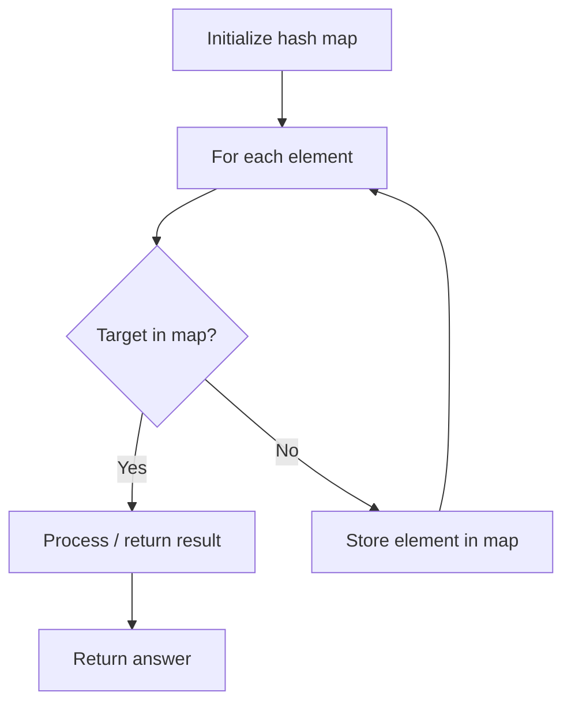

# Problem 554: Brick Wall

**Difficulty:** Medium  
**Tags:** Array, Hash Table  
**Pattern:** Hash Map Lookup  
**Link:** [leetcode.com/problems/brick-wall](https://leetcode.com/problems/brick-wall/)

## Description

There is a rectangular brick wall in front of you with `n` rows of bricks. The `i^th` row has some number of bricks each of the same height (i.e., one unit) but they can be of different widths. The total width of each row is the same.

Draw a vertical line from the top to the bottom and cross the least bricks. If your line goes through the edge of a brick, then the brick is not considered as crossed. You cannot draw a line just along one of the two vertical edges of the wall, in which case the line will obviously cross no bricks.

Given the 2D array `wall` that contains the information about the wall, return *the minimum number of crossed bricks after drawing such a vertical line*.

 

Example 1:

```

**Input:** wall = [[1,2,2,1],[3,1,2],[1,3,2],[2,4],[3,1,2],[1,3,1,1]]
**Output:** 2

```

Example 2:

```

**Input:** wall = [[1],[1],[1]]
**Output:** 3

```

 

**Constraints:**

	- `n == wall.length`
	- `1 <= n <= 10^4`
	- `1 <= wall[i].length <= 10^4`
	- `1 <= sum(wall[i].length) <= 2 * 10^4`
	- `sum(wall[i])` is the same for each row `i`.
	- `1 <= wall[i][j] <= 2^31 - 1`

## Approach: Hash Map Lookup

Use a hash map (dictionary) to store elements for O(1) lookup. Iterate through the input, checking membership or counting frequencies in the map.

## Pseudocode

```
1. Initialize hash map
2. Iterate through elements:
   a. Check if target/complement exists in map
   b. If found: process result
   c. Otherwise: store element in map
3. Return result
```

## Algorithm Flow



## Complexity Analysis

- **Time:** O(n)
- **Space:** O(n)

## Solution (Python3)

```python
class Solution:
    def leastBricks(self, wall: List[List[int]]) -> int:
        # Hash map approach - O(n) time, O(n) space
        seen = {}
        for i, val in enumerate(wall):
            complement = wall - val
            if complement in seen:
                return [seen[complement], i]
            seen[val] = i
        return 0
```

## Solution (C++)

```cpp
#include <string>
#include <unordered_map>
#include <vector>
using namespace std;

class Solution {
public:
    int leastBricks(vector<vector<int>>& wall) {
        // Hash map approach - O(n) time, O(n) space
        unordered_map<int, int> seen;
        for (int i = 0; i < wall.size(); i++) {
            int complement = wall - wall[i];
            if (seen.count(complement)) {
                return {seen[complement], i};
            }
            seen[wall[i]] = i;
        }
        return 0;
    }
};
```
