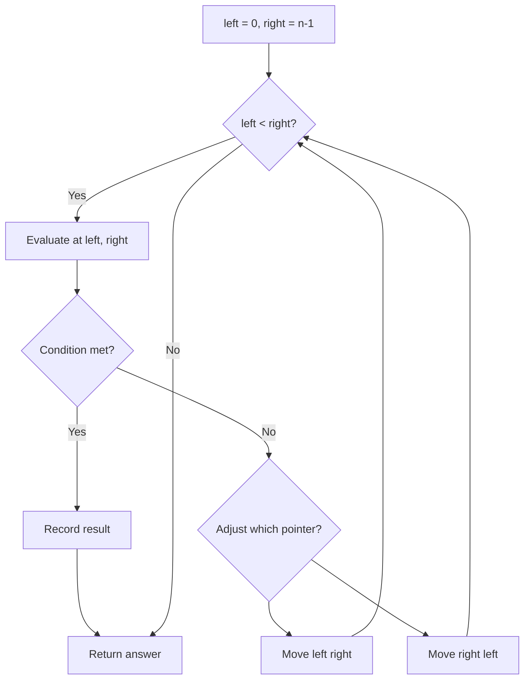
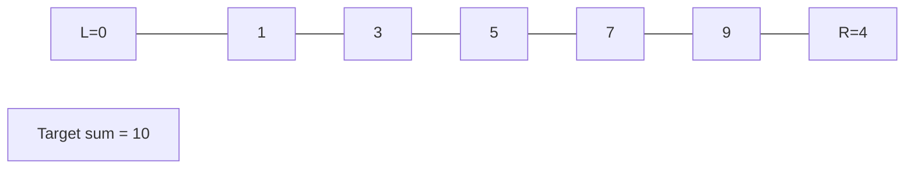
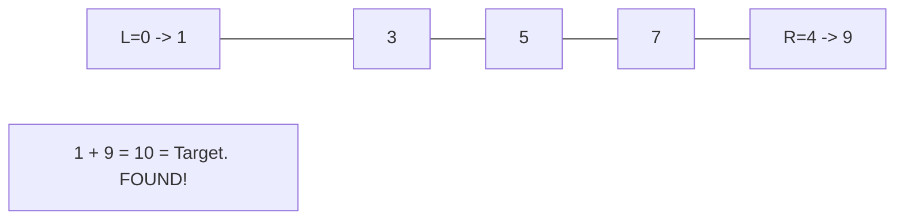

# Problem 556: Next Greater Element III

**Difficulty:** Medium  
**Tags:** Math, Two Pointers, String  
**Pattern:** Math / Next Permutation  
**Link:** [leetcode.com/problems/next-greater-element-iii](https://leetcode.com/problems/next-greater-element-iii/)

## Description

Given a positive integer `n`, find *the smallest integer which has exactly the same digits existing in the integer* `n` *and is greater in value than* `n`. If no such positive integer exists, return `-1`.

**Note** that the returned integer should fit in **32-bit integer**, if there is a valid answer but it does not fit in **32-bit integer**, return `-1`.

 

Example 1:

```
**Input:** n = 12
**Output:** 21

```
Example 2:

```
**Input:** n = 21
**Output:** -1

```

 

**Constraints:**

	- `1 <= n <= 2^31 - 1`

## Approach: Math / Next Permutation

Same as next permutation: find rightmost ascending pair, swap, reverse suffix.

## Pseudocode

```
1. Initialize left = 0, right = n-1 (or two independent pointers)
2. While pointers haven't crossed:
   a. Evaluate condition at pointer positions
   b. Move left pointer right or right pointer left
3. Return result
```

## Algorithm Flow



## Visual State Transitions

**Two Pointer Convergence:**

**Frame 1: Initialize pointers**


**Frame 2: Sum = 1+9 = 10, found!**



## Complexity Analysis

- **Time:** O(n)
- **Space:** O(n)

## Solution (Python3)

```python
class Solution:
    def nextGreaterElement(self, n: int) -> int:
        digits = list(str(n))
        i = len(digits) - 2
        while i >= 0 and digits[i] >= digits[i + 1]:
            i -= 1
        if i < 0:
            return -1
        j = len(digits) - 1
        while digits[j] <= digits[i]:
            j -= 1
        digits[i], digits[j] = digits[j], digits[i]
        digits[i + 1:] = reversed(digits[i + 1:])
        result = int(''.join(digits))
        return result if result <= 2**31 - 1 else -1
```

## Solution (C++)

```cpp
#include <string>
#include <vector>
using namespace std;

class Solution {
public:
    int nextGreaterElement(int n) {
        // Two pointer approach - O(n) time, O(1) space
        int left = 0, right = n.size() - 1;
        while (left < right) {
            int curr = n[left] + n[right];
            if (curr == n) {
                return {left, right};
            } else if (curr < n) {
                left++;
            } else {
                right--;
            }
        }
        return 0;
    }
};
```
