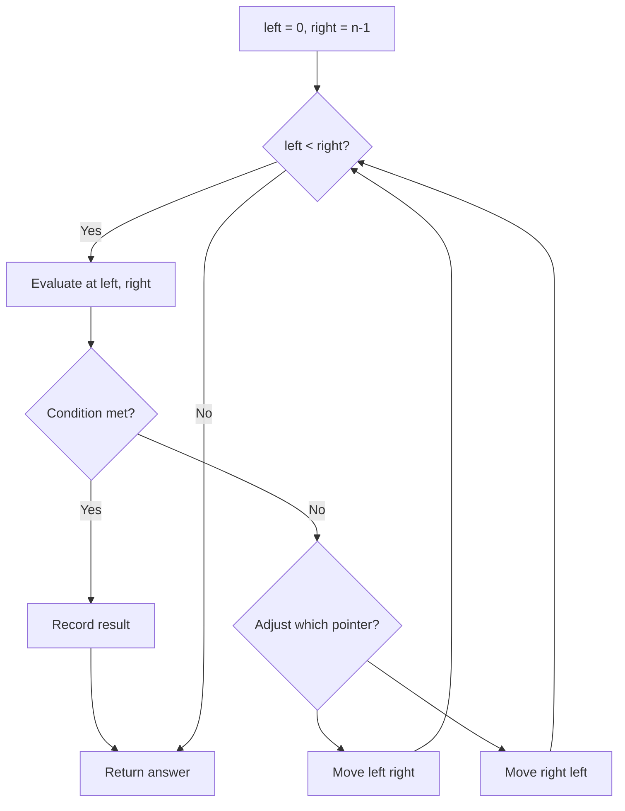
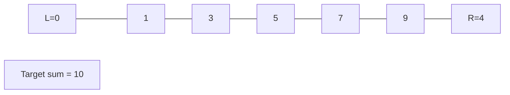
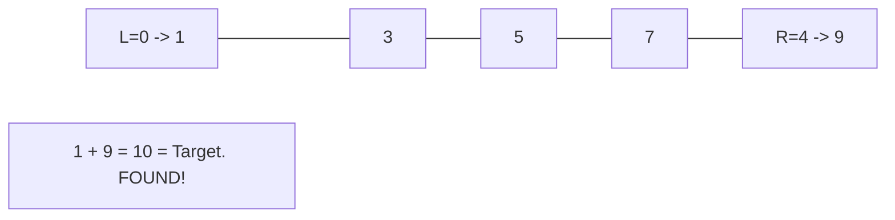

# Problem 557: Reverse Words in a String III

**Difficulty:** Easy  
**Tags:** Two Pointers, String  
**Pattern:** Two Pointers  
**Link:** [leetcode.com/problems/reverse-words-in-a-string-iii](https://leetcode.com/problems/reverse-words-in-a-string-iii/)

## Description

Given a string `s`, reverse the order of characters in each word within a sentence while still preserving whitespace and initial word order.

 

Example 1:

```

**Input:** s = "Let's take LeetCode contest"
**Output:** "s'teL ekat edoCteeL tsetnoc"

```

Example 2:

```

**Input:** s = "Mr Ding"
**Output:** "rM gniD"

```

 

**Constraints:**

	- `1 <= s.length <= 5 * 10^4`
	- `s` contains printable **ASCII** characters.
	- `s` does not contain any leading or trailing spaces.
	- There is **at least one** word in `s`.
	- All the words in `s` are separated by a single space.

## Approach: Two Pointers

Use two pointers moving through the data structure. Depending on the problem, pointers may move toward each other (converging), in the same direction (fast/slow), or independently.

## Pseudocode

```
1. Initialize left = 0, right = n-1 (or two independent pointers)
2. While pointers haven't crossed:
   a. Evaluate condition at pointer positions
   b. Move left pointer right or right pointer left
3. Return result
```

## Algorithm Flow



## Visual State Transitions

**Two Pointer Convergence:**

**Frame 1: Initialize pointers**


**Frame 2: Sum = 1+9 = 10, found!**



## Complexity Analysis

- **Time:** O(n)
- **Space:** O(1)

## Solution (Python3)

```python
class Solution:
    def reverseWords(self, s: str) -> str:
        # Two pointer approach - O(n) time, O(1) space
        left, right = 0, len(s) - 1
        while left < right:
            curr = s[left] + s[right]
            if curr == s:
                return [left, right]
            elif curr < s:
                left += 1
            else:
                right -= 1
        return ""
```

## Solution (C++)

```cpp
#include <string>
#include <vector>
using namespace std;

class Solution {
public:
    string reverseWords(string& s) {
        // Two pointer approach - O(n) time, O(1) space
        int left = 0, right = s.size() - 1;
        while (left < right) {
            int curr = s[left] + s[right];
            if (curr == s) {
                return {left, right};
            } else if (curr < s) {
                left++;
            } else {
                right--;
            }
        }
        return "";
    }
};
```
