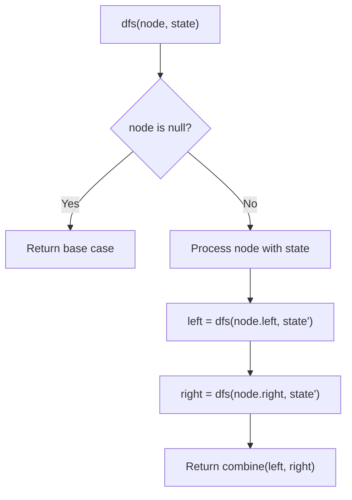
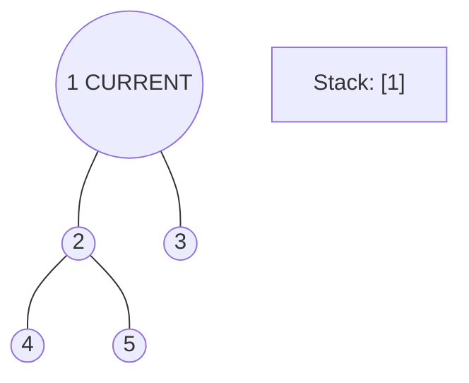
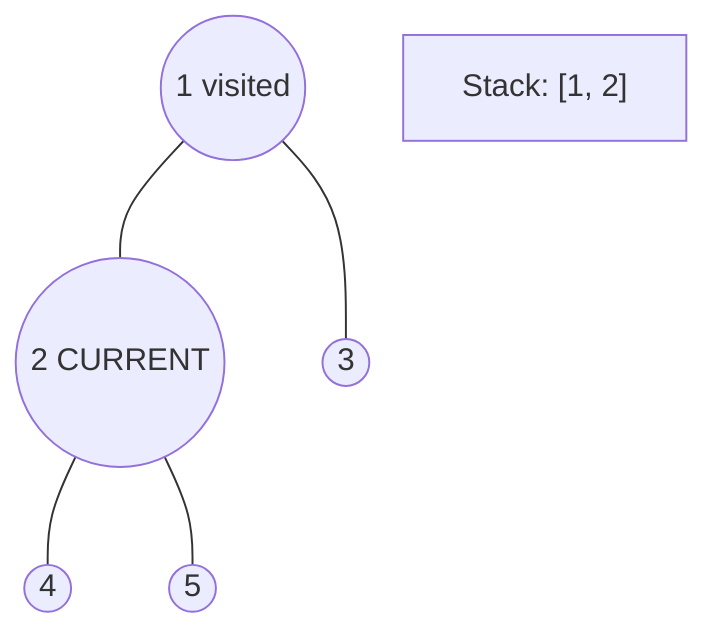
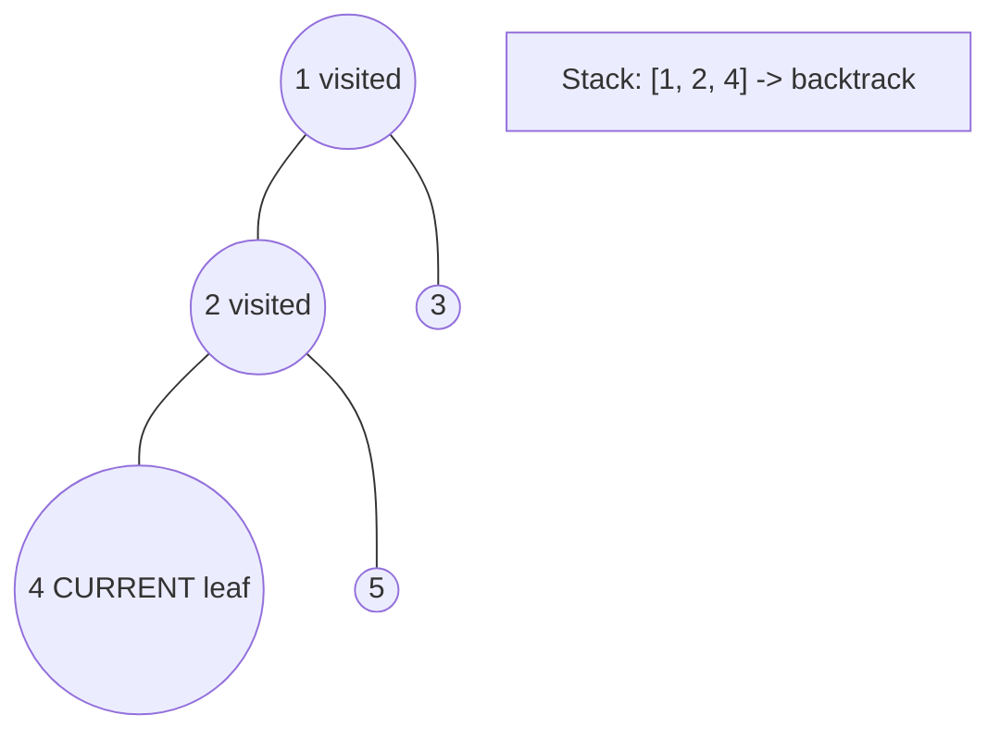
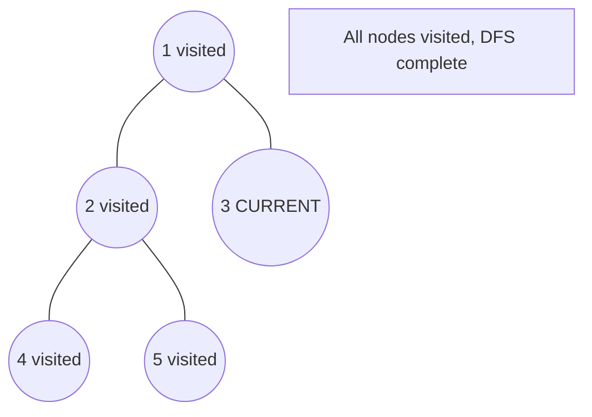

# Problem 559: Maximum Depth of N-ary Tree

**Difficulty:** Easy  
**Tags:** Tree, Depth-First Search, Breadth-First Search  
**Pattern:** DFS Tree Traversal  
**Link:** [leetcode.com/problems/maximum-depth-of-n-ary-tree](https://leetcode.com/problems/maximum-depth-of-n-ary-tree/)

## Description

Given a n-ary tree, find its maximum depth.

The maximum depth is the number of nodes along the longest path from the root node down to the farthest leaf node.

*Nary-Tree input serialization is represented in their level order traversal, each group of children is separated by the null value (See examples).*

 

Example 1:

```

**Input:** root = [1,null,3,2,4,null,5,6]
**Output:** 3

```

Example 2:

```

**Input:** root = [1,null,2,3,4,5,null,null,6,7,null,8,null,9,10,null,null,11,null,12,null,13,null,null,14]
**Output:** 5

```

 

**Constraints:**

	- The total number of nodes is in the range `[0, 10^4]`.
	- The depth of the n-ary tree is less than or equal to `1000`.

## Approach: DFS Tree Traversal

Perform depth-first search on the tree. Recurse on left and right subtrees, combining results bottom-up. Track state (path, depth, sum) during traversal.

## Pseudocode

```
1. Define dfs(node, state):
   a. Base case: if null, return default
   b. Process node with current state
   c. left_result = dfs(node.left, updated_state)
   d. right_result = dfs(node.right, updated_state)
   e. Return combine(left_result, right_result)
2. Return dfs(root, initial_state)
```

## Algorithm Flow



## Visual State Transitions

**DFS Tree Traversal Step-by-Step:**

**Frame 1: Start at root**


**Frame 2: Go left - visit node 2**


**Frame 3: Go left - visit node 4 (leaf)**


**Frame 4: Backtrack, visit node 5, then node 3**



## Complexity Analysis

- **Time:** O(n)
- **Space:** O(h)

## Solution (Python3)

```python
class Node:
    def __init__(self, val: Optional[int], children: Optional[List['Node']]):
        # Initialize data structure
        self.val = val
        self.children = children

    def maxDepth(self, root: 'Node') -> int:
        return 0

```

## Solution (C++)

```cpp
#include <algorithm>
#include <functional>
#include <string>
#include <vector>
using namespace std;

class Node {
public:
    Node(int val, vector<Node*>& children) {
        // Initialize
    }

    int maxDepth(Node* root) {
        return 0;
    }

};
```
