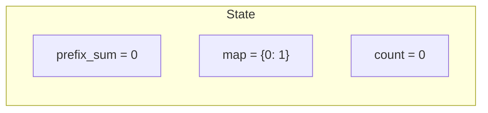
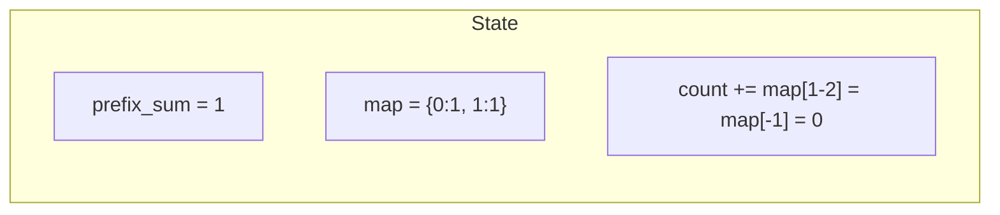
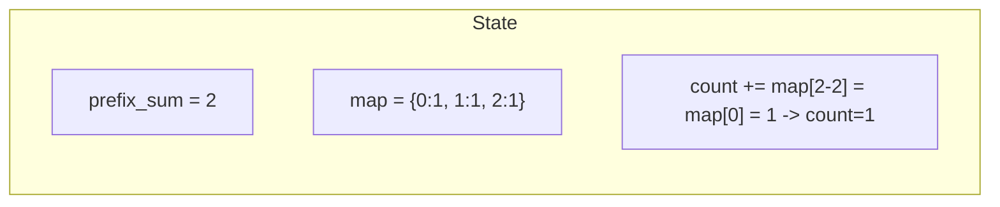
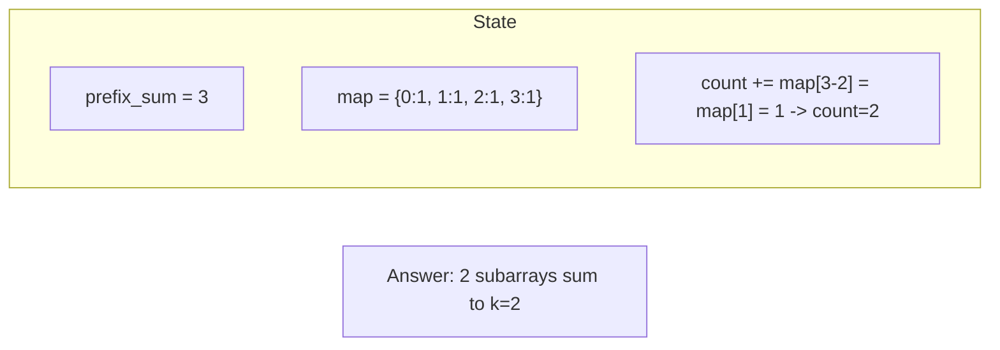

# Problem 560: Subarray Sum Equals K

**Difficulty:** Medium  
**Tags:** Array, Hash Table, Prefix Sum  
**Pattern:** Prefix Sum + Hash Map  
**Link:** [leetcode.com/problems/subarray-sum-equals-k](https://leetcode.com/problems/subarray-sum-equals-k/)

## Description

Given an array of integers `nums` and an integer `k`, return *the total number of subarrays whose sum equals to* `k`.

A subarray is a contiguous **non-empty** sequence of elements within an array.

 

Example 1:

```
**Input:** nums = [1,1,1], k = 2
**Output:** 2

```
Example 2:

```
**Input:** nums = [1,2,3], k = 3
**Output:** 2

```

 

**Constraints:**

	- `1 <= nums.length <= 2 * 10^4`
	- `-1000 <= nums[i] <= 1000`
	- `-10^7 <= k <= 10^7`

## Approach: Prefix Sum + Hash Map

**Key Insight:** If prefix[j] - prefix[i] = k, subarray (i,j] sums to k. Count how many times prefix_sum - k has appeared.

## Pseudocode

```
1. Build prefix sum array: prefix[0]=0, prefix[i]=prefix[i-1]+arr[i-1]
2. Use prefix sums to answer queries:
   - Subarray sum [l..r] = prefix[r+1] - prefix[l]
   - Or use hash map to find prefix[j]-prefix[i] == target
3. Return result
```

## Algorithm Flow

```mermaid
flowchart TD
    A[prefix_sum=0, map={0:1}] --> B[For each num]
    B --> C[prefix_sum += num]
    C --> D[count += map prefix_sum - k]
    D --> E[map prefix_sum += 1]
    E --> B
```

## Visual State Transitions

**Prefix Sum + Hash Map Step-by-Step:**

**Input:** nums = [1, 1, 1], k = 2

**Frame 1: Initialize**


**Frame 2: Process nums[0]=1**


**Frame 3: Process nums[1]=1**


**Frame 4: Process nums[2]=1**



## Complexity Analysis

- **Time:** O(n)
- **Space:** O(n)

## Solution (Python3)

```python
from collections import defaultdict

class Solution:
    def subarraySum(self, nums: list[int], k: int) -> int:
        count = 0
        prefix_sum = 0
        prefix_counts = defaultdict(int)
        prefix_counts[0] = 1
        for num in nums:
            prefix_sum += num
            count += prefix_counts[prefix_sum - k]
            prefix_counts[prefix_sum] += 1
        return count
```

## Solution (C++)

```cpp
#include <algorithm>
#include <string>
#include <unordered_map>
#include <vector>
using namespace std;

class Solution {
public:
    int subarraySum(vector<int>& nums, int k) {
        // Prefix sum approach - O(n) time, O(n) space
        unordered_map<int, int> prefix;
        prefix[0] = -1;
        int curr_sum = 0, result = 0;
        int target = k;
        for (int i = 0; i < (int)nums.size(); i++) {
            curr_sum += nums[i];
            if (prefix.count(curr_sum - target)) {
                result = max(result, i - prefix[curr_sum - target]);
            }
            if (!prefix.count(curr_sum)) {
                prefix[curr_sum] = i;
            }
        }
        return result;
    }
};
```
