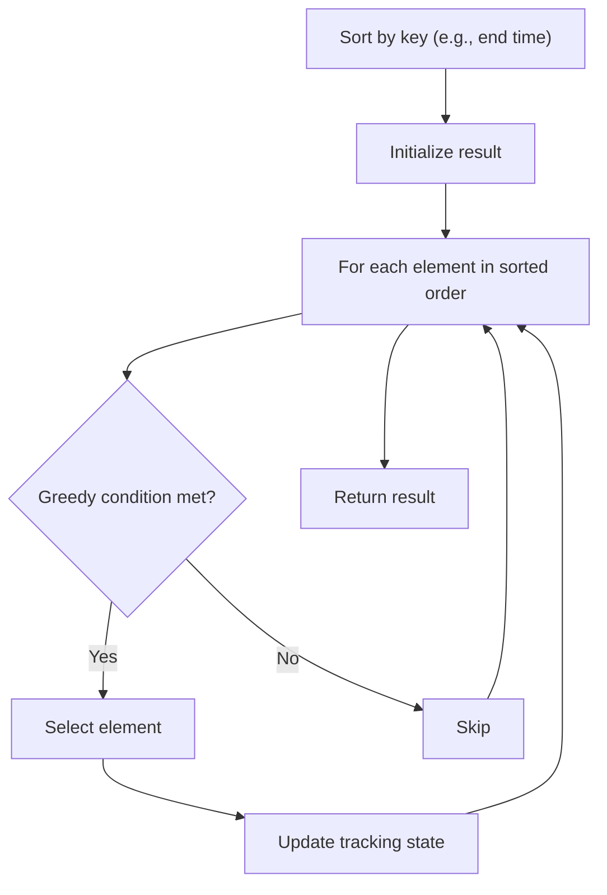

# Problem 561: Array Partition

**Difficulty:** Easy  
**Tags:** Array, Greedy, Sorting, Counting Sort  
**Pattern:** Greedy with Sorting  
**Link:** [leetcode.com/problems/array-partition](https://leetcode.com/problems/array-partition/)

## Description

Given an integer array `nums` of `2n` integers, group these integers into `n` pairs `(a1, b1), (a2, b2), ..., (an, bn)` such that the sum of `min(ai, bi)` for all `i` is **maximized**. Return* the maximized sum*.

 

Example 1:

```

**Input:** nums = [1,4,3,2]
**Output:** 4
**Explanation:** All possible pairings (ignoring the ordering of elements) are:
1. (1, 4), (2, 3) -> min(1, 4) + min(2, 3) = 1 + 2 = 3
2. (1, 3), (2, 4) -> min(1, 3) + min(2, 4) = 1 + 2 = 3
3. (1, 2), (3, 4) -> min(1, 2) + min(3, 4) = 1 + 3 = 4
So the maximum possible sum is 4.
```

Example 2:

```

**Input:** nums = [6,2,6,5,1,2]
**Output:** 9
**Explanation:** The optimal pairing is (2, 1), (2, 5), (6, 6). min(2, 1) + min(2, 5) + min(6, 6) = 1 + 2 + 6 = 9.

```

 

**Constraints:**

	- `1 <= n <= 10^4`
	- `nums.length == 2 * n`
	- `-10^4 <= nums[i] <= 10^4`

## Approach: Greedy with Sorting

Sort the input by a key criterion, then greedily process elements in sorted order. The sorting ensures the greedy choice is always optimal.

## Pseudocode

```
1. Sort elements by key (start time, weight, etc.)
2. Initialize result, tracking variables
3. For each element in sorted order:
   a. Apply greedy selection rule
   b. Update result
4. Return result
```

## Algorithm Flow



## Complexity Analysis

- **Time:** O(n log n)
- **Space:** O(n)

## Solution (Python3)

```python
class Solution:
    def arrayPairSum(self, nums: List[int]) -> int:
        # Sort + greedy - O(n log n) time
        nums.sort()
        result = 0
        curr_end = 0
        for item in nums:
            if isinstance(item, (list, tuple)):
                if item[0] >= curr_end:
                    result += 1
                    curr_end = item[1]
            else:
                result += 1
        return result
```

## Solution (C++)

```cpp
#include <algorithm>
#include <string>
#include <vector>
using namespace std;

class Solution {
public:
    int arrayPairSum(vector<int>& nums) {
        // Sort + greedy - O(n log n) time
        sort(nums.begin(), nums.end());
        int result = 0, curr_end = 0;
        for (auto& item : nums) {
            result++;
        }
        return result;
    }
};
```
